# Инсталација алата

Да би у овом поглављу успешно савладао рад са базама података, потребно је да
припремиш своје интегрисано радно окружење, као и да инсталираш неколико
додатних алата:

* инсталација радног пакета за рад са базама података у Visual Studio IDE,
* Microsoft SQL Server 2022 Express инсталација и
* SQL Server Management Studio инсталација.

Уколико већ имаш инсталиране ове алате, можеш да прескочиш ову лекцију.

## Visual Studio IDE инсталација радног пакета

Први корак је да из покренеш **Visual Studio Installer**
(*Start Menu\Programs\Visual Studio Installer*) и кликнеш на думе **Modify**:

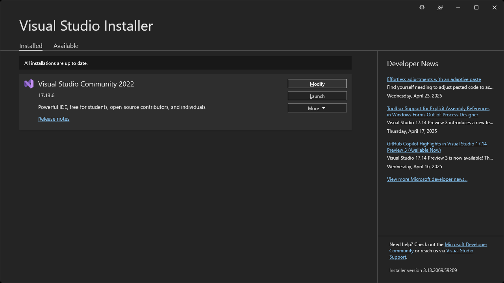

Потом је потребно да међу одабраним пакетима одабереш и радни пакет
**Data storage and processing** и кликнеш на дугме **Modify**, односно дугме
**Install** ако инсталираш Visual Studio Community 2022 први пут:

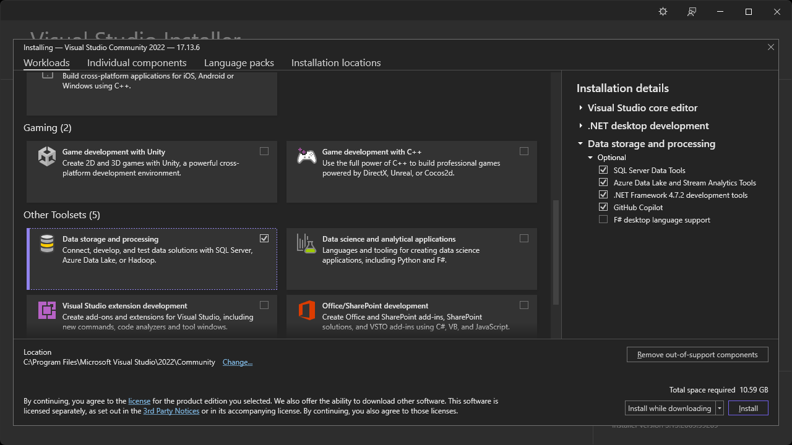

Сачекај да се фајлови преузму са интернета и инсталирају...

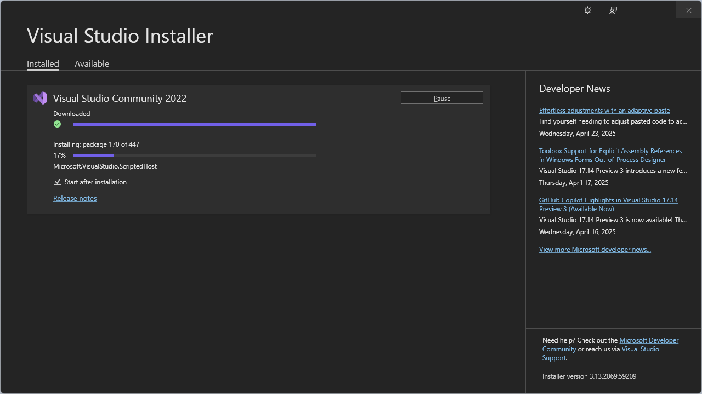

...па на крају затвори прозор *Visual Studio Installer*-а:

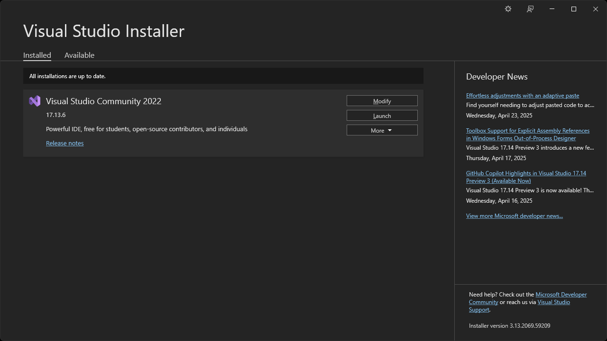

## Microsoft SQL Server 2022 Express инсталација

**Microsoft SQL Server** је систем за управљање релационим базама података
помоћу језика **T-SQL** (*Transact SQL*). Као сервер база података, то је
серверски софтвер којег обично користе друге апликације које се покрећу са
истог или са другог рачунара (преко мреже или интернета). Постоји више
различитих издања *Microsoft SQL Server*-а, намењених различитим корисницима и
различитим захтевима од једноставних апликација на једном рачунару за једног
корисника, до комплексних апликација које истовремено користе стотине
корисника. О овоме си много више учио у II и III разреду у оквиру наставног
предмета Базе података.

**Microsoft SQL Server Express** је бесплатно издање *Microsoft SQL Server*-а,
које укључује основни механизам за рад са базама података, у којем не постоји
ограничење у броју база података или броју корисника. Ограничење се огледа
једино у коришћењу процесора и меморије, као и величини фајлова базе података.
Због ових одлика, ово издање *Microsoft SQL Server*-а је идеално за ученике и
студенте, као и за програмере који развијају десктоп, веб и мале серверске
апликације.

Отвори страницу
[www.microsoft.com/en-us/sql-server/sql-server-downloads](https://www.microsoft.com/en-us/sql-server/sql-server-downloads),
пронађи секцију за преузимање **Express** издања, па кликни на дугме
**Download now**:

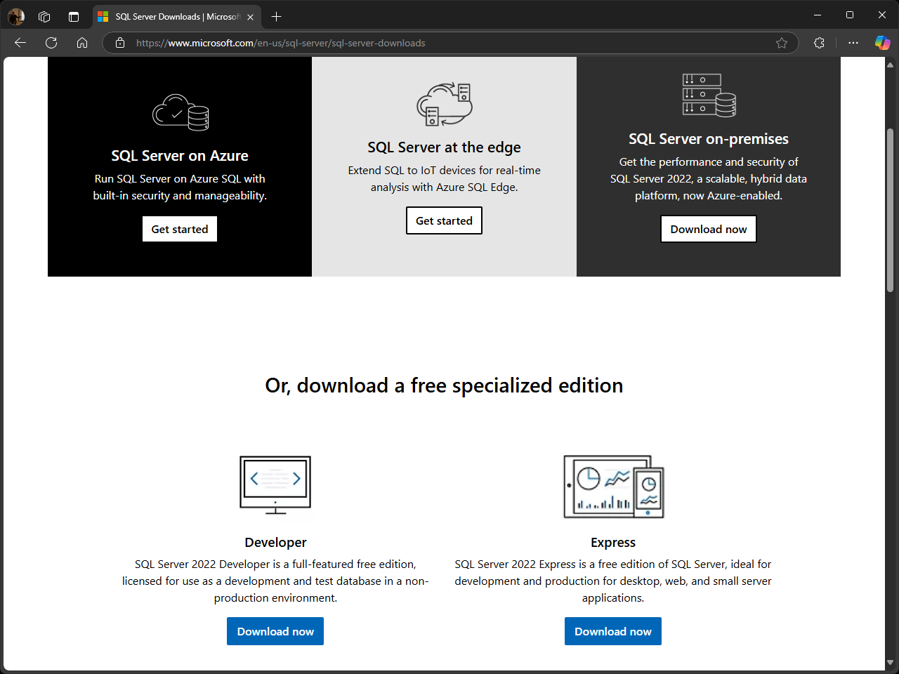

Када се преузме инсталер `SQL2022-SSEI-Expr.exe` покрени га, а ако је на твом
рачунару укључен UAC, притисни дугме **Yes**:

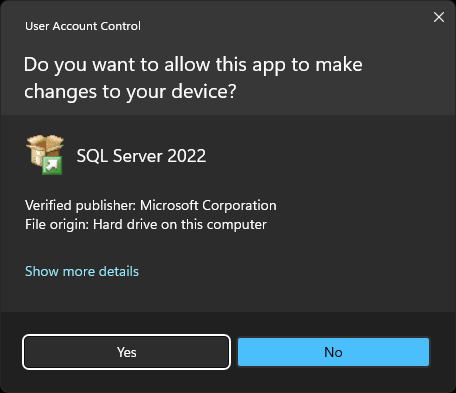

Одабери **Basic**...

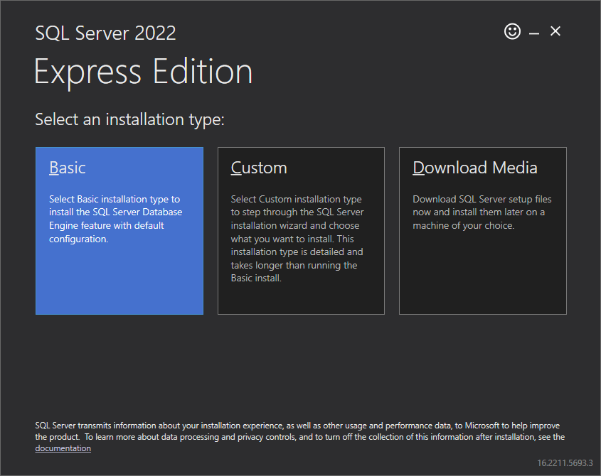

...притисни дугме **Accept**...

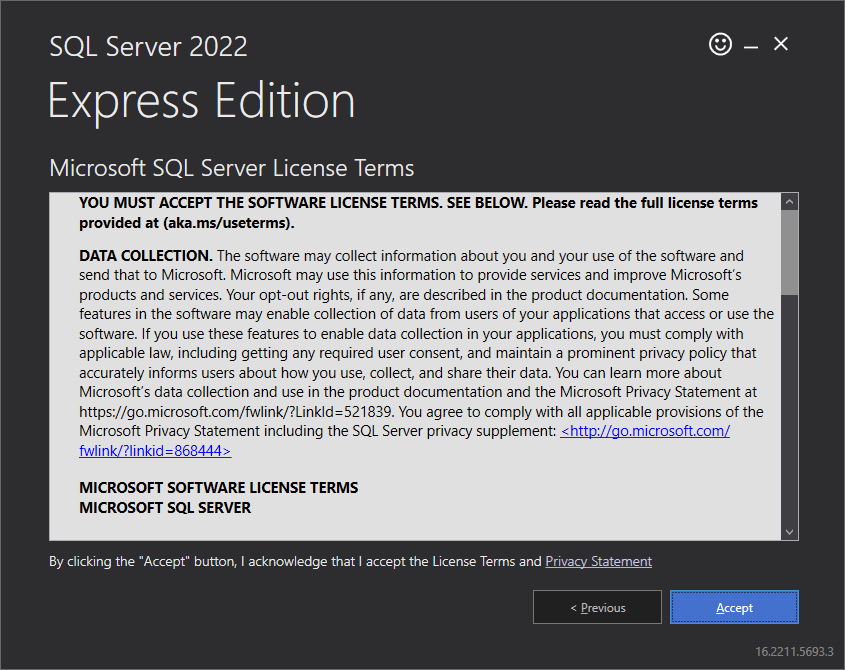

...па потом притисни дугме **Install**:

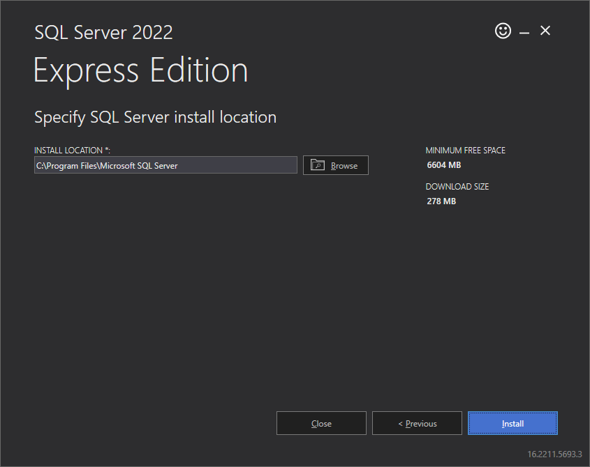

Сачекај да се инсталациони фајлови преузму са интернета и инсталирају:

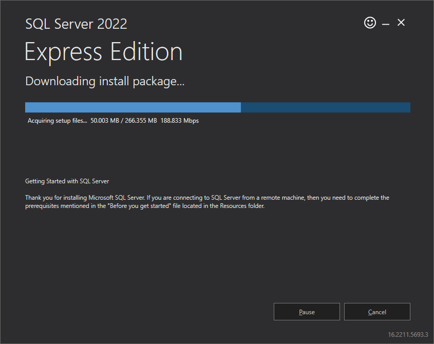

На крају притисни дугме **Close**...

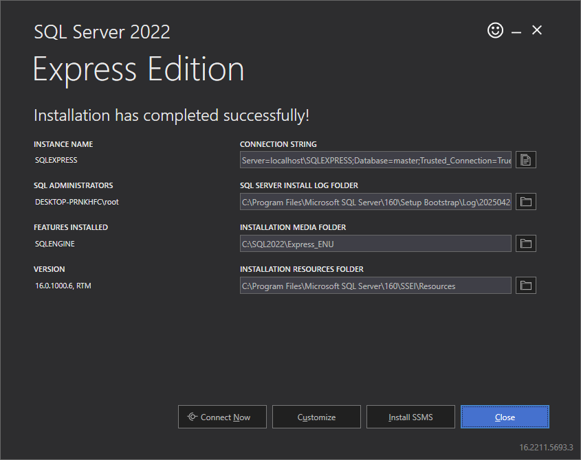

...па дугме **Yes**:

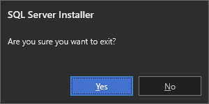

### Проблеми приликом инсталације

Ако је величина сектора системског диска на твом рачунару већа од $4 KB$ јавиће
се грешка приликом инсталације било којег издања *SQL Server*-а. Колика ће бити
величина сектора системског диска зависи од типа фајл система, типа и величине
уређаја за складиштење, подешавања приликом партиционисања и форматирања диска
итд. (нпр. модернији већи NVMe SSD дискови обично користе веће логичке секторе
како би оптимизовали рад).

Да провериш величину сектора свог системског диска покрени *Command Prompt* као
администратор па унеси...

```Console
fsutil fsinfo sectorinfo C:
```

...што ће резултирати следећим исписом:

```text
LogicalBytesPerSector :                                 512
PhysicalBytesPerSectorForAtomicity :                    4096
PhysicalBytesPerSectorForPerformance :                  4096
FileSystemEffectivePhysicalBytesPerSectorForAtomicity : 4096
Device Alignment :                                      Aligned (0x000)
Partition alignment on device :                         Aligned (0x000)
No Seek Penalty
Trim Supported
Not DAX capable
Not Thinly-Provisioned
```

Уколико својства `PhysicalBytesPerSectorForAtomicity` и
`PhysicalBytesPerSectorForPerformance` имају вредност већу од `4096` потребно
је да у *Command Prompt*-у унесеш...

```Console
REG ADD "HKLM\SYSTEM\CurrentControlSet\Services\stornvme\Parameters\Device" /v "ForcedPhysicalSectorSizeInBytes" /t   REG_MULTI_SZ /d "* 4095" /f
```

...па потом рестартујеш рачунар и поново инсталираш *SQL Server*. Исто можеш
урадити и у *PowerShell*-у уносом...

```PowerShell
New-ItemProperty -Path "HKLM:\SYSTEM\CurrentControlSet\Services\stornvme\Parameters\Device" -Name "ForcedPhysicalSectorSizeInBytes" -PropertyType MultiString -Force -Value "* 4095"
```

...рестартовањем рачунара и поновном инсталацијом *SQL Server*-а.

## SQL Server Management Studio инсталација

**SQL Server Management Studio (SSMS)** је интегрисано окружење за управљање
било којом SQL инфраструктуром, од *Microsoft SQL Server*-а до *Azure SQL* базе
података у облаку. SSMS пружа алате за конфигурисање, праћење и администрирање
инстанци SQL Server-а и база података. Њега ћеш користити за креирање упите,
дизајнирање и управљање базама података. Ово је још један алат о којем си пуно
учио у II и III разреду у оквиру наставног предмета Базе података.

Отвори страницу
[learn.microsoft.com/en-us/ssms/download-sql-server-management-studio-ssms](https://learn.microsoft.com/en-us/ssms/download-sql-server-management-studio-ssms)
па кликни на **Download SQL Server Management Studio (SSMS) 20.2.1**:

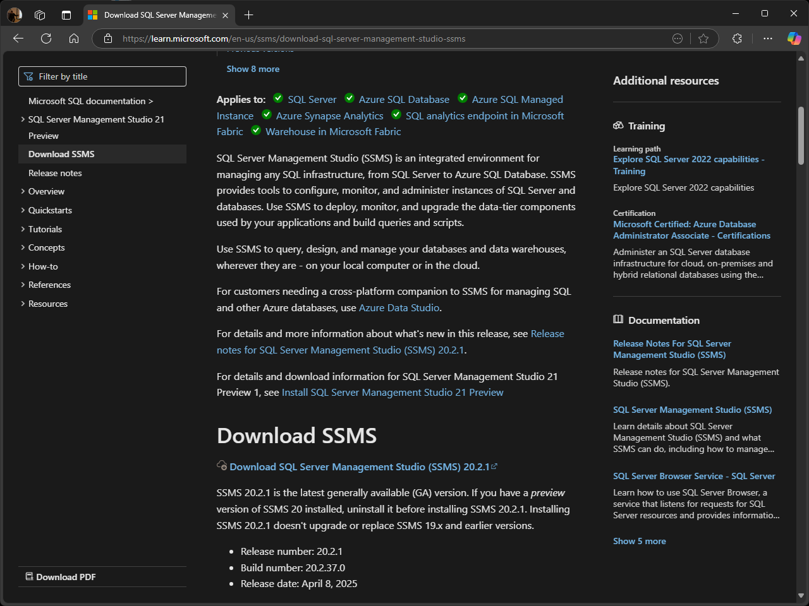

Када се преузме инсталер `SSMS-Setup-ENU.exe` покрени га, па притисни
**Install**...

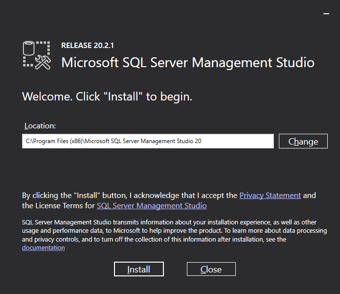

...па ако је на твом рачунару укључен UAC, притисни дугме **Yes**...

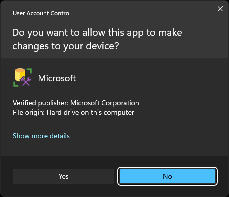

...и сачекај да се SSMS инсталира:

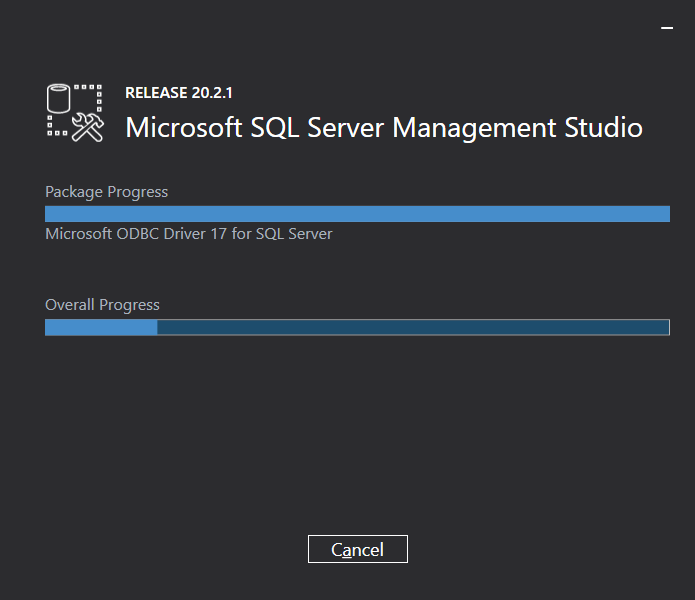

На крају притисни дугме **Close**:

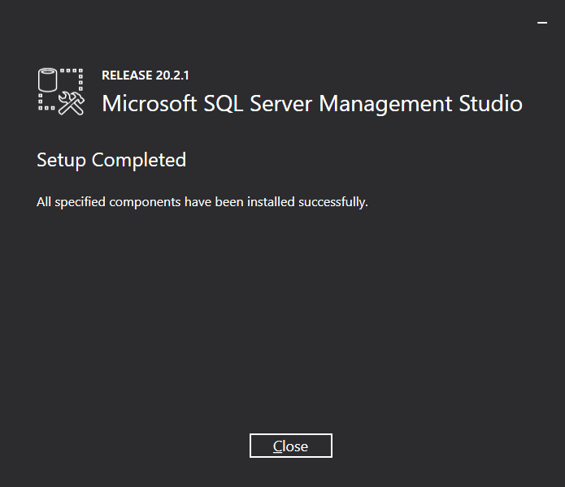

Овим си завршио са инсталацијом свих потребних алата за креирање апликација
које ће радити са базама података.
