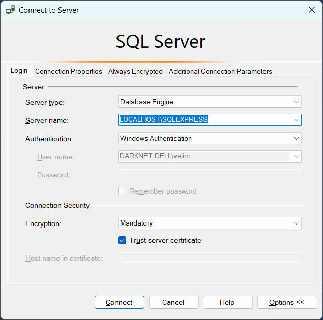
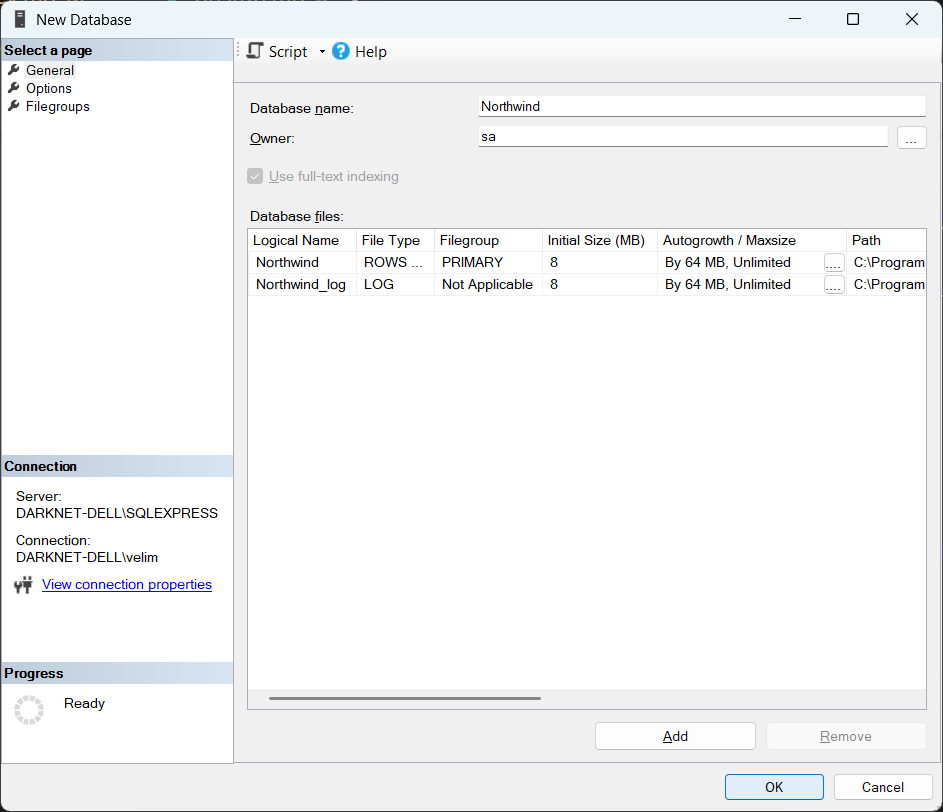
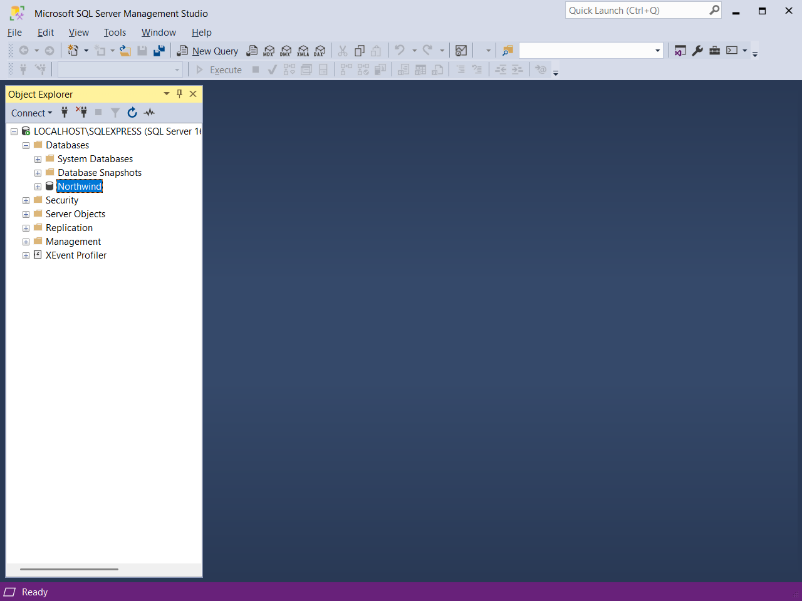
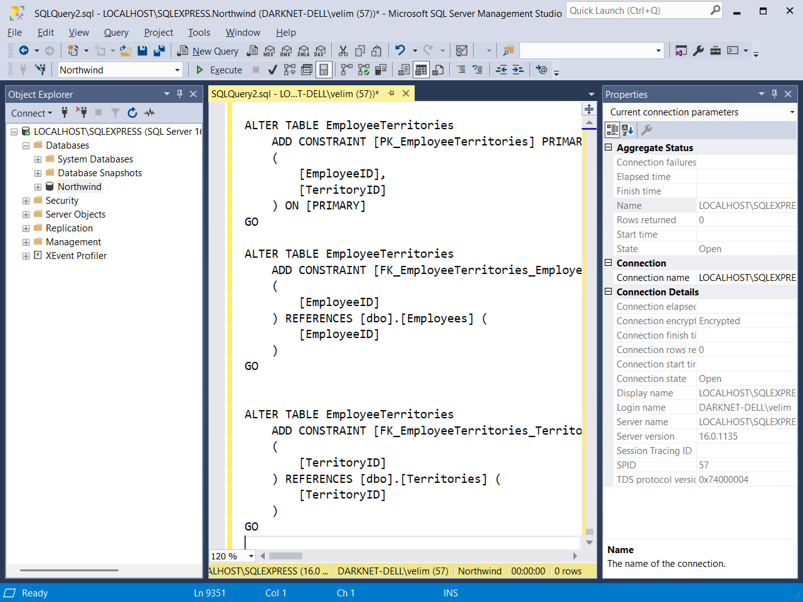
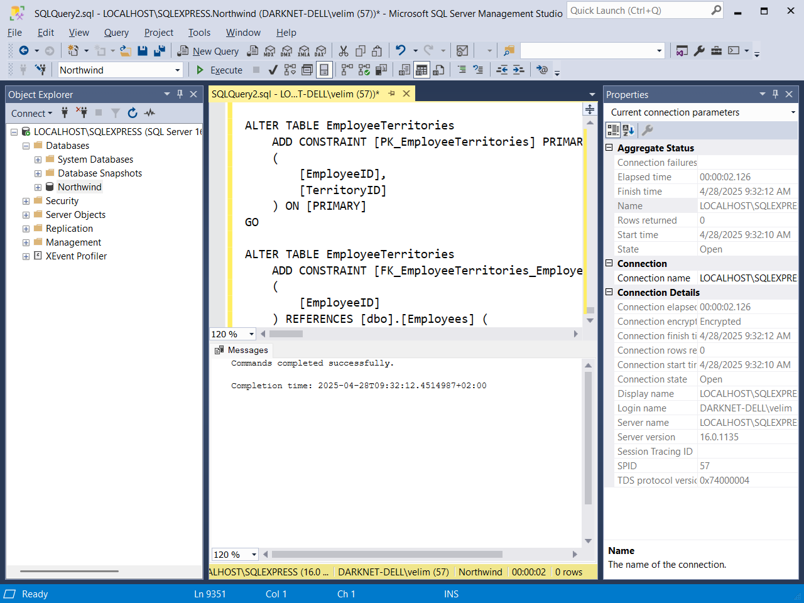
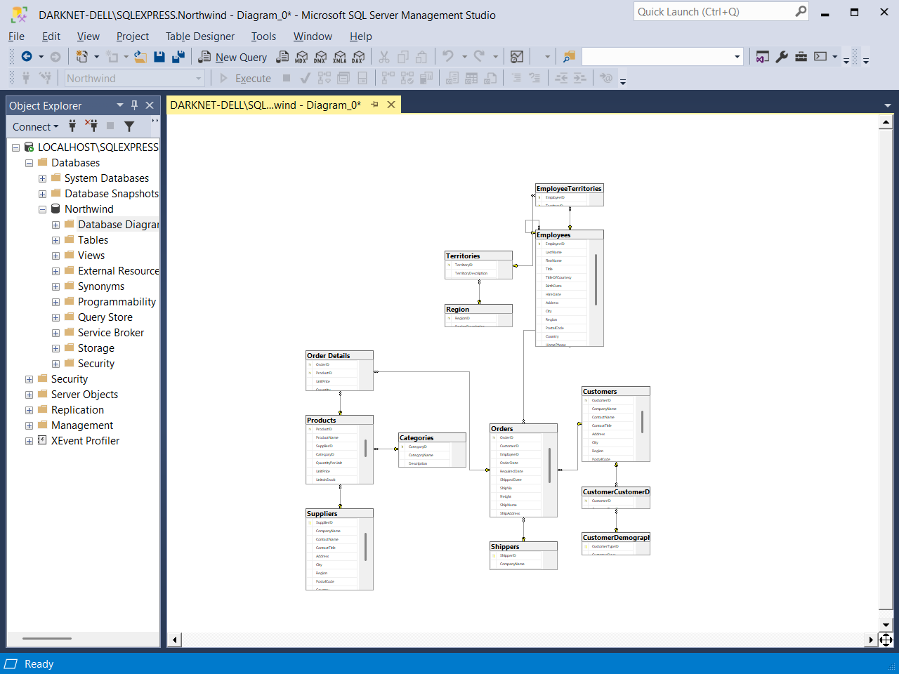

# Креирање базе података за вежбе

Базу података
[Northwind](https://github.com/microsoft/sql-server-samples/tree/master/samples/databases/northwind-pubs)
за потребе вежби у овом поглављу креираћеш помоћу SQL скрипте која се налази на
званичном GitHub налогу [microsoft](https://github.com/microsoft) /
[sql-server-samples](https://github.com/microsoft/sql-server-samples). Први
корак је да преузмеш саму скрипту са следеће везе
[instnwnd.sql](https://github.com/microsoft/sql-server-samples/raw/refs/heads/master/samples/databases/northwind-pubs/instnwnd.sql).
Отвори преузети фајл `instnwnd.sql` у Notepad-у, селектуј све (`CTRL` + `A`) и
копирај на клипборд (`CTRL` + `C`).

Након тога, отвори SSMS и повежи се на *SQL Server Express*:

У *Object Explorer*-у кликни десним тастером миша на **Databases** и одабери
**New Database**. Унеси име базе података (*Database name*) **Northwind** и
власника (*Owner*) **sa**:

Овим поступком креирао си празну базу података *Northwind*:

У менију SMSS-а кликни на `New Query` и у новом упиту налепи садржај клипборда:

Потом, у менију SMSS-а кликни на `Execute` и сачекај да се скрипта изврши.
Након успешног извршавања скрипте, у *Messages* прозору на дну појавиће се
порука: *Commands completed successfully.*

Провере ради, креирај дијаграм базе података. У *Object Explorer*-у кликни
десним тастером миша на *Database / Nothwind / Database Diagrams*, одабери
**New Database Diagram**, па на поруку
*This database does not have one or more of the support objects required to use database diagramming.  Do you wish to create them?*
одговори потврдно притиском на дугме **Yes**. Потом одабери све понуђене табеле
из базе притискајући дугме **Add** за сваку табелу. Када си додао све табеле,
притисни дугме **Close**. Дијаграм би требао да изгледа овако:

