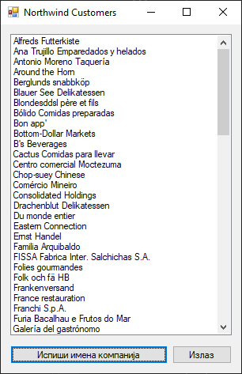

# Конекциони и бесконекциони приступ

Рад са базама података у .NET апликацијама заснива се на архитектури ADO.NET
(ActiveX Data Objects for .NET). ADO.NET омогућава апликацији да комуницира са
релационим базама података као што је Microsoft SQL Server. Постоје два основна
приступа бази података:

* Конекциони приступ (connected)
* Бесконекциони приступ (disconnected)

Разлика између ова два приступа лежи у томе како се управља везом (конекцијом)
са базом података током читања и писања података.

## Конекциони приступ

Конекциони приступ (енгл. *Connected Access*) подразумева да твоја апликација
успоставља конекцију са базом података и да је држи отвореном докле год су
потребне операције са подацима. Током отворене конекције, апликација може да
чита, уписује, ажурира и брише податке. Конекциони приступ се најчешће користи
када апликација ради са великим количинама података или када је потребна стална
интеракција са базом.

За конекциони приступ важи да је бржи одзив када је конекција активна. Међутим,
важи и да је неопходно креирати већи број отворених конекција ка серверу, што
може бити проблем када постоји велики броја клијентских апликација које се
повезују на базу података. Отворена конекција мора се мануелно затварати након
завршетка рада.

Када будеш радио са конекционим приступом ка Microsoft SQL Server-у, обично ћеш
користити именски простор `System.Data.SqlClient` која садржи специјализоване
класе за рад са SQL Server-ом (као што су `SqlConnection`, `SqlCommand`,
`SqlDataReader` итд).

`SqlConnection` користи се за везу са *SQL Server* базом података, `SqlCommand`
користи се за извршавање SQL упите над базом и `SqlDataReader` корирсти се за
секвенцијално читање резултата ред по ред из базе.

## Пример конекционог приступа

Конекциони приступ нећеш често користити у овом поглављу, али свакако такав
приступ има својих предности када је потребна директна интеракција са базом.

Нека је задатак да се у конзоли испишу имена свих компанија из поља
`CompanyName` из табеле `Customers` која се налази у бази података *Northwind*.
Шта је све потребно урадити? Отворити конекцију ка бази података *Northwind* на
локалном *SQLEXPRESS* серверу, извршити упит који враћа све редове из табеле
`Customers`, итеративно прочитати редове и исписати имена свих компанија у
конзоли и на крају, затворити све ресурсе.

Анализирај следећи кôд:

```cs
using System;
using System.Data.SqlClient;

internal class Program
{
    static void Main()
    {
        using (SqlConnection conn = new SqlConnection("Data Source=LOCALHOST\\SQLEXPRESS;Initial Catalog=Northwind;Integrated Security=True"))
        {
            conn.Open();
            SqlCommand cmd = new SqlCommand("SELECT * FROM Customers", conn);
            using (SqlDataReader reader = cmd.ExecuteReader())
            {
                while (reader.Read())
                {
                    Console.WriteLine(reader["CompanyName"].ToString());
                }
            }
        }
    }
}
```

Укључена су два именска простора: именски простор `System` који обезбеђује
основне типове и класе као што су `Console`, `String` и др., као и именски
простор `System.Data.SqlClient` који садржи класе за рад са *SQL Server*-ом
`SqlConnection`, `SqlCommand` и `SqlDataReader`.

Објекту класе `SqlConnection` названом `conn` прослеђен је конекциони стринг
чиме је креиран објекат који представља конекцију са базом, а методом `Open()`
конекција је и отворена. Објекат класе `SqlCommand` назван `cmd` везује упит
`SELECT * FROM Customers` за конекцију `conn`.

`ExecuteReader()` извршава упит и креира `SqlDataReader` који омогућава читање
резултата ред по ред. Објекат класе `SqlDataReader` назван `reader` не садржи
резултате упита одмах у меморији – он их чита стримовањем са сервера током
`Read()` позива ред по ред. `reader["CompanyName"]` приступа колони
`CompanyName` у тренутном реду, где се резултат конвертује у стринг и исписује
у конзоли. Када нема више редова, метода `Read()` враћа `false` чиме ће се
завршити `while` циклус. Нема потребе експлицитно затварати `SqlDataReader` и
`SqlConnection` јер се налазе у `using` блоковима који ће их аутоматски
затворити. `using` блокови обезбеђује да се ресурси ослободе чак и ако дође до
изузетка.

Исту логику можеш применити и приликом израде *Windows Forms* апликације која
изгледа, на пример, овако:



Методу у којој треба да дефинишеш догађај клика на дугме
`Испиши имена компанија` може да изгледа овако:

```cs
private void button1_Click(object sender, EventArgs e)
{
    using (SqlConnection conn = new SqlConnection("Data Source=LOCALHOST\\SQLEXPRESS;Initial Catalog=Northwind;Integrated Security=True"))
    {
        conn.Open();
        SqlCommand cmd = new SqlCommand("SELECT * FROM Customers", conn);
        using (SqlDataReader reader = cmd.ExecuteReader())
        {
            while (reader.Read())
            {
                listBox1.Items.Add(reader["CompanyName"].ToString());
            }
        }
    }
}
```

## Бесконекциони приступ

Бесконекциони приступ (енгл. *Disconnected Access*) подразумева да твоја
апликација успостави конекцију, учита податке у меморију и онда затвори
конекцију. Све даље операције раде се локално у меморији, без потребе за
сталном конекцијом са базом података. Када треба сачувати измене у бази,
поново се отвара конекција, шаљу се измене, и конекција се затвара.

За бесконекциони приступ важи да су мања оптерећење сервера јер су конекције
краткотрајне, али да постоји опасност од појаве конфиката ако више корисника
измени исте податке пре синхронизације са базом података. Бесконекциони приступ
је одличан за рад са привременим подацима или подацима које треба приказати у
неком извештају.

Када будеш радио са бесконекционим приступом ка Microsoft SQL Server-у, обично
ћеш користити именске просторе `System.Data` која садржи основне класе за рад
са подацима (нпр. `DataTable`, `DataSet` итд.) и `System.Data.SqlClient`
специјализоване класе за рад са SQL Server-ом (као што су `SqlConnection`,
`SqlCommand`, `SqlDataAdapter` итд).

`SqlConnection` користи се за везу са *SQL Server* базом података, `SqlCommand`
користи се за извршавање SQL упите над базом и `SqlDataAdapter` користи се као
посредник који аутоматски: отвара конекцију, извршава упит, пуни податке у
`DataSet` или `DataTable` и затвара конекцију. `DataTable` и `DataSet` користе
се за чување податке у меморији твог рачунара.

## Пример бесконекционог приступа

Нека је исти задатак као у претходном примеру да се у конзоли испишу имена свих
компанија из поља `CompanyName` из табеле `Customers` која се налази у бази
података *Northwind*.

Анализирај следећи кôд:

```cs
using System;
using System.Data;
using System.Data.SqlClient;

internal class Program
{
    static void Main()
    {
        DataTable dt = new DataTable();
        using (SqlConnection conn = new SqlConnection("Data Source=LOCALHOST\\SQLEXPRESS;Initial Catalog=Northwind;Integrated Security=True"))
        {
            SqlDataAdapter adapter = new SqlDataAdapter("SELECT * FROM Customers", conn);
            adapter.Fill(dt);
            foreach (DataRow row in dt.Rows)
            {
                Console.WriteLine(row["CompanyName"].ToString());
            }
        }
    }
}
```

Укључена су три именска простора: именски простор `System`, који омогућава
коришћење основних типова и класа као што су `Console` и `String`, именски
простор `System.Data`, који садржи класе за рад са подацима у меморији као што
су `DataTable` и `DataRow` и именски простор `System.Data.SqlClient`, који
садржи класе за рад са *SQL Server*-ом `SqlConnection` и `SqlDataAdapter`.

Креиран је објекат класе `DataTable` под именом `dt`, који ће у меморији чувати
резултате упита. Објекат класе `SqlConnection` назван `conn` представља
конекцију ка бази, а објекат класе `SqlDataAdapter` назван `adapter` везује
упит `SELECT * FROM Customers` за конекцију `conn`. Позивом методе `Fill(dt)`,
адаптер отвара конекцију, извршава упит, попуњава податке у `dt` и затвара
конекцију, све аутоматски.

Након тога, рад са подацима се обавља у `foreach` петљи која пролази кроз све
редове у `dt`, где се за сваки ред исписује вредност колоне `CompanyName`.
Пошто су `SqlConnection` и други објекти обухваћени `using` блоком, њихово
ослобађање ресурса се дешава аутоматски.

Уколико задатак треба да решиш у *Windows Forms* апликацији која треба да
изгледа, на пример, овако...


...можеш да примениш исту логику решења коју си користио и у конзолној
апликацији:

```cs
private void button1_Click(object sender, EventArgs e)
{
    DataTable dt = new DataTable();
    using (SqlConnection conn = new SqlConnection("Data Source=LOCALHOST\\SQLEXPRESS;Initial Catalog=Northwind;Integrated Security=True"))
    {
        SqlDataAdapter adapter = new SqlDataAdapter("SELECT * FROM Customers", conn);
        adapter.Fill(dt);
        foreach (DataRow row in dt.Rows)
        {
            listBox1.Items.Add(row["CompanyName"].ToString());
        }
    }
}
```

## Поређење приступа

Ако покушаш да сумираш шта си научио у овој лекцији, у кратким цртама то би
изгледало овако:

Главне карактеристике конекционог приступа су:

* Бржи приступ подацима.
* Мање меморије се користи у апликацији.
* Захтева пажљиво управљање ресурсима (отворена конекција мора брзо да се
затвори).

Најчешће коришћени објекти су:

* `SqlConnection` за успостављање везе са базом.
* `SqlCommand` за извршавање SQL команди.
* `SqlDataReader` за читање података ред по ред.

Главне карактеристике бесконекционог приступа су:

* Подршка за офлајн рад (без сталне везе са базом).
* Омогућава рад са више табела и односа између њих.
* Заузима више меморије у апликацији.

Најчешће коришћени објекти су:

* `SqlDataAdapter` за преузимање и упис података.
* `DataSet`, `DataTable` структуре у меморији које садрже податке.
* `DataRow`, `DataColumn` објекти за приступ и обраду појединачних података.

Табеларно поређење особина ова два приступа може да изгледа овако:

| Особина             | Конекциони приступ           | Бесконекциони приступ              |
|---------------------|------------------------------|------------------------------------|
| Класа               | `SqlDataReader`              | `SqlDataAdapter` и `DataTable`     |
| Конекција отворена? | Отворена током читања/уписа  | Затвара се након учитавања         |
| Рад са подацима     | Ред по ред, директно из базе | Рад са копијом података у меморији |
| Употреба ресурса    | Захтева активну конекцију    | "Штеди" конекцију                  |
| Употреба меморије   | Мања (чита ред по ред)       | Већа (складишти цео скуп података) |
| Перформансе         | Брз за једноставне упите     | Спорији због кеширања              |
| Погодно за          | Брзо читање великих скупова  | Рад са подацима офлајн или измену  |

Избор између конекционог и бесконекционог приступа зависи од конкретне
ситуације и потреба апликације. У једноставним случајевима довољан је
конекциони приступ, док је за сложеније сценарије погоднији бесконекциони. У
наставку ћеш научити како се ови приступи примењују у пракси, као и како се
користе одговарајући ADO.NET објекти.
