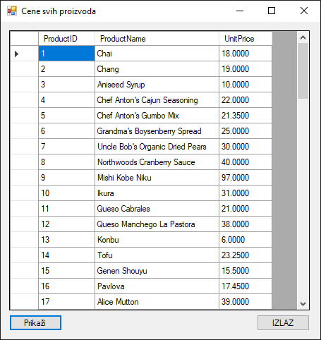

# Рад са класама

Сада је прави тренутак да се подсетиш основа објектно оријентисаног
програмирања,
[рада са класама](https://petlja.org/sr-Latn-RS/kurs/14469/3/9869) и
[изведеним класама](https://petlja.org/sr-Latn-RS/kurs/14469/5/9900). Издвајање
кода у посебне класе је једна од кључних добрих пракси при изради .NET
Framework апликација које раде са SQL Server базом података. Овај приступ
доноси бројне предности у погледу организације, одржавања, тестирања и поновне
употребе кода.

Што се раздвајања одговорности (енгл. *Separation of Concerns*) тиче, кôд који
се односи на кориснички интерфејс, логику апликације и приступ бази података
треба да буде јасно раздвојен. То олакшава одржавање и разумевање кода. Поновна
употреба кода подразумева да једном написан кôд за приступ бази може да се
користи у више делова апликације. Такође, издвојене класе се лакше тестирају
јер су изоловане, а цео пројекат постаје прегледнији и лакше га је проширивати.

Најчешће се програмери, приликом израде оваквих апликација, воде трослојном
архитектуром (енгл. *Three-Layer Architecture*). Први слој за приступ подацима
(енгл. *Data Access Layer - DAL*) треба да садржи сав кôд којим се директно
приступа бази и у њему се обично користе објекти класа `SqlConnection`,
`SqlCommand` и `SqlDataAdapter`. Други слој логике пословања (енгл.
*Business Logic Layer - BLL*) бави се обрадом правила пословања и позива методе
из слоја за приступ подацима. Трећи презентациони слој (енгл.
*Presentation Layer - UI*) одговоран је за комуникацију са корисником и позива
методе из слоја логике пословања. Ако је у питању мала апликација, други слој
се често интегрише у слој за приступ подацима или чак у презентациони слој.

На пример, нека је у питању једноставна Windows Forms апликација за преглед
цена производа из табеле `Products` у бази података Northwind.



На основу правила трослојне архитектуре, апликација би могла да поседује више
класа:

* Класа за остваривање конекције са базом података Northwind, (нпр. класа
`Konekcija`) треба да садржи само кôд који служи за повезивање на базу. На овај
начин остварујеш јасно одвајање одговорности (јер класа `Konekcija` служи само
за повезивање), лакоћу употребе (јер друге класе лако долазе до `SqlCommand`
објекта) и једну тачку за промену конекционог стринга (јер ће бити довољно да
се конекциони стринг мења само на овом месту).
* Класа података о производу (нпр. класа `Proizvod`) треба да имплементира
комуникацију са базом података извршавајући ускладиштене процедуре, односно SQL
упите. У овој класи би се креирали и користили објекти `SqlConnection`,
`SqlCommand` и `SqlDataAdapter` и мапирали подаци у објекте.
* Класа за обраду података треба да имплементира правила пословања и обради
податке пре и после приступа бази. Она може да садржи пословну логику као што
је филтрирање, валидација или трансформација података. Помоћу ње се може и
одлучивати када и како треба позивати методе из класе за приступ подацима.
Пошто се у овом случају ради о изузетно једноставној апликацији где се подаци
само приказују, нема потребе креирати ову класу.
* Класа за презентацију података (нпр. класа `CeneProizvodaForm`) треба да
имплементира контроле за приказ података, контроле за прикупљање података од
корисника, контроле за позивање метода из класе за обраду података итд.

Пре него што почнеш са креирањем класа, потребно је да напишеш ускладиштену
процедуру која ће вратити тражене податке:

```sql
SET ANSI_NULLS ON
GO
SET QUOTED_IDENTIFIER ON
GO

CREATE PROCEDURE usp_Proizvodi
AS
BEGIN
    SET NOCOUNT ON;
    SELECT ProductID, ProductName, UnitPrice FROM Products
END
GO
```

Фајл који у којем се чува конекциони стринг `App.config` може да изгледа овако:

```xml
<?xml version="1.0" encoding="utf-8" ?>
<configuration>
    <connectionStrings>
        <add name="NorthwindCS"
             connectionString="Data Source=LOCALHOST\SQLEXPRESS;Initial Catalog=Northwind;Integrated Security=True"
             providerName="System.Data.SqlClient" />
    </connectionStrings>
    <startup> 
        <supportedRuntime version="v4.0" sku=".NETFramework,Version=v4.8" />
    </startup>
</configuration>
```

Чување осетљивих или променљивих података, као што је конекциони стринг,
директно у C# коду је лоша пракса. Ако би се променила локација базе података
или параметри за приступ, морао би да мењаш кôд и поново компајлираш целу
апликацију. Управо зато се користи конфигурациони фајл `App.config`. Унутар
секције `<connectionStrings>` можеш дефинисати један или више конекционих
стрингова. Сваки има јединствено име преко којег му приступаш и саму вредност у
атрибуту `connectionString` и `providerName` који дефинише тип провајдера за
базу података.

Класа за остваривање конекције на базу података може да изгледа овако:

```cs
using System.Configuration;

namespace CeneSvihProizvoda
{
    internal class Konekcija
    {
        public static string ConnString
        {
            get
            {
                return ConfigurationManager.ConnectionStrings["NorthwindCS"].ConnectionString;
            }
        }
    }
}
```

Можеш да приметиш да ова класа изгледа изузетно једноставна и прати Принцип
јединствене одговорности (енгл. *Single Responsibility Principle*). Њен једини
задатак је да из конфигурационог фајла прочита конекциони стринг и учини га
доступним остатку апликације. За приступ `App.config` фајлу користи се
`System.Configuration.ConfigurationManager`. Својство `ConnString` је
дефинисано као `static`, што значи да не мораш да правиш инстанцу класе
`Konekcija` да би му приступио. Довољно је написати `Konekcija.ConnString` било
где у пројекту. Да би `ConfigurationManager` био доступан, потребно је у
пројекту додати референцу на `System.Configuration` склоп.

Класа података може да изгледа овако:

```cs
using System.Data;
using System.Data.SqlClient;

namespace CeneSvihProizvoda
{
    internal class Proizvod
    {
        public static DataTable Prikazi()
        {
            using (SqlConnection con = new SqlConnection(Konekcija.ConnString))
            using (SqlCommand cmd = con.CreateCommand())
            {
                cmd.CommandText = "usp_Proizvodi";
                cmd.CommandType = CommandType.StoredProcedure;
                using (SqlDataAdapter da = new SqlDataAdapter(cmd))
                {
                    DataTable dt = new DataTable();
                    da.Fill(dt);
                    return dt;
                }
            }
        }
    }
}
```

Кључна ствар у овој класи је правилно управљање ресурсима помоћу `using`
наредбе. Класе као што су `SqlConnection` и `SqlCommand` заузимају системске
ресурсе (попут мрежне конекције) које је неопходно ослободити након употребе.
`using` блок гарантује да ће `.Dispose()` метода објекта бити позвана
аутоматски, чиме се ресурси ослобађају, без обзира на то да ли је операција
успела или је дошло до грешке. Ово је сигурнији и читљивији начин од коришћења
`try-catch-finally` блока за затварање конекције.

Такође, важно је да уочиш да унутар методе `Prikazi` не постоји `try-catch`
блок. Ово је намерно! Слој за приступ подацима не би требало да буде одговоран
за приказивање грешака кориснику. Његов задатак је да покуша да изврши
операцију и, ако не успе, да "проследи" изузетак (грешку) слоју који га је
позвао. У овом случају, то је презентациони слој (форма), који ће ухватити
грешку и приказати је кориснику на одговарајући начин. На крају, метода враћа
`DataTable` објекат. Ако упит не врати ниједан ред, `DataTable` ће бити празан,
што није грешка, већ валидан резултат.

На крају, класа за презентацију података може да изгледа овако:

```cs
using System;
using System.Data;
using System.Windows.Forms;

namespace CeneSvihProizvoda
{
    public partial class CeneProizvodaForm : Form
    {
        public CeneProizvodaForm()
        {
            InitializeComponent();
        }

        private void btnPrikaz_Click(object sender, EventArgs e)
        {
            try
            {
                DataTable dt = Proizvod.Prikazi();
                if (dt.Rows.Count > 0)
                {
                    dgvCeneSvihProizvoda.DataSource = dt;
                }
                else
                {
                    dgvCeneSvihProizvoda.DataSource = null;
                    MessageBox.Show("Nema podataka o proizvodima u bazi.");
                }
            }
            catch (Exception ex)
            {
                MessageBox.Show("Došlo je do greške: " + ex.Message);
            }
        }

        private void btnIzlaz_Click(object sender, EventArgs e)
        {
            Application.Exit();
        }
    }
}
```

Кôд у класи форме, која представља презентациони слој, обједињује све што си до
сада урадио. Унутар `btnPrikaz_Click` догађаја, позив методе
`Proizvod.Prikazi()` налази се у `try-catch` блоку. Ово је право место за
руковање грешкама, јер је овај слој директно одговоран за комуникацију са
корисником. Ако током извршавања методе `Proizvod.Prikazi()` дође до било
каквог изузетка (нпр. сервер базе није доступан), он ће бити ухваћен у `catch`
блоку, а кориснику ће бити приказана порука о грешци.

Након успешног добијања података, проверава се да ли враћени `DataTable` садржи
редове (`dt.Rows.Count > 0`). Ако садржи, додељује се као извор података за
контролу `DataGridView`. У супротном, ако је табела празна, бришу се претходни
подаци из контроле (`DataSource = null`) и обавештава се корисник да подаци
нису пронађени. На овај начин, презентациони слој доноси одлуке о томе како ће
се подаци (или њихов недостатак) представити кориснику.
