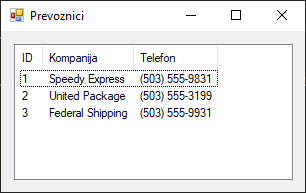
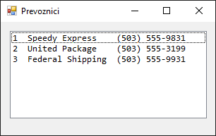
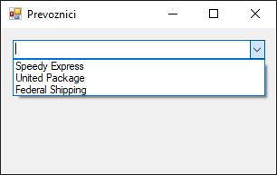

# Учитавање података из базе

У претходној лекцији научио си да је издвајање кода у посебне класе једна од
кључних добрих пракси приликом израде .NET Framework апликација које раде са
SQL Server базом података. У лекцијама које следе држаћемо се овог принципа.

Читање података из базе података је једна од четири основне CRUD (CREATE, READ,
UPDATE и DELETE) операције приликом рада са релационом базом података.
Најједноставнији случај може да буде да треба да прикажеш све податке из једне
табеле, на пример, да прикажеш све превознике из табеле `Shippers` из Northwind
базе података у ListView контроли:



Како је упит за добијање ових података једноставан и не садржи никакав
кориснички унос, задатак можеш да реализујеш и без ускладиштене процедуре
навођењем упита `SELECT` ... `FROM Shippers` у самој апликацији. Конфигурациони
фајл у којем се чува конекциони стринг...

```xml
<?xml version="1.0" encoding="utf-8" ?>
<configuration>
    <connectionStrings>
        <add name="NorthwindCS"
             connectionString="Data Source=LOCALHOST\SQLEXPRESS;Initial Catalog=Northwind;Integrated Security=True"
             providerName="System.Data.SqlClient" />
    </connectionStrings>
    <startup>
        <supportedRuntime version="v4.0" sku=".NETFramework,Version=v4.8" />
    </startup>
</configuration>
```

...и класу за остваривање конекције са базом података...

```cs
using System.Configuration;

namespace Prevoznici
{
    internal class Konekcija
    {
        public static string ConnString
        {
            get
            {
                return ConfigurationManager.ConnectionStrings["NorthwindCS"].ConnectionString;
            }
        }
    }
}
```

...можеш да дефинишеш као и у преходној лекцији. Класа `Prevoznik`, која служи
и као модел података и као слој за приступ подацима, може изгледати овако:

```cs
using System;
using System.Collections.Generic;
using System.Data;
using System.Data.SqlClient;

namespace Prevoznici
{
    internal class Prevoznik
    {
        public int ShipperID { get; set; }
        public string CompanyName { get; set; }
        public string Phone { get; set; }

        public static List<Prevoznik> UcitajSve()
        {
            List<Prevoznik> prevoznici = new List<Prevoznik>();
            using (SqlConnection con = new SqlConnection(Konekcija.ConnString))
            using (SqlCommand cmd = con.CreateCommand())
            {
                cmd.CommandText = "SELECT ShipperID, CompanyName, Phone FROM Shippers";
                SqlDataAdapter da = new SqlDataAdapter(cmd);
                DataTable dt = new DataTable();
                da.Fill(dt);
                foreach (DataRow dr in dt.Rows)
                {
                    Prevoznik p = new Prevoznik();
                    p.ShipperID = Convert.ToInt32(dr["ShipperID"]);
                    p.CompanyName = dr["CompanyName"].ToString();
                    p.Phone = dr["Phone"].ToString();
                    prevoznici.Add(p);
                }
            }
            return prevoznici;
        }
    }
}
```

Класа `Prevoznik` има двоструку улогу у овом једноставном примеру. Прво, са
својим својствима (`ShipperID`, `CompanyName`, `Phone`), она представља модел
података – C# репрезентацију једног реда из табеле `Shippers`. Друго, са својом
статичком методом `UcitajSve()`, она преузима улогу слоја за приступ подацима,
вршећи комуникацију са базом.

Можеш да уочиш неколико кључних свари у овој класи. Метода `UcitajSve()` увек
враћа `List<Prevoznik>`. Ако табела `Shippers` нема података, метода ће вратити
празну листу, што је предвидљиво и сигурно понашање. Овде нема `try-catch`
блока јер је одговорност UI слоја да обрађује грешке настале приликом
комуникације са базом. Такође, експлицитно су наведене колоне у `SELECT` упиту
уместо коришћења `SELECT *`, што је добра пракса јер чини упит јаснијим и
отпорнијим на промене у структури табеле.

Коначно, у класи форме која чини наш презентациони слој, позива се метода
`UcitajSve()` и приказују добијени подаци. Од кључне је важности да се сав кôд
који може изазвати грешку (попут комуникације са базом) стави унутар try-catch
блока.

```cs
using System;
using System.Collections.Generic;
using System.Windows.Forms;

namespace Prevoznici
{
    public partial class Form1 : Form
    {
        public Form1()
        {
            InitializeComponent();
        }

        private void Form1_Load(object sender, EventArgs e)
        {
            lstPrevoznici.View = View.Details;
            lstPrevoznici.Columns.Clear();
            lstPrevoznici.Items.Clear();
            lstPrevoznici.Columns.Add("ID", 50);
            lstPrevoznici.Columns.Add("Kompanija", 150);
            lstPrevoznici.Columns.Add("Telefon", 100);
            lstPrevoznici.FullRowSelect = true;
            try
            {
                List<Prevoznik> prevoznici = Prevoznik.UcitajSve();
                if (prevoznici.Count > 0)
                {
                    foreach (Prevoznik p in prevoznici)
                    {
                        ListViewItem item = new ListViewItem(p.ShipperID.ToString());
                        item.SubItems.Add(p.CompanyName);
                        item.SubItems.Add(p.Phone);
                        lstPrevoznici.Items.Add(item);
                    }
                }
                else
                {
                    MessageBox.Show("Nema podataka o prevoznicima.");
                }
            }
            catch (Exception ex)
            {
                MessageBox.Show("Došlo je do greške prilikom učitavanja podataka: " + ex.Message);
            }
        }
    }
}
```

За разлику од `ListView` контроле, `ListBox` и `ComboBox` приказују само једну
вредност по ставци. Најбржи начин да се подаци прикажу јесте да се листа
објеката директно додели `DataSource` својству контроле. Када се то уради,
контрола ће за сваки објекат у листи позвати његову `ToString()` методу како би
одлучила шта да прикаже.

Ако треба да прикажеш резултате у контроли `ListBox`...



...онда је најједноставније да надјачаш методу `ToString()` у класи `Prevoznik`
овако...

```cs
public override string ToString()
{
    return String.Format("{0,-3}{1,-18}{2,-16}", ShipperID, CompanyName, Phone);
}
```

...и притом обратиш пажњу на највећу могућу ширину података у формату стринга.
Након тога можеш да, у класи за UI, употребиш `ListBox` уместо `ListView`...

```cs
private void Form1_Load(object sender, EventArgs e)
{
    List<Prevoznik> prevoznici = Prevoznik.UcitajSve();
    lstPrevoznici.Font = new Font("Consolas", 10);
    lstPrevoznici.DataSource = prevoznici;
    lstPrevoznici.SelectedIndex = -1;
}
```

...где треба да обратиш пажњу да је неопходно да користиш *моноширинске* (енгл.
*monospaced* или *fixed-width*) фонтове попут `Terminal`, `Courier New`,
`Consolas` итд.

Ако је потребно да се резултати прикажу у контроли `ComboBox`, на пример,
вредности из колоне `CompanyName`...



...надјачана метода `ToString()` у класи `Prevoznik` могла би да изгледа
једноставно овако...

```cs
public override string ToString()
{
    return CompanyName;
}
```

...а кôд у класи за UI овако:

```cs
private void Form1_Load(object sender, EventArgs e)
{
    List<Prevoznik> prevoznici = Prevoznik.UcitajSve();
    cmbPrevoznici.DataSource = prevoznici;
    cmbPrevoznici.SelectedIndex = -1;
}
```

Учитавање података из базе података и приказ у контролама `DataGridView` и
`Chart`, биће тема у некој од наредних лекција.
