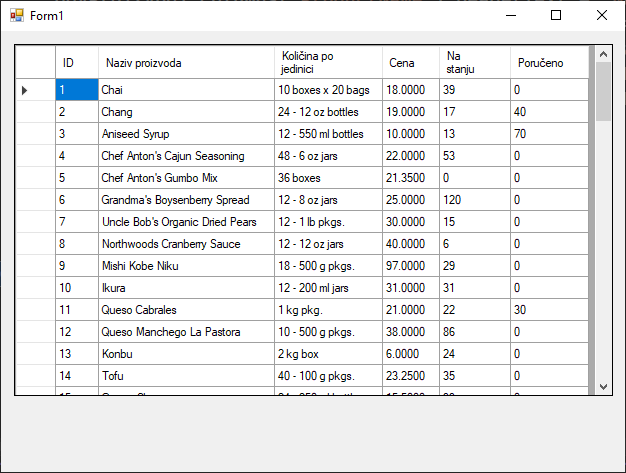
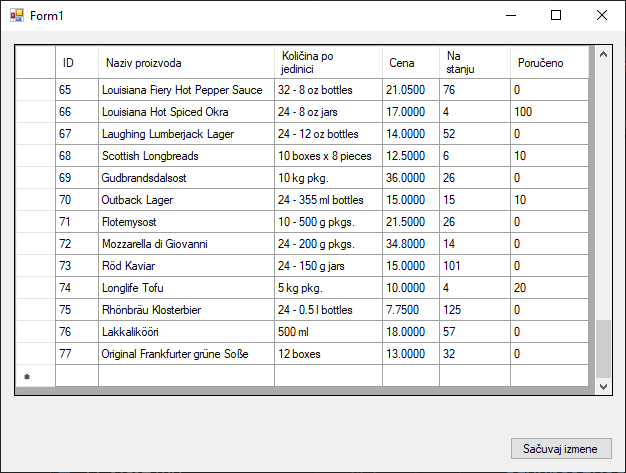

# Коришћење контроле DataGridView

До сада је фокус бито на томе како да на сигуран и организован начин дођеш до
података из базе. Научио си да креираш слој за приступ подацима који враћа
податке у облику објеката. Сада је време да истражиш како да те податке
представиш кориснику на различите, визуелно привлачне и функционалне начине.

У оквиру Windows Forms (.NET Framework) пројекта доступан је богат скуп
контрола за приказ података. У овој лекцији, научићеш да радиш са четири
најчешће коришћене:

* `DataGridView` за детаљан, табеларни приказ података,
* `ListView` за флексибилан приказ који може бити у форми листе, детаља или
иконица,
* `Chart` за графички приказ података, идеалан за визуелизацију и
* `TreeView` за хијерархијски приказ података, као што су категорије и
производи.

За потребе ове лекције, користићеш податке из табеле `Products` из базе
података Northwind, укључујући и називе категорија. Претпоставимо да си за овај
задатак применио до сада научено: написао ускладиштену процедуру...

```sql
GO
SET ANSI_NULLS ON
GO
SET QUOTED_IDENTIFIER ON
GO

CREATE PROCEDURE usp_Proizvodi
AS
BEGIN
    SELECT ProductID, ProductName, QuantityPerUnit, UnitPrice, UnitsInStock, UnitsOnOrder
    FROM Products
END
```

...унео конекциони стринг у `App.config`...

```xml
<?xml version="1.0" encoding="utf-8" ?>
<configuration>
    <connectionStrings>
        <add name="NorthwindCS"
             connectionString="Data Source=LOCALHOST\SQLEXPRESS;Initial Catalog=Northwind;Integrated Security=True"
             providerName="System.Data.SqlClient" />
    </connectionStrings>
    <startup>
        <supportedRuntime version="v4.0" sku=".NETFramework,Version=v4.8" />
    </startup>
</configuration>
```

...креирао класу `Konekcija`...

```cs
using System.Configuration;

namespace KontroleZaPrikazPodataka
{
    internal class Konekcija
    {
        public static string ConnString
        {
            get
            {
                return ConfigurationManager.ConnectionStrings["NorthwindCS"].ConnectionString;
            }
        }
    }
}
```

...и креирао класу `Proizvod` са методом `Proizvod.UcitajSve()` који враћа
`List<Proizvod>`:

```cs
using System;
using System.Data;
using System.Data.SqlClient;
using System.Collections.Generic;

namespace KontroleZaPrikazPodataka
{
    internal class Proizvod
    {
        public int ProductID { get; set; }
        public string ProductName { get; set; }
        public string QuantityPerUnit { get; set; }
        public decimal UnitPrice { get; set; }
        public short UnitsInStock { get; set; }
        public short UnitsOnOrder { get; set; }

        public static List<Proizvod> UcitajSve()
        {
            List<Proizvod> proizvodi = new List<Proizvod>();
            using (SqlConnection con = new SqlConnection(Konekcija.ConnString))
            using (SqlCommand cmd = con.CreateCommand())
            {
                cmd.CommandText = "usp_Proizvodi";
                cmd.CommandType = CommandType.StoredProcedure;
                SqlDataAdapter da = new SqlDataAdapter(cmd);
                DataTable dt = new DataTable();
                da.Fill(dt);
                foreach (DataRow dr in dt.Rows)
                {
                    Proizvod p = new Proizvod();
                    p.ProductID = Convert.ToInt32(dr["ProductID"]);
                    p.ProductName = dr["ProductName"].ToString();
                    p.QuantityPerUnit = dr["QuantityPerUnit"].ToString();
                    p.UnitPrice = Convert.ToDecimal(dr["UnitPrice"]);
                    p.UnitsInStock = Convert.ToInt16(dr["UnitsInStock"]);
                    p.UnitsOnOrder = Convert.ToInt16(dr["UnitsOnOrder"]);
                    proizvodi.Add(p);
                }
            }
            return proizvodi;
        }
    }
}
```

## Контрола DataGridView

[`DataGridView`](https://learn.microsoft.com/en-us/dotnet/api/system.windows.forms.datagridview?view=netframework-4.8)
је најмоћнија и најлакша контрола за приказ табеларних података.
Њена највећа предност је што може директно да се повеже са извором података
(као што је `List<Proizvod>`) и аутоматски генерише колоне и редове. Потребно
је да само доделиш листу података `DataSource` својству контроле.

Из ToolBox-а превуци контролу `DataGridView` на форму и подеси својство `Name`
на нпр. `dgvProizvodi`. Можеш поставити и својство
`DataGridViewAutoSizeColumnsMode` на `AllCells` како би се аутоматски одредила
ширина свих ћелија на основу садржаја у ћелијама и својство `ReadOnly` на
`true` ако је потребан само приказ података.

Након тога, можеш да доделиш листу података `DataSource` својству контроле,
имајући у виду да свака операција која укључује комуникацију са базом података
треба бити у `try-catch` блоку унутар презентационог слоја. То може да изгледа
овако:

```cs
private void Form1_Load(object sender, EventArgs e)
{
    try
    {
        List<Proizvod> proizvodi = Proizvod.UcitajSve();
        if (proizvodi != null && proizvodi.Count > 0)
        {
            dgvProizvodi.DataSource = proizvodi;
            dgvProizvodi.Columns["ProductID"].HeaderText = "ID";
            dgvProizvodi.Columns["ProductName"].HeaderText = "Naziv proizvoda";
            dgvProizvodi.Columns["QuantityPerUnit"].HeaderText = "Količina po jedinici";
            dgvProizvodi.Columns["UnitPrice"].HeaderText = "Cena";
            dgvProizvodi.Columns["UnitsInStock"].HeaderText = "Na stanju";
            dgvProizvodi.Columns["UnitsOnOrder"].HeaderText = "Poručeno";
        }
        else
        {
            MessageBox.Show("Nema podataka o proizvodima u bazi.");
        }
    }
    catch (Exception ex)
    {
        MessageBox.Show("Greška prilikom učitavanja podataka: " + ex.Message);
    }
}
```



На догађај учитавања форме, подаци из базе биће приказани у `DataGridView`
контроли. Ако подаци не постоје у бази или се деси грешка приликом учитавања
података, корисник ће о томе бити обавештен.

`DataGridView` подржава уређивање података у табели, али уређивање ће имати
ефекта само ако је извор података везан за базу преко објекта који то подржава,
на пример објекта `DataTable`. Када је као `DataSource` постављен `List<T>`,
као у овом примеру (`List<Proizvod>`), довање, ажурирање и измене података у
табели неће аутоматски утицати на базу. Све ово мораш "ручно" обрадити и након
тога извршити ажурирање над базом.

ADO.NET нуди и моћнији, аутоматизованији начин рада који је идеалан за брзу
израду апликација за управљање подацима. Овај приступ се ослања на сарадњу три
кључне компоненте:

* `DataTable` - објекат који у меморији апликације представља тачну копију
једне табеле из базе података. Он "зна" који редови су додати, измењени или
обрисани.
* `SqlDataAdapter` - служи као "мост" између `DataTable` објекта у апликацији и
стварне табеле у SQL Server бази. Његов задатак је да попуни `DataTable`
подацима и да касније проследи све измене назад у базу.
* `SqlCommandBuilder` - је помоћна класа која ради у позадини. Када јој се
проследи `SqlDataAdapter`, она аутоматски генерише потребне SQL команде
(INSERT, UPDATE, DELETE) на основу SELECT упита који је задат. Ово те ослобађа
писања тих команди.

Како ове компоненте раде заједно у једноставном практичном примеру? Нека се сав
кôд налази унутар форме, што није препоручена пракса за веће апликације, али је
одлична за демонстрацију рада са контролом `DataGridView`.

```cs
public partial class Form1 : Form
{
    private SqlDataAdapter da;
    private DataTable dt;

    public Form1()
    {
        InitializeComponent();
    }

    private void Form1_Load(object sender, EventArgs e)
    {
        string conStr = "Data Source=LOCALHOST\\SQLEXPRESS;Initial Catalog=Northwind;Integrated Security=True";
        SqlConnection con = new SqlConnection(conStr);
        da = new SqlDataAdapter("SELECT ProductID, ProductName, QuantityPerUnit, UnitPrice, UnitsInStock, UnitsOnOrder FROM Products", con);
        SqlCommandBuilder builder = new SqlCommandBuilder(da);
        dt = new DataTable();
        da.Fill(dt);
        dgvProizvodi.DataSource = dt;
        dgvProizvodi.Columns["ProductID"].ReadOnly = true;
        dgvProizvodi.Columns["ProductID"].HeaderText = "ID";
        dgvProizvodi.Columns["ProductName"].HeaderText = "Naziv proizvoda";
        dgvProizvodi.Columns["QuantityPerUnit"].HeaderText = "Količina po jedinici";
        dgvProizvodi.Columns["UnitPrice"].HeaderText = "Cena";
        dgvProizvodi.Columns["UnitsInStock"].HeaderText = "Na stanju";
        dgvProizvodi.Columns["UnitsOnOrder"].HeaderText = "Poručeno";
        dgvProizvodi.SelectionMode = DataGridViewSelectionMode.FullRowSelect;
        dgvProizvodi.AllowUserToAddRows = true;
        dgvProizvodi.AllowUserToDeleteRows = true;
        dgvProizvodi.EditMode = DataGridViewEditMode.EditOnKeystrokeOrF2;
    }

    private void button1_Click(object sender, EventArgs e)
    {
        try
        {
            da.Update(dt);
            MessageBox.Show("Izmene su sačuvane u bazi podataka.");
        }
        catch (Exception ex)
        {
            MessageBox.Show("Greška pri čuvanju: " + ex.Message);
        }
    }
}
```

Када се апликација покрене, дешава се следеће:

1. `da.Fill(dt)` - `SqlDataAdapter` отвара конекцију, извршава SELECT упит и
све резултате учитава у `DataTable` објекат `dt`. Након тога, конекција се
затвара. Апликација сада ради са подацима у меморији.
2. `dgvProizvodi.DataSource = dt` - `DataGridView` се повезује на `DataTable`.
Захваљујући овом "живом" повезивању, свака промена коју корисник направи у
табели контроле `DataGridView` (уређивање ћелије, додавање новог реда, брисање
реда) аутоматски се одражава на стање `DataTable` објекта у меморији.
3. `button1_Click` - када корисник кликне на дугме, позива се `da.Update(dt)`.
`SqlDataAdapter` тада анализира `DataTable`, проналази све редове који су
измењени, додати или обрисани од последњег `Fill` или `Update` позива, и за
сваки од њих извршава одговарајућу SQL команду (UPDATE, INSERT или DELETE) коју
је `SqlCommandBuilder` претходно припремио.



Овај приступ је изузетно ефикасан за брзу израду апликација где је потребно
омогућити кориснику да директно манипулише подацима у табели. Он аутоматизује
већину посла, али по цену мање флексибилности у поређењу са ручним приступом
који си користио у првом примеру.
