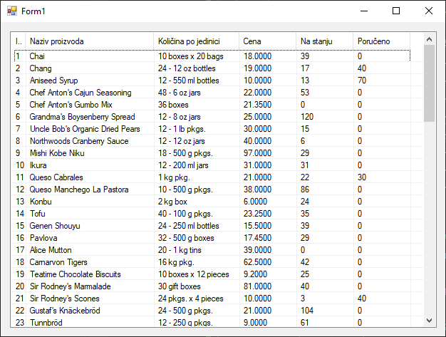
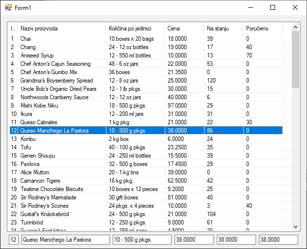

# Контрола ListView

За разлику од `DataGridView` контроле која је специјализована за табеларни
приказ, `ListView` је много флексибилнија контрола. Она може приказати податке
на више начина, од којих су најчешће коришћени:

* `LargeIcon`, приказује велике иконице са текстом испод,
* `SmallIcon`, приказује мале иконице са текстом поред,
* `List`, приказује једноставну листу ставки у једној колони и
* `Details`, приказује податке у више колона, слично табели.

Управо ова флексибилност има своју цену - `ListView` контрола не подржава
директно повезивање са извором података преко `DataSource` својства. Уместо
тога, мораш "ручно" да прођеш кроз листу података и за сваки објекат креираш и
додаш одговарајућу ставку (`ListViewItem`) у контролу. Ово захтева више кода,
али ти даје потпуну контролу над приказом.

Како се у овом поглављу бавиш израдом апликација које раде са базама података,
фокус ће бити на `Details` приказу. `Details` режим је најчешће коришћен када
желиш да прикажеш више информација о свакој ставци. Процес се састоји из три
корака:

1. Подешавање контроле - потребно је да подесиш `View` својство на `Details` и
дефинишеш колоне које желимо да прикажемо (у коду или у дизајнеру).
2. Пролазак кроз податке - помоћу foreach петље треба да прођеш кроз сваки
`Proizvod` у листи.
3. Креирање ставки - за сваки производ, креираћеш `ListViewItem` и додати му
под-ставке (`SubItems`) за сваку додатну колону.

Из ToolBox-а превуци контролу `ListView` на форму и подеси својство `Name` на
нпр. `lvProizvodi`. У догађају учитавања форме, имплементираћеш горе наведену
логику (претпоставка је да већ имаш написану ускладиштену процедуру, подешен
конекциони стринг у `AppConfig` фајлу, и написане класе `Konekcija` и
`Proizvod` из претходне лекције).

```cs
private void Form1_Load(object sender, EventArgs e)
{
    lvProizvodi.View = View.Details;
    lvProizvodi.GridLines = true;
    lvProizvodi.FullRowSelect = true;
    lvProizvodi.Columns.Add("ID", 20);
    lvProizvodi.Columns.Add("Naziv proizvoda", 180);
    lvProizvodi.Columns.Add("Količina po jedinici", 120);
    lvProizvodi.Columns.Add("Cena", 80);
    lvProizvodi.Columns.Add("Na stanju", 80);
    lvProizvodi.Columns.Add("Poručeno", 80);
    try
    {
        List<Proizvod> proizvodi = Proizvod.UcitajSve();
        if (proizvodi != null && proizvodi.Count > 0)
        {
            foreach (Proizvod p in proizvodi)
            {
                ListViewItem item = new ListViewItem(p.ProductID.ToString());
                item.SubItems.Add(p.ProductName);
                item.SubItems.Add(p.QuantityPerUnit);
                item.SubItems.Add(p.UnitPrice.ToString());
                item.SubItems.Add(p.UnitsInStock.ToString());
                item.SubItems.Add(p.UnitsOnOrder.ToString());
                lvProizvodi.Items.Add(item);
            }
        }
        else
        {
            MessageBox.Show("Nema podataka o proizvodima u bazi.");
        }
    }
    catch (Exception ex)
    {
        MessageBox.Show("Greška prilikom učitavanja podataka: " + ex.Message);
    }
}
```

Резултат извршавања овог кода биће детаљан приказ производа у више колона.



За разлику од `DataGridView` контроле која је повезана са `DataTable` објектом
и може аутоматски да прати измене, `ListView` контрола не поседује ни сличне
могућности. Она само приказује податке и не зна ништа о њиховом пореклу. То
значи да свака интеракција, попут читања података из селектованог реда,
додавања, ажурирања или брисања, мора бити ручно имплементирана.

Како би онда направио класичну апликацију за управљање подацима користећи
контролу `ListView`? Апликација би требала да има `ListView` за приказ свих
производа, `TextBox` контроле за приказ и измену података селектованог
производа и дугмад за додавање, ажурирање и брисање.

Први корак је да, када корисник кликне на неки ред у `ListView` контроли, ти
прочиташ податке из тог реда и прикажеш их у `TextBox` контролама. За ово ћеш
користити догађај `SelectedIndexChanged`. Међутим, како да знаш који производ
одговара ком реду? Најбољи приступ је да у сваки `ListViewItem` сакријеш ID
производа (или чак цео објекат `Proizvod`). Сваки `ListViewItem` има својство
`Tag` које је типа `object` и служи управо за чување додатних података. Измени
`Form1_Load` методу тако да у `Tag` својству сваке ставке буде смештем ID
производа, додавањем линије `item.Tag = p.ProductID;` у foreach петљи.

Када си то урадио, у `SelectedIndexChanged` догађају, можеш лако доћи до ID-ја
изабраног производа:

```cs
private void lvProizvodi_SelectedIndexChanged(object sender, EventArgs e)
{
    if (lvProizvodi.SelectedItems.Count > 0)
    {
        ListViewItem selektovanaStavka = lvProizvodi.SelectedItems[0];
        txtID.Text = selektovanaStavka.SubItems[0].Text;
        txtNaziv.Text = selektovanaStavka.SubItems[1].Text;
        txtKolicina.Text = selektovanaStavka.SubItems[2].Text;
        txtCena.Text = selektovanaStavka.SubItems[3].Text;
        txtStanje.Text = selektovanaStavka.SubItems[3].Text;
        txtPoruceno.Text = selektovanaStavka.SubItems[3].Text;
    }
    else
    {
        txtID.Clear();
        txtNaziv.Clear();
        txtKolicina.Clear();
        txtCena.Clear();
        txtStanje.Clear();
        txtPoruceno.Clear();
    }
}
```

Сада ће се кликом на одређени производ попунити `TextBox` контроле са подацима
о том производу:



Да би изменио податке у неком реду, корисник треба кликне на тај ред, потом
измени податке у `TextBox` контролама и кликне на дугме `Izmeni`. Под
претпоставком да си у класи `Proizvod` написао методу за ажурирање производа,
кôд би могао да изгледа овако:

```cs
private void btnIzmeni_Click(object sender, EventArgs e)
{
    if (lvProizvodi.SelectedItems.Count == 0)
    {
        MessageBox.Show("Odaberite proizvod za izmenu.");
        return;
    }
    try
    {
        int id = int.Parse(txtID.Text);
        string naziv = txtNaziv.Text;
        string kolicina = txtKolicina.Text;
        decimal cena = decimal.Parse(txtCena.Text);
        short stanje = short.Parse(txtStanje.Text);
        short poruceno = short.Parse(txtPoruceno.Text);

        // Proizvod.Izmeni(id, naziv, ...);
        
        ListViewItem stavka = lvProizvodi.SelectedItems[0];
        stavka.SubItems[1].Text = naziv;
        stavka.SubItems[2].Text = kolicina;
        stavka.SubItems[3].Text = cena.ToString();
        stavka.SubItems[4].Text = stanje.ToString();
        stavka.SubItems[5].Text = poruceno.ToString();
        MessageBox.Show("Podaci su uspešno izmenjeni.");
    }
    catch (Exception ex)
    {
        MessageBox.Show("Greška prilikom izmene: " + ex.Message);
    }
}
```

Додавање новог реда је слично, али уместо измене постојећег реда, креира се
потпуно нови `ListViewItem`. Након што корисник попуни празна поља за нови
производ, осим поља ID, позива се метода за додавање у базу која треба да
врати ID унетог производа, па се након тога креира нови `ListViewItem` и додаје
на крају листе. Под претпоставком да си у класи `Proizvod` написао методу за
додавање новог производа, кôд би могао да изгледа овако:

```cs
private void btnDodaj_Click(object sender, EventArgs e)
{
    if (txtID.Text != String.Empty)
    {
        MessageBox.Show("Polje ID mora biti prazno.");
        return;
    }
    try
    {
        string naziv = txtNaziv.Text;
        string kolicina = txtKolicina.Text;
        decimal cena = decimal.Parse(txtCena.Text);
        short stanje = short.Parse(txtStanje.Text);
        short poruceno = short.Parse(txtPoruceno.Text);

        // int noviId = Proizvod.Dodaj(naziv, ...);

        ListViewItem noviProizvod = new ListViewItem(noviId.ToString());
        noviProizvod.SubItems.Add(naziv);
        noviProizvod.SubItems.Add(kolicina);
        noviProizvod.SubItems.Add(cena.ToString());
        noviProizvod.SubItems.Add(stanje.ToString());
        noviProizvod.SubItems.Add(poruceno.ToString());
        noviProizvod.Tag = noviId;
        lvProizvodi.Items.Add(noviProizvod);
        MessageBox.Show("Novi proizvod je uspešno dodat.");
    }
    catch (Exception ex)
    {
        MessageBox.Show("Greška pri dodavanju: " + ex.Message);
    }
}
```

Брисање је најједноставнике. Када корисник одабере производ позива се метода
за брисање из базе, и ако је то успешно, брише се одговарајући `ListViewItem`
из контроле. Под претпоставком да си у класи `Proizvod` написао методу за
брисање производа, кôд би могао да изгледа овако:

```cs
private void btnObrisi_Click(object sender, EventArgs e)
{
    if (lvProizvodi.SelectedItems.Count == 0)
    {
        MessageBox.Show("Morate prvo izabrati proizvod za brisanje.");
        return;
    }
    if (MessageBox.Show("Da li ste sigurni?", "Potvrda brisanja", MessageBoxButtons.YesNo) == DialogResult.No)
    {
        return;
    }
    try
    {
        ListViewItem stavka = lvProizvodi.SelectedItems[0];
        int id = (int)stavka.Tag;

        // Proizvod.Obrisi(id);

        lvProizvodi.Items.Remove(stavka);
        MessageBox.Show("Proizvod je uspešno obrisan.");
    }
    catch (Exception ex)
    {
        MessageBox.Show("Greška prilikom brisanja: " + ex.Message);
    }
}
```

Рад са `ListView` контролом захтева од тебе да будеш много експлицитнији. Свака
промена података у бази мора бити праћена одговарајућом променом у самој
контроли. Ово "ручно" синхронизовање је главна разлика у односу на
аутоматизовани приступ који смо имао код `DataGridView`-а када је повезан са
`DataTable` објектом.
