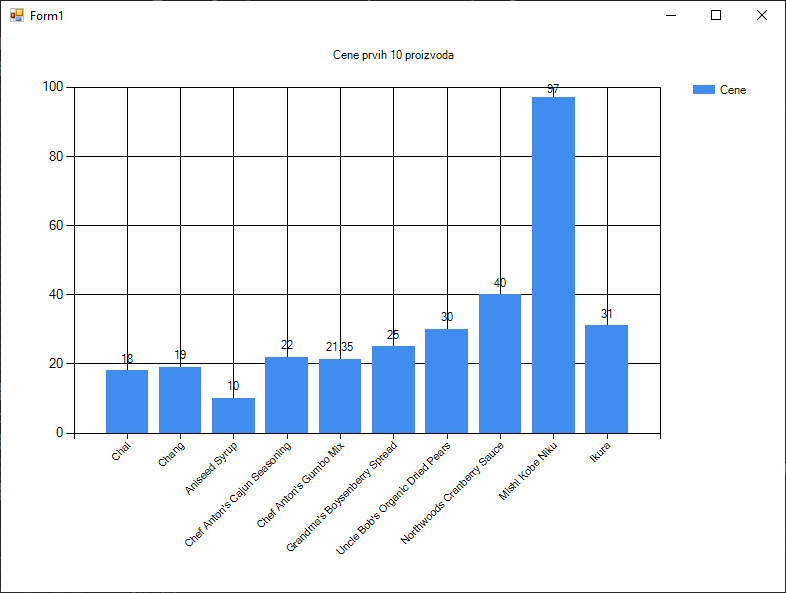
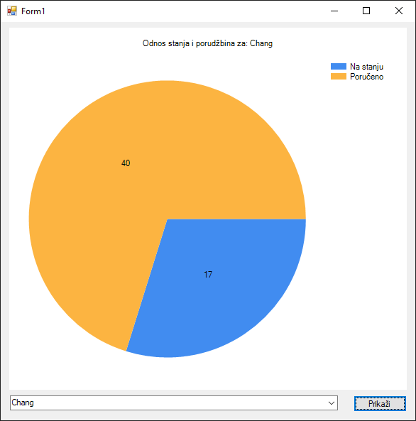

# Визуализација података контролом Chart

Док су `DataGridView` и `ListView` одличне контроле за приказ табеларних
података, људски мозак много лакше и брже обрађује визуелне информације. Табела
са стотинама редова може бити тешка за тумачење, али један добро осмишљен
графикон може у трену открити трендове, односе и аномалије.

Управо ту на сцену ступа контрола
[`Chart`](https://learn.microsoft.com/en-us/dotnet/api/system.windows.forms.datavisualization.charting.chart?view=netframework-4.8).
Она је моћан алат у Windows Forms апликацијама који омогућава креирање широког
спектра графикона, од једноставних стубичастих и кружних, до комплексних
финансијских и статистичких дијаграма. Заправо контрола `Chart` "личи" на
графикониме креиране у апликацијама за табеларне прорачуне попут апликације
Microsoft Excel.

Да би разумео како се `Chart` контрола користи, важно је да познајеш њене
кључне компоненте:

* `Titles` представља колекцију наслова који се приказују на графикону.
* `ChartAreas` представља површину на којој се црта графикон. Свака `ChartArea`
има своје осе (X и Y), мрежу (*grid*) и позадину. Један `Chart` може имати више
`ChartArea`.
* `Series` је најважнији део и представља скуп тачака података које се
приказују на графикону (нпр. једна серија може представљати продају по
месецима). Свака серија има свој тип графикона (`ChartType`), боју, и податке.
* `Legends` представља колекцију легенди које објашњавају значење различитих
серија на графикону.

Нека је задатак да направиш једноставан стубичасти графикон који ће приказати
цене првих 10 производа из базе. Користићеш исту класу `Proizvod` и метод
`UcitajSve()` као у претходним лекцијама.

Слично као `DataGridView`, контрола `Chart` подржава директно повезивање са
извором података преко `DataSource` својства. Кључно је да јој дефинишеш која
својства објекта `Proizvod` треба да користи за X осу, а која за Y осу. Превуци
Chart контролу на форму, па у `Form_Load` догађају унеси следећи кôд:

```cs
private void Form1_Load(object sender, EventArgs e)
{
    try
    {
        List<Proizvod> proizvodi = Proizvod.UcitajSve().Take(10).ToList();
        chart1.Series.Clear();
        chart1.Titles.Clear();
        chart1.Titles.Add("Cene prvih 10 proizvoda");
        Series serijaCene = chart1.Series.Add("Cene");
        serijaCene.ChartType = SeriesChartType.Column;
        chart1.DataSource = proizvodi;
        serijaCene.XValueMember = "ProductName";
        serijaCene.YValueMembers = "UnitPrice";
        chart1.ChartAreas[0].AxisX.Interval = 1;
        chart1.ChartAreas[0].AxisX.LabelStyle.Angle = -45;
        serijaCene.IsValueShownAsLabel = true;
    }
    catch (Exception ex)
    {
        MessageBox.Show("Greška prilikom učitavanja podataka: " + ex.Message);
    }
}
```

Прво су учитани сви производи и "узето" је првих десет. Потом су "очишћени"
претходни подаци, уколико постоје, додат је наслов `"Cene prvih 10 proizvoda"`
и креирана је серија `Cene` са стубичастим типом графикона. Као `DataSource`
додељено је првих десет производа, па су мапиране X и Y осе - X за незиве
производа и Y за цене производа.

Један од најчешћих проблема са којим се сусрећу програмери када први пут раде
са `Chart` контролом јесте уграђена функционалност `Chart` контроле која
аутоматски сакрива називе на оси како би спречила њихово преклапање. Када има
много тачака података на X-оси, контрола "закључи" да нема довољно простора да
их све прикаже читљиво и зато приказује само неке. Срећом, постоји једноставно
решење. Можеш експлицитно "наредити" контроли да не буде "паметна" и да прикаже
лабелу за сваку тачку (`Interval = 1`), а можеш и да накривиш лабеле на X оси
ради боље читљивости (`LabelStyle.Angle = -45`). На крају су цене додате као
лабеле на врховима стубића (`IsValueShownAsLabel = true`).



Пита графикони су идеални за приказ удела појединих делова у целини. Нека је
задатак да направиш графикон који за један изабрани производ приказује однос
између броја јединица на стању (`UnitsInStock`) и броја поручених јединица
(`UnitsOnOrder`). У овом примеру, немој да користиш DataSource, већ ће можеш
ручно да додаш тачке података у серију. Ово ти даје фину контролу када извор
података није директно у листи објеката. Претпоставимо да на форми имаш један
`ComboBox` који је попуњен свим производима и дугме "Prikaži".

```cs
private void Form1_Load(object sender, EventArgs e)
{
    List<Proizvod> proizvodi = Proizvod.UcitajSve();
    cmbProizvodi.DataSource = proizvodi;
}

private void cmbProizvodi_SelectedIndexChanged(object sender, EventArgs e)
{
    if (cmbProizvodi.SelectedItem is Proizvod izabraniProizvod)
    {
        chart1.Series.Clear();
        chart1.Titles.Clear();
        chart1.Titles.Add($"Odnos stanja i porudžbina za: {izabraniProizvod.ProductName}");
        Series serijaStanje = chart1.Series.Add("StanjeVsPorudzbine");
        serijaStanje.ChartType = SeriesChartType.Pie; // Tip: kružni
        serijaStanje.Points.AddXY("Na stanju", izabraniProizvod.UnitsInStock);
        serijaStanje.Points.AddXY("Poručeno", izabraniProizvod.UnitsOnOrder);
        serijaStanje.IsValueShownAsLabel = true;
        chart1.Legends[0].Enabled = true;
    }
    else
    {
        MessageBox.Show("Morate prvo izabrati proizvod.");
    }
}
```

Овај приступ ти омогућава да динамички креираш графиконе на основу корисничког
уноса.



`Chart` контрола је изузетно моћан алат за трансформисање сувопарних табеларних
података у смислене визуелне приказе. Било да користиш директно повезивање са
извором података или ручно додајеш тачке, могућности су огромне.
Експериментисањем са различитим типовима графикона (SeriesChartType), бојама,
легендама и стиловима оса, можеш креирати професионалне и информативне графике
у оквиру твоје Windows Forms апликације.
