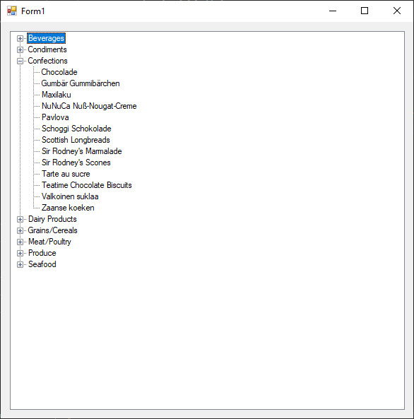
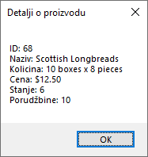

# Хијерархијски приказ података

У претходним лекцијама видео си како да прикажеш податке у табелама, листама и
графиконима. Међутим, многи подаци у стварном свету имају природну
хијерархијску структуру – структуру где постоје "родитељски" и "дечији"
елементи. Примери су свуда око тебе:

* Директоријуми и фајлови на рачунару.
* Организациона шема у компанији.
* Категорије, подкатегорије и производи у интернет продавници.

За приказ оваквих података, контрола
[`TreeView`](https://learn.microsoft.com/en-us/dotnet/api/system.windows.forms.treeview?view=netframework-4.8)
је идеалан алат. Она приказује податке у облику стабла, где се свака грана може
проширити или скупити како би се приказали или сакрили њени дечији елементи.

`TreeView` контрола је релативно једноставна. Цела структура се састоји од
објеката типа `TreeNode`. Значи:

* `TreeView` је главна контрола. Њено својство `Nodes` садржи колекцију чворова
највишег нивоа тј. коренских чворова.
* `TreeNode` представља један чвор у стаблу. Сваки TreeNode има:
  * `Text` - текст који се приказује кориснику,
  * `Nodes` - колекцију сопствених, дечијих чворова и
  * `Tag` - својство за чување додатних података (нпр. ID објекта).

Слично као `ListView`, ни `TreeView` не подржава директно повезивање са извором
података. Мораш ручно да прођеш кроз податке и да изградиш хијерархију чворова.

Нека је задатак да прикажеш све производе из базе, али груписане по њиховим
категоријама. Свака категорија ће бити родитељски чвор, а производи унутар те
категорије биће његови дечији чворови.

Да би ово постигао, прво мораш имати податке који садрже и назив производа и
назив категорије. Потребно је да измениш или креираш нову ускладиштену
процедуру и класу `Proizvod` тако да укључују и `CategoryName`. За измену
ускладиштене процедуре можеш користити `INNER JOIN` да спојиш табеле `Products`
и `Categories`...

```sql
CREATE PROCEDURE usp_Kat_Proizvodi
AS
BEGIN
    SELECT 
        p.ProductID, 
        p.ProductName,
        p.QuantityPerUnit,
        p.UnitPrice, 
        p.UnitsInStock, 
        p.UnitsOnOrder,
        c.CategoryName
    FROM 
        Products p
    INNER JOIN 
        Categories c ON p.CategoryID = c.CategoryID
    ORDER BY
        c.CategoryName, p.ProductName;
END
```

...а ажурирана класа `Proizvod` може да изгледа овако:

```cs
internal class Proizvod
{
    public int ProductID { get; set; }
    public string ProductName { get; set; }
    public string CategoryName { get; set; }
    public string QuantityPerUnit { get; set; }
    public decimal UnitPrice { get; set; }
    public short UnitsInStock { get; set; }
    public short UnitsOnOrder { get; set; }

    public static List<Proizvod> UcitajSve()
    {
        List<Proizvod> proizvodi = new List<Proizvod>();
        using (SqlConnection con = new SqlConnection(Konekcija.ConnString))
        using (SqlCommand cmd = con.CreateCommand())
        {
            cmd.CommandText = "usp_Kat_Proizvodi";
            cmd.CommandType = CommandType.StoredProcedure;
            SqlDataAdapter da = new SqlDataAdapter(cmd);
            DataTable dt = new DataTable();
            da.Fill(dt);
            foreach (DataRow dr in dt.Rows)
            {
                Proizvod p = new Proizvod();
                p.ProductID = Convert.ToInt32(dr["ProductID"]);
                p.ProductName = dr["ProductName"].ToString();
                p.CategoryName = dr["CategoryName"].ToString();
                p.QuantityPerUnit = dr["QuantityPerUnit"].ToString();
                p.UnitPrice = Convert.ToDecimal(dr["UnitPrice"]);
                p.UnitsInStock = Convert.ToInt16(dr["UnitsInStock"]);
                p.UnitsOnOrder = Convert.ToInt16(dr["UnitsOnOrder"]);
                proizvodi.Add(p);
            }
        }
        return proizvodi;
    }
}
```

Превуци `TreeView` контролу и додај је на форму. Најефикаснији начин за
изградњу хијерархије је да прво групишеш листу производа по називу
категорије помоћу `GroupBy` методе:

```cs
private void Form1_Load(object sender, EventArgs e)
{
    tvProizvodi.Nodes.Clear();
    try
    {
        List<Proizvod> sviProizvodi = Proizvod.UcitajSve();
        var grupisaniProizvodi = sviProizvodi.GroupBy(p => p.CategoryName);
        foreach (var grupa in grupisaniProizvodi)
        {
            TreeNode categoryNode = new TreeNode(grupa.Key);
            foreach (Proizvod proizvod in grupa)
            {
                TreeNode productNode = new TreeNode(proizvod.ProductName);
                productNode.Tag = proizvod;
                categoryNode.Nodes.Add(productNode);
            }
            tvProizvodi.Nodes.Add(categoryNode);
        }
    }
    catch (Exception ex)
    {
        MessageBox.Show("Greška prilikom učitavanja podataka: " + ex.Message);
    }
}
```

Резултат груписања производа је колекција група, где је свака група једна
категорија. Спољашња foreach петља пролази кроз групе (категорије), а унутар ње
се креирају родитељски чворови, где 'grupa.Key' садржи вредност по којој је
груписање извршено - назив категорије. Унутрашња foreach петља пролази кроз
производе унутар групе, а унутар ње се креирају дечији чворови (називи
производа), сакрива се цео објекат `Proizvod` унутар `Tag` својства и додаје се
чвор производа као дете чвора категорије. Када се заврше итерације унутрашње
петље додаје се комплетан чвор категорије са свом децом у `TreeView`. Резултат
је савршено организовано стабло где корисник може лако да сагледа све
категорије и проналази производе у њима.



Једном када је стабло направљено, најчешћа интеракција је клик на неки чвор.
За то треба да користиш догађај `AfterSelect` којим ће се реаговати на
корисников избор и приказати детаљи о изабраном чвору. Захваљујући томе што си
у `Tag` својству `productNode`-а сачувао цео објекат `Proizvod`, лако можеш
доћи до свих информација.

```cs
private void tvProizvodi_AfterSelect(object sender, TreeViewEventArgs e)
{
    if (e.Node.Tag is Proizvod izabraniProizvod)
    {
        string info = $"ID: {izabraniProizvod.ProductID}\n" +
                      $"Naziv: {izabraniProizvod.ProductName}\n" +
                      $"Kolicina: {izabraniProizvod.QuantityPerUnit}\n" +
                      $"Cena: {izabraniProizvod.UnitPrice:c}\n" +
                      $"Stanje: {izabraniProizvod.UnitsInStock}\n" +
                      $"Porudžbine: {izabraniProizvod.UnitsOnOrder}";
        MessageBox.Show(info, "Detalji o proizvodu");
    }
}
```



`TreeView` је незаменљива контрола када радиш са подацима који имају
хијерархијску структуру. Иако захтева ручну изградњу стабла, флексибилност коју
нуди је огромна. Коришћењем техника попут груписања података (GroupBy) и чувања
додатних информација у `Tag` својству, можеш креирати веома моћне и интуитивне
корисничке интерфејсе за навигацију кроз комплексне скупове података.
