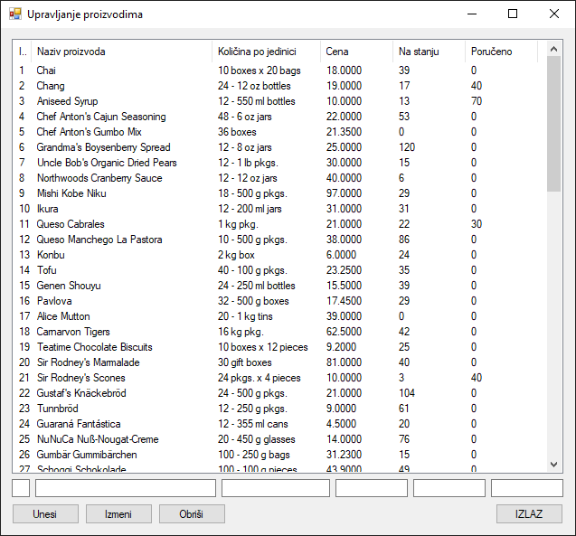

# Израда CRUD апликација

Дошао си скоро до краја овог серијала лекција. До сада си учио о појединачним
CRUD операцијама и различитим контролама за приказ података. Сада је време да
све то знање објединиш и да направимо једну комплетну апликацију која омогућава
пун животни циклус управљања подацима.

Нека је задатак да направиш апликацију за управљање производима из табеле
`Products`. Апликација ће имати следеће функционалности:

* Приказ свих производа у ListView контроли.
* Омогућавање кориснику да изабере производ и види његове детаље.
* Додавање новог производа.
* Ажурирање података постојећег производа.
* Брисање производа из базе.

Први корак је припрема базе података. Креираћеш одједном четири ускладиштене
процедуре, по једну за сваку CRUD операцију (или, ако желиш, креирај једну за све
четири операције). Ово је најбоља пракса јер централизује логику у бази,
повећава безбедност и олакшава одржавање.

```sql
-- 1. READ: Procedura za čitanje svih proizvoda
CREATE PROCEDURE usp_Proizvod_SelectAll
AS
BEGIN
    SET NOCOUNT ON;
    SELECT ProductID, ProductName, QuantityPerUnit, UnitPrice, UnitsInStock, UnitsOnOrder
    FROM Products;
END
GO

-- 2. CREATE: Procedura za unos novog proizvoda
CREATE PROCEDURE usp_Proizvod_Insert
    @ProductName NVARCHAR(40),
    @QuantityPerUnit NVARCHAR(20),
    @UnitPrice MONEY,
    @UnitsInStock SMALLINT,
    @UnitsOnOrder SMALLINT
AS
BEGIN
    INSERT INTO Products (ProductName, QuantityPerUnit, UnitPrice, UnitsInStock, UnitsOnOrder)
    VALUES (@ProductName, @QuantityPerUnit, @UnitPrice, @UnitsInStock, @UnitsOnOrder);
    SELECT SCOPE_IDENTITY();
END
GO

-- 3. UPDATE: Procedura za ažuriranje postojećeg proizvoda
CREATE PROCEDURE usp_Proizvod_Update
    @ProductID INT,
    @ProductName NVARCHAR(40),
    @QuantityPerUnit NVARCHAR(20),
    @UnitPrice MONEY,
    @UnitsInStock SMALLINT,
    @UnitsOnOrder SMALLINT
AS
BEGIN
    UPDATE Products
    SET
        ProductName = @ProductName,
        QuantityPerUnit = @QuantityPerUnit,
        UnitPrice = @UnitPrice,
        UnitsInStock = @UnitsInStock,
        UnitsOnOrder = @UnitsOnOrder
    WHERE
        ProductID = @ProductID;
END
GO

-- 4. DELETE: Procedura za brisanje proizvoda
CREATE PROCEDURE usp_Proizvod_Delete
    @ProductID INT
AS
BEGIN
    DELETE FROM Products
    WHERE ProductID = @ProductID;
END
GO
```

Фајл `App.config`...

```xml
<?xml version="1.0" encoding="utf-8" ?>
<configuration>
    <connectionStrings>
        <add name="NorthwindCS"
             connectionString="Data Source=LOCALHOST\SQLEXPRESS;Initial Catalog=Northwind;Integrated Security=True"
             providerName="System.Data.SqlClient" />
    </connectionStrings>
    <startup>
        <supportedRuntime version="v4.0" sku=".NETFramework,Version=v4.8" />
    </startup>
</configuration>
```

...и класа `Konekcija`...

```cs
using System.Configuration;

namespace UpravljanjeProizvodima
{
    internal class Konekcija
    {
        public static string ConnString
        {
            get
            {
                return ConfigurationManager.ConnectionStrings["NorthwindCS"].ConnectionString;
            }
        }
    }
}
```

...могу да изгледају исто, као и у свим лекцијама до сада.

Следећи задатак је да креираш класу `Proizvod` која ће служити и као модел
података (са својим својствима) и као слој за приступ подацима (са својим
статичким методама). Свака статичка метода ће одговарати једној ускладиштеној
процедури.

```cs
using System;
using System.Collections.Generic;
using System.Data;
using System.Data.SqlClient;

namespace UpravljanjeProizvodima
{
    public class Proizvod
    {
        public int ProductID { get; set; }
        public string ProductName { get; set; }
        public string QuantityPerUnit { get; set; }
        public decimal UnitPrice { get; set; }
        public short UnitsInStock { get; set; }
        public short UnitsOnOrder { get; set; }

        public static List<Proizvod> UcitajSve()
        {
            List<Proizvod> lista = new List<Proizvod>();
            using (SqlConnection con = new SqlConnection(Konekcija.ConnString))
            using (SqlCommand cmd = con.CreateCommand())
            {
                cmd.CommandText = "usp_Proizvod_SelectAll";
                cmd.CommandType = CommandType.StoredProcedure;
                con.Open();
                using (SqlDataReader reader = cmd.ExecuteReader())
                {
                    while (reader.Read())
                    {
                        Proizvod p = new Proizvod
                        {
                            ProductID = reader.GetInt32(0),
                            ProductName = reader.GetString(1),
                            QuantityPerUnit = reader.IsDBNull(2) ? "" : reader.GetString(2),
                            UnitPrice = reader.IsDBNull(3) ? 0 : reader.GetDecimal(3),
                            UnitsInStock = reader.IsDBNull(4) ? (short)0 : reader.GetInt16(4),
                            UnitsOnOrder = reader.IsDBNull(5) ? (short)0 : reader.GetInt16(5),
                        };
                        lista.Add(p);
                    }
                }
            }
            return lista;
        }

        public static int Unesi(Proizvod p)
        {
            using (SqlConnection con = new SqlConnection(Konekcija.ConnString))
            using (SqlCommand cmd = con.CreateCommand())
            {
                cmd.CommandText = "usp_Proizvod_Insert";
                cmd.CommandType = CommandType.StoredProcedure;
                cmd.Parameters.AddWithValue("@ProductName", p.ProductName);
                cmd.Parameters.AddWithValue("@QuantityPerUnit", p.QuantityPerUnit);
                cmd.Parameters.AddWithValue("@UnitPrice", p.UnitPrice);
                cmd.Parameters.AddWithValue("@UnitsInStock", p.UnitsInStock);
                cmd.Parameters.AddWithValue("@UnitsOnOrder", p.UnitsOnOrder);
                con.Open();
                return Convert.ToInt32(cmd.ExecuteScalar());
            }
        }

        public static bool Izmeni(Proizvod p)
        {
            using (SqlConnection con = new SqlConnection(Konekcija.ConnString))
            using (SqlCommand cmd = con.CreateCommand())
            {
                cmd.CommandText = "usp_Proizvod_Update";
                cmd.CommandType = CommandType.StoredProcedure;
                cmd.Parameters.AddWithValue("@ProductID", p.ProductID);
                cmd.Parameters.AddWithValue("@ProductName", p.ProductName);
                cmd.Parameters.AddWithValue("@QuantityPerUnit", p.QuantityPerUnit);
                cmd.Parameters.AddWithValue("@UnitPrice", p.UnitPrice);
                cmd.Parameters.AddWithValue("@UnitsInStock", p.UnitsInStock);
                cmd.Parameters.AddWithValue("@UnitsOnOrder", p.UnitsOnOrder);
                con.Open();
                return cmd.ExecuteNonQuery() > 0;
            }
        }

        public static bool Obrisi(int productId)
        {
            using (SqlConnection con = new SqlConnection(Konekcija.ConnString))
            using (SqlCommand cmd = con.CreateCommand())
            {
                cmd.CommandText = "usp_Proizvod_Delete";
                cmd.CommandType = CommandType.StoredProcedure;
                cmd.Parameters.AddWithValue("@ProductID", productId);
                con.Open();
                return cmd.ExecuteNonQuery() > 0;
            }
        }
    }
}
```

У методи `UcitajSve`, можеш да користиш само `SqlDataReader` уместо
`SqlDataAdapter` и `DataTable`. `SqlDataReader` је ефикаснији начин за читање
података ред по ред, директно из базе, без креирања међу-објеката у меморији.

На крају треба да креираш кориснички интерфејс. Форма треба да има `ListView`
за приказ, `TextBox` контроле за унос и измену, и три дугмета за CRUD
операције.



Кôд форме можеш да организујеш у неколико метода: `UcitajProizvode()` за
попуњавање контроле `ListView`, `lvProizvodi_SelectedIndexChanged` која реагује
на избор производа и попуњава `TextBox` контроле и три методе за догађаје клика
на дугмад Unesi, Izmeni и Obriši.

```cs
using System;
using System.Collections.Generic;
using System.Windows.Forms;

namespace UpravljanjeProizvodima
{
    public partial class Form1 : Form
    {
        public Form1()
        {
            InitializeComponent();
        }

        private void Form1_Load(object sender, EventArgs e)
        {
            lvProizvodi.View = View.Details;
            lvProizvodi.FullRowSelect = true;
            lvProizvodi.Columns.Add("ID", 20);
            lvProizvodi.Columns.Add("Naziv proizvoda", 200);
            lvProizvodi.Columns.Add("Količina po jedinici", 120);
            lvProizvodi.Columns.Add("Cena", 80);
            lvProizvodi.Columns.Add("Na stanju", 80);
            lvProizvodi.Columns.Add("Poručeno", 80);
            UcitajProizvode();
        }

        private void UcitajProizvode()
        {
            lvProizvodi.Items.Clear();
            try
            {
                List<Proizvod> proizvodi = Proizvod.UcitajSve();
                foreach (Proizvod p in proizvodi)
                {
                    ListViewItem item = new ListViewItem(p.ProductID.ToString());
                    item.SubItems.Add(p.ProductName);
                    item.SubItems.Add(p.QuantityPerUnit);
                    item.SubItems.Add(p.UnitPrice.ToString());
                    item.SubItems.Add(p.UnitsInStock.ToString());
                    item.SubItems.Add(p.UnitsOnOrder.ToString());
                    item.Tag = p;
                    lvProizvodi.Items.Add(item);
                }
            }
            catch (Exception ex)
            {
                MessageBox.Show("Greška: " + ex.Message);
            }
        }

        private void lvProizvodi_SelectedIndexChanged(object sender, EventArgs e)
        {
            if (lvProizvodi.SelectedItems.Count > 0)
            {
                Proizvod p = (Proizvod)lvProizvodi.SelectedItems[0].Tag;
                txtID.Text = p.ProductID.ToString();
                txtNaziv.Text = p.ProductName;
                txtKolicinaPoJedinici.Text = p.QuantityPerUnit;
                txtCena.Text = p.UnitPrice.ToString();
                txtNaStanju.Text = p.UnitsInStock.ToString();
                txtPoruceno.Text = p.UnitsOnOrder.ToString();
            }
        }

        private void btnUnesi_Click(object sender, EventArgs e)
        {
            try
            {
                Proizvod p = new Proizvod
                {
                    ProductName = txtNaziv.Text,
                    QuantityPerUnit = txtKolicinaPoJedinici.Text,
                    UnitPrice = decimal.Parse(txtCena.Text),
                    UnitsInStock = short.Parse(txtNaStanju.Text),
                    UnitsOnOrder = short.Parse(txtPoruceno.Text)
                };
                int noviId = Proizvod.Unesi(p);
                MessageBox.Show($"Uspešno unet proizvod sa ID: {noviId}");
                UcitajProizvode();
            }
            catch (Exception ex)
            {
                MessageBox.Show("Greška pri unosu: " + ex.Message);
            }
        }

        private void btnIzmeni_Click(object sender, EventArgs e)
        {
            if (lvProizvodi.SelectedItems.Count == 0) return;
            try
            {
                Proizvod p = new Proizvod
                {
                    ProductID = int.Parse(txtID.Text),
                    ProductName = txtNaziv.Text,
                    QuantityPerUnit = txtKolicinaPoJedinici.Text,
                    UnitPrice = decimal.Parse(txtCena.Text),
                    UnitsInStock = short.Parse(txtNaStanju.Text),
                    UnitsOnOrder = short.Parse(txtPoruceno.Text)
                };
                if (Proizvod.Izmeni(p))
                {
                    MessageBox.Show("Podaci uspešno izmenjeni.");
                    UcitajProizvode();
                }
            }
            catch (Exception ex)
            {
                MessageBox.Show("Greška pri izmeni: " + ex.Message);
            }
        }

        private void btnObrisi_Click(object sender, EventArgs e)
        {
            if (lvProizvodi.SelectedItems.Count == 0) return;
            if (MessageBox.Show("Da li ste sigurni?", "Potvrda", MessageBoxButtons.YesNo) == DialogResult.No) return;

            try
            {
                int id = int.Parse(txtID.Text);
                if (Proizvod.Obrisi(id))
                {
                    MessageBox.Show("Proizvod uspešno obrisan.");
                    UcitajProizvode();
                }
            }
            catch (Exception ex)
            {
                MessageBox.Show("Greška pri brisanju: " + ex.Message);
            }
        }

        private void btnIzlaz_Click(object sender, EventArgs e)
        {
            Application.Exit();
        }
    }
}
```

Имај у виду да већ унете податке нећеш моћи да обришеш због
референцијалног интегритета и да ће покушај брисања тих података бацити
изузетак! Моћи ћеш да бришеш само податке које си ти унео!
