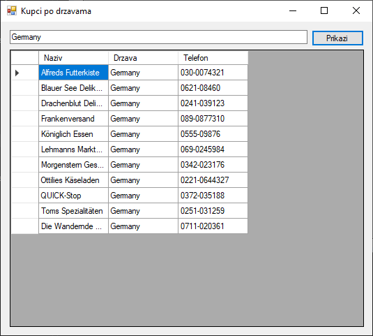

# Рад са класама

Сада је прави тренутак да се подсетиш основа објектно-оријентисаног
програмирања,
[рада са класама](https://petlja.org/sr-Latn-RS/kurs/14469/3/9869)
и
[изведеним класама](https://petlja.org/sr-Latn-RS/kurs/14469/5/9900). Издвајање
кода у посебне класе је једна од кључних добрих пракси при изради .NET
Framework апликација које раде са SQL Server базом података. Овај приступ
доноси бројне предности у погледу организације, одржавања, тестирања и поновне
употребе кода.

Што се раздвајање логике (енгл. *Separation of Concerns*) тиче, кôд који се
односи на кориснички интерфејс, логику апликације и приступ бази података треба
да буде јасно раздвојен. То олакшава одржавање и разумевање кода. Поновна
употреба кода подразумева да једном написан кôд за приступ бази може да се
користити у више делова апликације. Такође, издвојене класе се лакше тестирају
јер су изоловане, а цео пројекат постаје прегледнији и лакше га је проширивати.

Најчешће се програмери, приликом израде оваквих апликација, воде организацијом
у три слоја (енгл. *Three-Layer Architecture*). Први презентациони слој (енгл.
*Presentation Layer - UI*) одговоран је за комуникацију са корисником и позива
методе из слоја логике пословања. Други слој логике пословања (енгл.
*Business Logic Layer - BLL*) бави се обрадом правила пословања и позива методе
из слоја за приступ подацима. Трећи слој за приступ подацима (енгл.
*Data Access Layer - DAL*) треба да садржи сав код којим се директно приступа
бази и у њему се обично користе објекти класа `SqlConnection`, `SqlCommand` и
`SqlDataAdapter`.

На пример, ако се ради о CRUD апликацији за управљање клијентима (табела
`Customers` у бази података Northwind), на основу организације у три слоја,
апликација би требала да има најмање три класе:

* Класа за приступ подацима (нпр. класа `Kupac`) треба да имплементира
комуникацију са базом података извршавајући ускладиштене процедуре, односно SQL
упите  (`SELECT`, `INSERT`, `UPDATE` и `DELETE`). У овој класи би се креирали и
користили објекти `SqlConnection`, `SqlCommand` и `SqlDataAdapter` и мапирали
подаци из базе у објекте (нпр. у објекат класе `Customer`).
* Класа за обраду података (нпр. класа `KupacPoDrzavi`) треба да имплементира
правила пословања и обради податаке пре и после приступа бази. Она може да
садржи пословну логику као што је филтрирање, валидација или трансформација
података. Помоћу се може вршити проверава исправности података. Помоћу ње може
и да се одлучује када и како треба позивати методе из класе за приступ
подацима.
* Класа за презентацију података (нпр. Windows Forms UI класа `KupciForm`),
треба да имплементира контроле за приказ података, контроле за прикупљање
података од корисника, контроле за позивање метода из класе за обраду података.

Овакав приступ израда апликација најбоље ћеш разумети кроз једноставан пример
Windows Forms (.NET Framework) апликације. Апликација треба да, из табеле
`Customers`, из базе података Northwind, прикаже називе, државе и телефоне
купаца са седиштем у држави коју је унео корисник. Интерфејс апликације може да
изгледа овако:



## Data Access Layer

```cs
using System.Data;
using System.Data.SqlClient;
using System.Collections.Generic;

namespace UpravljanjeKupcima
{
    internal class Kupac
    {
        public string Naziv { get; set; }
        public string Drzava { get; set; }
        public string Telefon { get; set; }

        public static List<Kupac> PrikaziSve()
        {
            List<Kupac> kupci = new List<Kupac>();
            string connString = "Data Source=LOCALHOST\\SQLEXPRESS;Initial Catalog=Northwind;Integrated Security=True";
            using (SqlConnection conn = new SqlConnection(connString))
            {
                conn.Open();
                SqlCommand cmd = new SqlCommand("SELECT CompanyName, Country, Phone FROM Customers", conn);
                SqlDataAdapter da = new SqlDataAdapter(cmd);
                DataTable dt = new DataTable();
                da.Fill(dt);
                foreach (DataRow dr in dt.Rows)
                {
                    kupci.Add(new Kupac
                    {
                        Naziv = dr["CompanyName"].ToString(),
                        Drzava = dr["Country"].ToString(),
                        Telefon = dr["Phone"].ToString()
                    });
                }
                return kupci;
            }
        }
    }
}
```

## Business Logic Layer

```cs
using System.Collections.Generic;

namespace UpravljanjeKupcima
{
    internal class KupciPoDrzavi
    {
        public List<Kupac> PrikaziKupcePoDrzavi(string drzava)
        {
            List<Kupac> sviKupci = Kupac.PrikaziSve();
            List<Kupac> filtrirani = new List<Kupac>();
            foreach (Kupac k in sviKupci)
            {
                if (k.Drzava == drzava)
                {
                    filtrirani.Add(k);
                }
            }
            return filtrirani;
        }
    }
}
```

## Presentation Layer - UI

```cs
using System;
using System.Collections.Generic;
using System.Windows.Forms;

namespace UpravljanjeKupcima
{
    public partial class KupciForm : Form
    {
        public Form1()
        {
            InitializeComponent();
        }

        private void btnPrikazi_Click(object sender, EventArgs e)
        {
            string drzava = textBox1.Text;
            KupciPoDrzavi kd = new KupciPoDrzavi();
            List<Kupac> kupciIzDrzave = kd.PrikaziKupcePoDrzavi(drzava);
            dataGridView1.DataSource = kupciIzDrzave;
        }
    }
}
```
