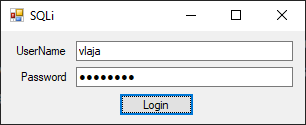

# Пренос параметара командном објекту

Када се говори о преносу параметара командном објекту, мисли се на начин на
који се вредности прослеђују у SQL упите или складиштене процедуре путем
`SqlCommand` објекта. Ово је кључно за: безбедност, јер се избегава могућност
*SQL injection*-а, перформансе јјер је боља припрема и кеширање упита, и на
крају, за јасноћу. и одвојеност логике и података.

*SQL injection (SQLi)* је један од најстаријих и најопаснијих облика сајбер
напада, који је први пут документован крајем деведесетих година прошлог века.
Овај напад омогућава хакерима да убаце злонамерне SQL команде у апликације које
користе базе података, чиме могу да приступе осетљивим информацијама, да измене
или униште податке. Компаније могу изгубити милионе због крађе података, као
што је случај са нападом на *Heartland Payment Systems* 2008. године, где је
компромитовано 130 милиона бројева кредитних картица. Поред финансијске штете,
компаније могу трајно оштетити свој имиџ, репутацију и кредибилитет. Можеш само
да замислиш колико страшни могу бити сигурносни пропусти због којих се открију
лични подаци и угрози приватност и безбедност људи. Иако је *SQLi* релативно
лако спречити, он и даље представља велики ризик због своје једноставности и
ефикасности, па је због тога ово изузетно важна лекција!

## Како НЕ ТРЕБА слати упите командном објекту

Замисли да у некој бази података постоји табела `Users` која садржи личне
или осетљиве податке корисника неке апликације. Нека то за пример буду поља
корисничко име (`UserName`) и лозинка (`Password`) која је сачувана као
отворени текст, на пример овако:

| UserID | UserName | Password |
|--------|----------|----------|
| 1      | paja     | p@55w0rd |
| 2      | raja     | R@j@2025 |
| 3      | gaja     | GajaGaja |
| 4      | vlaja    | Vlaja!!! |
| 5      | zlaja    | ZlAjAaAa |

Програмер је направио форму за пријаву корисника. Ако корисник унесе тачно
корисничко име и лозинку покренуће се главни програм, а у супротном јавиће се
грешка. Форма за пријаву и кôд догађа клика на дугме за пријаву изгледа овако:



```cs
private void btnLogin_Click(object sender, EventArgs e)
{
    string username = txtUserName.Text;
    string password = txtPassword.Text;
    string connString = "Data Source=LOCALHOST\\SQLEXPRESS;Initial Catalog=Domaci;Integrated Security=True";
    string sqlUpit = $"SELECT * FROM users WHERE username = '{username}' AND password = '{password}'";
    using (SqlConnection conn = new SqlConnection(connString))
    {
        conn.Open();
        SqlCommand cmd = new SqlCommand(sqlUpit, conn);
        using (SqlDataReader reader = cmd.ExecuteReader())
        {
            if (reader.HasRows)
            {
                // Pokretanje glavnog dela programa
            }
            else
            {
                MessageBox.Show("Pogresno korisnicko ime ili lozinka!");
            }
        }
    }
}
```

Када корисник унесе корисничко име и лозинку формира се стринг `sqlUpit`,
отвара се конекција ка бази и упит се прослеђује објекту `SqlCommand` на
извршавање. Ако је корисник унео исправно корисничко име и лозинку, објекат
`reader` имаће један ред па ће се извршити `if` грана и покренути главни део
програма, а ако је унео неисправно корисничко име и/или лозинку извршиће се
`else` грана и јавиће се порука о грешци. На први поглед је све у реду, зар
не?

Ако овакву апликацију користи злонамерни корисник, он у пољу за унос
корисничког имена може унети...

```sql
' OR 1 = 1 --
```

...што значи да би формирани стринг `sqlUpit` изгледао овако:

```sql
SELECT * FROM users WHERE username = '' OR 1 = 1 --' AND password = ''
```

Иако корисничко име `''` не постоји у бази података, израз `1 = 1` је тачан,
па ће операција дисјункције `OR` вратити тачно, јер нетачно или тачно даје
тачно. Након израза `1 = 1` кôд је коментарисан помоћу `--`, па неће утицати на
извршавање упита. Како је израз тачан објекат `reader` ће бити попуњен свим
подацима из табеле `Users`, па ће се извршити `if` грана и покренути главни део
програма.

Значи, ако упит садржи било какав унос корисника, никад немој да формираш упит
као стринг! Увек користи параметризоване упите, као у делу лекције који следи.

## Параметризовани упити
