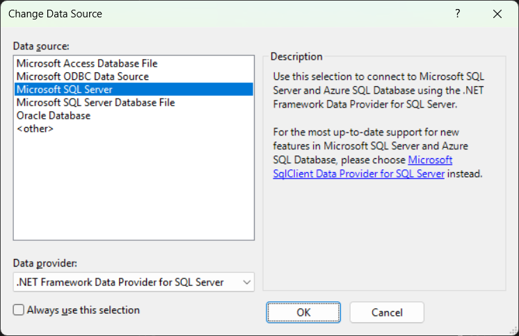
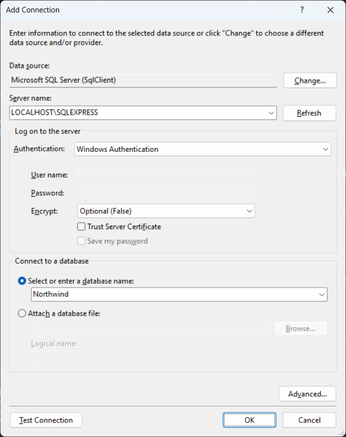
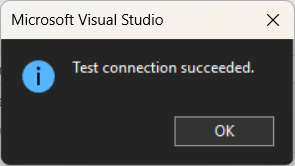
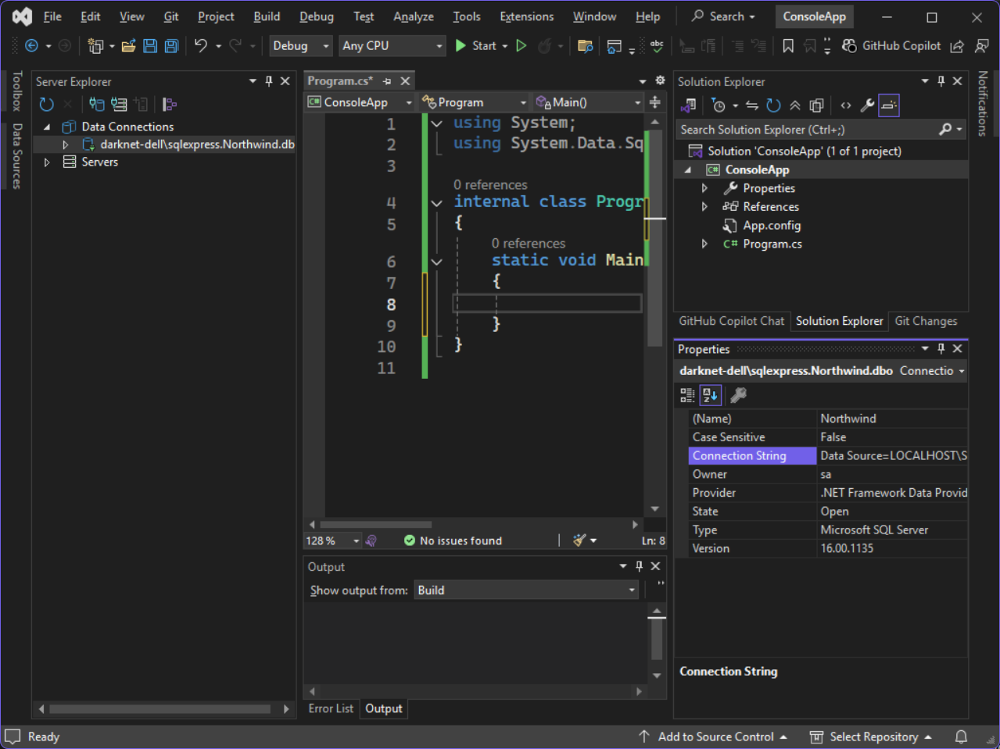

# Конекциони стринг

Конекциони стринг је стринг који садржи све информације неопходне апликацији
за повезивање на базу података. У конекционом стрингу дефинисане су:

* име или IP адреса хоста на којем се налази *SQL Server*,
* име базе података,
* врста аутентификација, као и
* додатне опције попут времена тајмаута, типа енкрипције итд.

## Добијање конекционог стринга

Претпоставља се да си на свом рачунару успешно инсталирао *SQL Server Express*
и *SSMS* (како је описано у лекцији [Инсталација алата](./alati.md)), као и да
си успешно креирао базу података *Northwind* (како је описано у лекцији
[Креирање базе података за вежбе](./skripta.md)).

У интегрисаном развојном окружењу *Visual Studio*, у менију *View* одабери
**Server Explorer**. У *Server Explorer*-у десним кликом на
**Data Connections** одабери **Add Connection**. У прозору *Change Data Source*
одабери **Microsoft SQL Server** као *Data source* и
**.NET Framework Data Provider** као *Data provider*...



...па притисни дугме OK.

Отвориће се *Add Connection* прозор. У овом прозору, у пољу *Data source* треба
да буде уписано **Microsoft SQL Server (SqlClient)**. Уколико није, притисни
дугме *Change* и понови поступак из претходног пасуса. У поље *Server name*
унеси **`LOCALHOST\SQLEXPRESS`**. Уместо `LOCALHOST`можеш унети и име или IP
адресу свог рачунара.

У секцији *Log on to the server*, у пољу за одабир начина аутентификације
*Authentication* одабери **Windows Authentication**, па у пољу *Encrypt*
одабери **Optional (False)**. У секцији *Connect to database* треба да буде
одабрана опција *Select or enter a database name*, па из падајуће листе треба
да одабереш базу података **Northwind** коју си креирао у претходној лекцији.
На крају, *Add Connection* прозор треба да изгледа овако:



Кликом на дугме **Test Connection** треба да искочи порука
*Test connection succeeded*:



На крају притисни дугме OK.

У *Server Explorer*-у појавиће се конекција коју си управо дефинисао, у формату
**`ime-racunara\sqlexpress.Northwind.db`**. Кликом на ту конекцију, у
*Solution Explorer*-у отвориће се својства конекције, а међу њима и својство
**Connection String**:



Конекционом стринг изгледа овако:

```text
Data Source=LOCALHOST\SQLEXPRESS;Initial Catalog=Northwind;Integrated Security=True;Encrypt=False
```

* `Data Source=LOCALHOST\SQLEXPRESS` дефинише име хоста са *SQL Server*-ом,
* `Initial Catalog=Northwind` дефинише име базе података,
* `Integrated Security=True` дефинише тип аутентификације (*Windows* аутентификација) и
* `Encrypt=False` дефинише тип енкрипције која је додатна опција и коју можеш у овом случају да обришеш.

Значи, минимални конекциони стринг до *Northwind* базе података која је
креирана у *SQL Express Server*-у на твом рачунару треба да изгледа овако:

```text
Data Source=LOCALHOST\SQLEXPRESS;Initial Catalog=Northwind;Integrated Security=True;
```

Како је у питању стринг, обрати пажњу на прелазне секвенце! Приликом доделе
конекционог стринга некој променљивој треба да уместо обрнуте косе црте `\`
напишеш две обрнуте косе црте `\\`, на пример:

```cs
string connectionString = "Data Source=LOCALHOST\\SQLEXPRESS;Initial Catalog=Northwind;Integrated Security=True";
```
