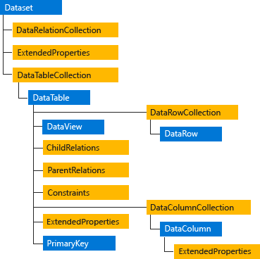

# Класе именског простора System.Data

Именски простор
[`System.Data`](https://learn.microsoft.com/en-us/dotnet/api/system.data?view=netframework-4.8)
представља основу за ADO.NET технологију која омогућава рад са подацима у .NET
Framework апликацијама. Овај именски простор садржи класе за рад са везом према
бази, али и класе које омогућавају рад са подацима у меморији, односно
бесконекциони приступ. У контексту рада са SQL Server базом података,
најважније класе именског простора `System.Data` су:

* класа `DataSet` (више табела и релације међу њима),
* класа `DataTable` (једна табела),
* класа `DataRow` (један ред у табели),
* класа `DataColumn` (једна колона у табели) и
* класа `DataView` (омогућава филтрирање и сортирање података).



## DataSet

[`DataSet`](https://learn.microsoft.com/en-us/dotnet/api/system.data.dataset?view=netframework-4.8)
је комплексна структура која представља сачувану базу података у меморији. То
значи да може да садржи једну или више табела (`DataTable`), као и релације
међу њима (`DataRelation`). Омогућава бесконекциони приступ бази података, што
значи да се подаци могу учитати, обрадити, приказати и изменити без сталне
конекције са SQL Server-ом. Обично се користи у комбинацији са
`SqlDataAdapter`-ом за пуњење података. Идеална је за манипулацију сложеним
скупом података у којем постоји више табела и више релација.

Нека је задатак да креираш `DataSet` који ће се састојати из табеле добављачи
(`Suppliers`) и табеле производи (`Products`) из базе података `Northwind`, као
и да успоставиш релацију између ових табела.

```cs
string connString = "Data Source=LOCALHOST\\SQLEXPRESS;Initial Catalog=Northwind;Integrated Security=True";
using (SqlConnection conn = new SqlConnection(connString))
{
    conn.Open();
    DataSet ds = new DataSet("SuppliersAndProducts");
    SqlDataAdapter sAdapter = new SqlDataAdapter("SELECT * FROM Suppliers", conn);
    sAdapter.Fill(ds, "Suppliers");
    SqlDataAdapter pAdapter = new SqlDataAdapter("SELECT * FROM Products", conn);
    pAdapter.Fill(ds, "Products");
    DataRelation relation = new DataRelation(
        "SuppliersProducts",
        ds.Tables["Suppliers"].Columns["SupplierID"],
        ds.Tables["Products"].Columns["SupplierID"]
    );
    ds.Relations.Add(relation);
}
```

Када си креирао овакав `DataSet`, можеш, на пример, да прикажеш све производе
груписане по добављачима директно из меморије односно из DataSet-а, без слања
додатних упита SQL Server-у.

## DataTable

[`DataTable`](https://learn.microsoft.com/en-us/dotnet/api/system.data.datatable?view=netframework-4.8)
представља једну табелу података у меморији. То је основни градивни
блок објекта `DataSet`, али може се користити и самостално, као у претходним
лекцијама. Садржи колоне (`DataColumn`), редове (`DataRow`) и дефинише
структуру сличну оној у релационим базама података. Конкретно, подржава
типизацију података по колонама, омогућава дефинисање примарног кључа
(`PrimaryKey`), ограничења (`Constraints`) и сл., као и филтрирање, претрагу,
сортирање и приступ подацима као у релационој бази података.

Током овог поглавља, а и на матурском испиту, најчешће ћеш користити
`DataTable` самостално, а не у оквиру `DataSet`-а. Нека је задатак да креираш
`DataTable` који ће садржати све податке из табеле о добављачима (`Suppliers`)
из базе података `Northwind`.

```cs
string connString = "Data Source=LOCALHOST\\SQLEXPRESS;Initial Catalog=Northwind;Integrated Security=True";
using (SqlConnection conn = new SqlConnection(connString))
{
    conn.Open();
    SqlDataAdapter adapter = new SqlDataAdapter("SELECT * FROM Suppliers", conn);
    DataTable dt = new DataTable();
    adapter.Fill(dt);
}
```

Када си креирао `DataTable`, можеш да радиш са подацима о добављачима директно
у меморији односно у креираном `dt` објекту, без слања додатних упита SQL
Server-у.

## DataRow

[`DataRow`](https://learn.microsoft.com/en-us/dotnet/api/system.data.datarow?view=netframework-4.8)
представља један ред података у табели (`DataTable`). Сваки ред садржи
вредности за све колоне табеле и користи се за читање, измену, додавање и
брисање података у меморији. `DataRow` се увек користи у контексту `DataTable`
и не може постојати самостално.

Нека је задатак да излисташ све добављаче и њихове бројеве телефона из
`DataTable` објекта `dt` из претходног примера. Да би то урадио, потребно је да
у `using` блоку додаш једну `foreach` петљу која ће проћи кроз све редове
објекта `dt` и приказати тражене податке.

```cs
foreach (DataRow row in dt.Rows)
{
    Console.WriteLine($"{row["CompanyName"]}: {row["Phone"]}");
}
```

Осим читања података из реда, `DataRow` можеш да користиш и креирање и додавање
новог реда, измену постојећег реда, брисање реда, филтрирање и претрагу редова
итд.

## DataColumn

[`DataColumn`](https://learn.microsoft.com/en-us/dotnet/api/system.data.datacolumn?view=netframework-4.8)
представља једну колону у табели података (`DataTable`). Одређује назив колоне,
тип података, подразумевану вредност, да ли се дозвољавају `null` вредности, да
ли је колона део примарног кључа итд. Сваки објекат `DataTable` садржи
колекцију појединачних колона кроз својство `Columns`.

Нека је задатак да прикажеш који се све подаци налазе у креираном `dt` објекту
и којег су типа. Да би то урадио, потребно је да у `using` bloku додаш једну
`foreach` петљу која ће проћи кроз све колоне `dt` и приказати тражене податке:

```cs
foreach (DataColumn col in dt.Columns)
{
    Console.WriteLine($"{col.ColumnName} ({col.DataType})");
}
```

`DataColumn` можеш да користиш и за додавање нове колоне, промену својства
постојеће колоне итд.

## DataView

[`DataView`](https://learn.microsoft.com/en-us/dotnet/api/system.data.dataview?view=netframework-4.8)
омогућава креирање приказа (погледа) над подацима из `DataTable` објекта, без
измене саме табеле. Користи се за филтрирање редова, сортирање података, рад са
подгрупама редова и повезивање са UI контролама у Windows Forms апликацијама.
Битно је да знаш да `DataView` не креира нову табелу у меморији, већ само
представља поглед у постојећу табелу. Ако се редови додају, бришу или мењају у
`DataTable` објекту, то се аутоматски одражава и у `DataView` објекту.

Нека је задатак да из креираног `dt` објекта прикажеш само називе добављача
који су из Немачке, тако да списак буде сортиран лексикографски. Овај задатак
можеш решити креирањем новог погледа на објекат `dt`, са филтером реда и
сортирањем у `using` блоку.

```cs
DataView dv = new DataView(dt);
dv.RowFilter = "Country = 'Germany'";
dv.Sort = "CompanyName ASC";
foreach (DataRowView drv in dv)
{
    Console.WriteLine($"{drv["CompanyName"]}");
}
```

`DataView` можеш користи и за филтрирање по више услова, филтрирање по
делимичном подударању, сортирању по више колона, приказ јединствених вредности,
динамичку претрагу итд.
