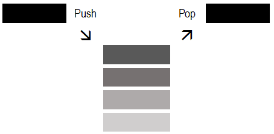

# Стек

Стек преставља листу елемената у којoj је могуће додавање и уклањање елемената
само на једном крају листе који се назива врх стека. То значи да се елементи са
стека уклањају обрнутим редоследом у односу на редослед којим су додавани на
стек (енгл. *Last In First Out - LIFO*). Елементи се на стек додају операцијом
`Push`, а са стека уклањају операцијом `Pop`.



У лекцији [Колекције података](07_kolekcije.md) поменуто је да је колекција
стек у програмском језику C# реализована и као генеричка и као негенеричка
колекција података. Негенеричка колекција стек дефинисана је у класи
[`Stack`](https://learn.microsoft.com/en-us/dotnet/api/system.collections.stack?view=netframework-4.8.1)
која се налази у именском простору `System.Collections` и она неће бити тема
овог курса. Генеричка колекција стек дефинисана је у класи
[`Stack<T>`](https://learn.microsoft.com/en-us/dotnet/api/system.collections.generic.stack-1?view=netframework-4.8.1)
која се налази у именском простору `System.Collections.Generic`. Генерички стек
се може дефинисати као LIFO колекција инстанци истог типа променљиве
величине. Креирање генеричког стека и рад са методама из класе `Stack<T>` је
прилично једноставан и интуитиван.

У следећем примеру...

```cs
static void Main()
{
    Stack<int> stek = new Stack<int>();

    stek.Push(10);
    stek.Push(20);
    stek.Push(30);
    stek.Push(40);
    stek.Push(50);

    Console.WriteLine("Na steku se nalaze sledeci elementi:");
    foreach (int element in stek)
    {
        Console.WriteLine(element);
    }

    stek.Pop();

    Console.WriteLine("Na steku se nalaze sledeci elementi:");
    foreach (int element in stek)
    {
        Console.WriteLine(element);
    }
}
```

...креира се нови стек `stek` који ће садржати целобројне вредности типа `int`.
Елементи се додају на стек коришћењем методе `Push`. Редослед додавања
елемената је: `10`, `20`, `30`, `40`, `50`. Након ових операција, стек изгледа
овако, од врха ка дну:

```text
50     врх стека
40
30
20
10     дно стека
```

Програм пролази кроз све елементе на стеку и приказује их. Методом `Pop` уклања
се елемент са врха стека – у овом случају, елемент `50`. Значи, извршавањем
овог програма, у конзоли ће се исписати:

```text
Na steku se nalaze sledeci elementi:
50
40
30
20
10
Na steku se nalaze sledeci elementi:
40
30
20
10
```

Један од практичних примера где се колекција `Stack<T>` може користити је
праћење историје операција у некој апликацији, на пример, у текстуалном
едитору. Стек се може користити за имплементацију функционалности враћања,
тј. операције **undo** и понављања, тј. операције **redo**.

Нека је задатак да креираш класу `UndoRedo` која се може користити у неком
текст едитору, а која користи генеричку колекцију `Stack<T>`. Решење овог
задатка може да изгледа овако:

```cs
class UndoRedo
{
    private Stack<string> undoStek;
    private Stack<string> redoStek;
    private string trenutniStek;

    public UndoRedo()
    {
        undoStek = new Stack<string>();
        redoStek = new Stack<string>();
        trenutniStek = "";
    }

    public void DodajTekst(string noviTekst)
    {
        undoStek.Push(trenutniStek);
        trenutniStek += noviTekst;
        redoStek.Clear();
    }

    public void Undo()
    {
        if (undoStek.Count > 0)
        {
            redoStek.Push(trenutniStek);
            trenutniStek = undoStek.Pop();
        }
        else
        {
            Console.WriteLine("Nema operacija za vracanje!");
        }
    }

    public void Redo()
    {
        if (redoStek.Count > 0)
        {
            undoStek.Push(trenutniStek);
            trenutniStek = redoStek.Pop();
        }
        else
        {
            Console.WriteLine("Nema operacija za ponavljanje!");
        }
    }

    public void PrikaziTekst()
    {
        Console.WriteLine("Trenutni tekst: " + trenutniStek);
    }
}
```

У класи се креирају `undoStek` за чување стања текста пре сваке измене и
`redoStek` који чува стање текста након `Undo` операције, како би се омогућила
операција понављања `Redo`. Пре додавања новог текста, тренутно стање се чува
у `undoStek`-у. Нова измена брише све операције у `redoStek`-у, јер нова измена
чини `Redo` операцију неважећом. Приликом операције враћања, тренутно стање се
премешта у `redoStek`, док се претходно стање враћа из `undoStek`-а. Приликом
операције понављања тренутно стање се премешта у `undoStek`, док се стање после
операције `Redo` враћа из `redoStek`-а. Стек је идеалан за ову сврху јер је
LIFO принцип управо оно што је потребно за `Undo`/`Redo` функционалност.
Креирана класа се може користити на следећи начин:

```cs
class Program
{
    static void Main()
    {
        UndoRedo undoredo = new UndoRedo();
        undoredo.DodajTekst("Zdravo, ");
        undoredo.DodajTekst("svete. ");
        undoredo.PrikaziTekst();

        undoredo.Undo();
        undoredo.PrikaziTekst();

        undoredo.DodajTekst("ucenici. ");
        undoredo.PrikaziTekst();

        undoredo.Undo();
        undoredo.PrikaziTekst();

        undoredo.Redo();
        undoredo.PrikaziTekst();
    }
}
```

Извршавањем овог програма у конзоли ће се исписати:

```text
Trenutni tekst: Zdravo, svete.
Trenutni tekst: Zdravo,
Trenutni tekst: Zdravo, ucenici.
Trenutni tekst: Zdravo,
Trenutni tekst: Zdravo, ucenici.
```

Операција додавања елемената на стек `Push` и операција уклањања `Pop`
елемената са стека су веома ефикасне и имају временску сложеност $O(1)$. Поред
метода `Push` и `Pop`, често се користе и друге основне методе или својства
дефинисана у класи `Stack<T>`:

* `Peek()` - враћа елемент са врха стека без његовог уклањања, а ако је стек
празан, баца `InvalidOperationException`,
* `Count` - враћа број елемената у стеку итд,
* `Clear()` - уклања све елементе из стека,
* `Contains(T element)` - проверава да ли стек садржи елемент `element`,
* `ToArray()` - враћа низ који садржи елементе стека.

Главне мане колекције стек су ограничен приступ и непостојање индекса. То значи
да можеш приступити само елементу на врху стека, док приступ другим елементима
није могућ без уклањања елемената. За разлику од листа или низова, елементима
стека не можеш приступити преко индекса. Можеш да закључиш да из стека не
можеш уклањати произвољне елементе, да не можеш уметати елементе у стек, нити
да сортираш елементе стека.
