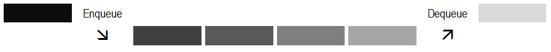

# Ред

Ред представља колекцију објеката у којима се елементи додају на једном крају
листе који се назива крај реда, а уклањају на другом крају листе, који се
назива почетак реда. То значи да се елементи са реда уклањају истим редоследом
којим су и додавани на ред (енгл. *First In First Out - FIFO*). Значи, FIFO
принцип треба да примењујеш када треба да обезбедиш да се задаци обрађују
редоследом којим су стигли, односно где је редослед обраде битан. Елементи се
на ред додају операцијом `Enqueue`, а уклањају операцијом `Dequeue`.



У лекцији [Колекције података](07_kolekcije.md) поненуто је да је колекција
ред у програмском језику C# реализована и као генеричка и као негенеричка
колекција података. Негенеричка колекција ред дефинисана је у класи
[`Queue`](https://learn.microsoft.com/en-us/dotnet/api/system.collections.queue?view=netframework-4.8.1)
која се налази у именском простору `System.Collections` и она неће бити тема
овог курса. Генеричка колекција ред дефинисана је у класи
[`Queue<T>`](https://learn.microsoft.com/en-us/dotnet/api/system.collections.generic.queue-1?view=netframework-4.8.1)
која се налази у именском простору `System.Collections.Generic`. Генерички ред
се може дефинисати као FIFO колекција инстанци истог типа типа променљиве
величине. Креирање генеричког реда и рад са методама из класе `Queue<T>` је
прилично једноставан и интуитиван.

У следећем примеру...

```cs
static void Main()
{
    Queue<int> red = new Queue<int>();

    red.Enqueue(10);
    red.Enqueue(20);
    red.Enqueue(30);
    red.Enqueue(40);
    red.Enqueue(50);

    Console.WriteLine("U redu se nalaze sledeci elementi:");
    foreach (int element in red)
    {
        Console.WriteLine(element);
    }

    red.Dequeue();

    Console.WriteLine("U redu se nalaze sledeci elementi:");
    foreach (int element in red)
    {
        Console.WriteLine(element);
    }
}
```

...креира се нови ред `red` који ће садржати целобројне вредности типа `int`.
Елементи се додају у ред коришћењем методе `Enqueue`. Редослед додавања
елемената је: `10`, `20`, `30`, `40`, `50`. Након ових операција, ред изгледа
овако, од краја ка почетку:

```text
   50          40          30          20          10
крај реда                                      почетак реда
```

Програм пролази кроз све елементе у реду и приказује их. Методом `Dequeue`
уклања се елемент на почетку реда, у овом случају овом, елемент `10`. Значи,
извршавањем овог програма, у конзоли ће се исписати:

```text
U redu se nalaze sledeci elementi:
10
20
30
40
50
U redu se nalaze sledeci elementi:
20
30
40
50
```

Један од практичних примера где се колекција `Queue<T>` може користити је
управљање задацима у неком систему, на пример, систему који прима поруке од
корисника и треба да их обрађује редоследом којим су стигле. Овај систем може
бити део веб апликације, сервиса за обраду података, или било ког система где
је редослед обраде битан.

Нека је задатак да креираш класу `ObradaPoruka` која се може користити у таквом
систему, а која користи генеричку колекцију `Queue<T>`. Решење овог задатка
може да изгледа овако:

```cs
class ObradaPoruka
{
    private Queue<string> redPoruka = new Queue<string>();

    public void DodajPoruku(string poruka)
    {
        redPoruka.Enqueue(poruka);
        Console.WriteLine("Dodata poruka: {0}", poruka);
    }

    public void ObradiPoruke()
    {
        while (redPoruka.Count > 0)
        {
            string poruka = redPoruka.Dequeue();
            Console.WriteLine("Obradjena poruka: {0}", poruka);
        }
    }
}
```

Поруке се додају у ред коришћењем методе `Enqueue`, а уклањају из реда
коришћењем методе `Dequeue` у редоследу којим су стигле. Метода `ObradiPoruke`
узима поруке из реда једнy по једну и симулира њихову обраду. Креирана класа се
може користити на следећи начин:

```cs
static void Main()
{
    ObradaPoruka obrada = new ObradaPoruka();

    obrada.DodajPoruku("Prva poruka");
    obrada.DodajPoruku("Druga poruka");
    obrada.DodajPoruku("Treca poruka");

    obrada.ObradiPoruke();
}
```

Извршавањем овог програма у конзоли ће се исписати:

```text
Dodata poruka: Prva poruka
Dodata poruka: Druga poruka
Dodata poruka: Treca poruka
---> obrada poruke "Prva poruka" <---
Obradjena poruka: Prva poruka
---> obrada poruke "Druga poruka" <---
Obradjena poruka: Druga poruka
---> obrada poruke "Treca poruka" <---
Obradjena poruka: Treca poruka
```

Операције додавања `Enqueue` елемената у ред и уклањања `Dequeue` елемената из
реда су веома ефикасне и имају временску сложеност $O(1)$. Поред метода
`Enqueue` и `Dequeue`, често се користе и друге основне методе или својства
дефинисана у класи `Queue<T>`:

* `Peek()` - враћа елемент са почетка реда без његовог уклањања. Ако је ред
празан, баца `InvalidOperationException`,
* `Count` - враћа број елемената у реду,
* `Clear()` - уклања све елементе из реда.
* `Contains(T element)` - проверава да ли ред садржи елемент `element`,
* `ToArray()` - копира елементе реда у нови низ итд.

Главне мане колекције ред су ограничен приступ и непостојање индекса. То значи
да можеш приступити само елементу на почетку и на крају реда, док приступ
другим елементима није могућ без уклањања елемената. За разлику од листа или
низова, елементима реда не можеш приступити преко индекса. Можеш да закључиш да
из реда не можеш уклањати произвољне елементе, да не можеш уметати елементе у
ред, нити да сортираш елементе реда.
