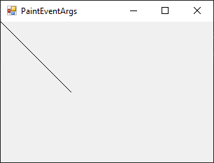
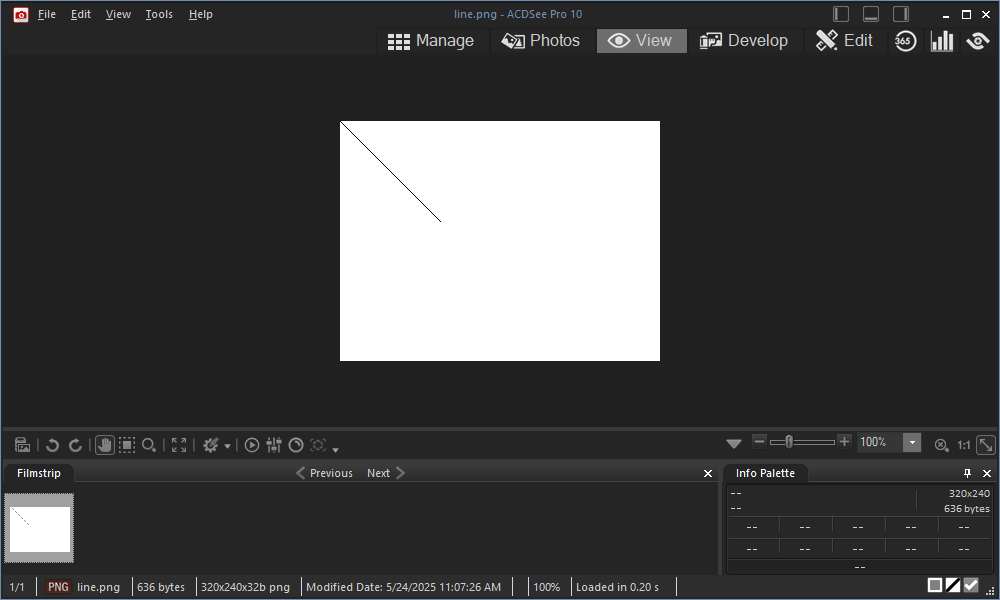
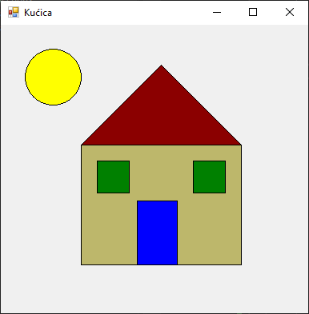

# Класа за рад са графиком

Класа Graphics представља основни интерфејс за цртање графике у GDI+ (енгл.
*Graphics Device Interface Plus*) систему програмског језика C# и налази се у
именском простору
[`System.Drawing`](https://learn.microsoft.com/en-us/dotnet/api/system.drawing?view=netframework-4.8.1).
Омогућава цртање различитих графичких елемената као што су линије, облици,
слике, текст и друге визуелне компоненте, на различитим површинама (нпр. у
прозору, контроли или слици). Неке од често коришћених метода ове класе су:

* DrawLine,
* DrawRectangle и FillRectangle,
* DrawEllipse и FillEllipse,
* DrawPolygon и FillPolygon и
* DrawString.

Постоји више начина за добијање објекта класе `Graphics`. Први и најпоузданији
начин је добијање графичког контекста из објекта `PaintEventArgs` унутар метода
`OnPaint`. Ово је најбољи приступ за цртање у Windows Forms апликацијама, јер
осигурава да се графика исправно освежава. На пример, ако је потребно да
нацрташ црну линију од координате $(0,0)$ до координате $(100,100)$, `OnPaint`
метода може да изгледа овако:

```cs
protected override void OnPaint(PaintEventArgs e)
{
    base.OnPaint(e);
    Graphics g = e.Graphics;
    g.DrawLine(Pens.Black, 0, 0, 100, 100);
}
```



Мање поуздан начин за креирање графичких објеката је помоћу `CreateGraphics()`
методе која се користи када је потребно динамичко цртање. Тај начин се не
препоручује јер није гарантовано да ће се графика задржати након освежавања
прозора, тј. цртеж се неће задржати ако дође до освежавања прозора,
минимизовања, прекривања или промене величине прозора:

```cs
Graphics g = this.CreateGraphics();
g.DrawLine(Pens.Black, 0, 0, 100, 100);
g.Dispose();
```

Трећи начин се користи када треба да црташ на слици тј. битмапи. Тада можеш да
користиш класу `Bitmap` и креираш графички објекат из ње. На пример, ако желиш
да креираш слику димензија 320х240, на којој је нацртана црна линија од
координате $(0,0)$ до координате $(100,100)$, кôд твог програма може да изгледа
овако:

```cs
Bitmap bmp = new Bitmap(320, 240);
using(Graphics g = Graphics.FromImage(bmp))
{
    g.DrawLine(Pens.Black, 0, 0, 100, 100);
}
bmp.Save("line.png");
```



Неке од основних метода класе `Graphics` обухватају цртање линија,
правоугаоника, елипса, текста, слика и др. На пример, нека је задатак да на
форми нацрташ једноставну сцену на којој се види пун месец и кућица, на пример
овако...



...одговарајући програм може да изгледа овако:

```cs
protected override void OnPaint(PaintEventArgs e)
{
    base.OnPaint(e);
    Graphics g = e.Graphics;
    g.FillEllipse(Brushes.Yellow, 30, 30, 70, 70);
    g.DrawEllipse(Pens.Black, 30, 30, 70, 70);
    g.FillRectangle(Brushes.DarkKhaki, 100, 150, 200, 150);
    g.DrawRectangle(Pens.Black, 100, 150, 200, 150);
    Point[] krov = { new Point(100, 150), new Point(200, 50), new Point(300, 150) };
    g.FillPolygon(Brushes.DarkRed, krov);
    g.DrawPolygon(Pens.Black, krov);
    g.FillRectangle(Brushes.Blue, 170, 220, 50, 80);
    g.DrawRectangle(Pens.Black, 170, 220, 50, 80);
    g.FillRectangle(Brushes.Green, 120, 170, 40, 40);
    g.DrawRectangle(Pens.Black, 120, 170, 40, 40);
    g.FillRectangle(Brushes.Green, 240, 170, 40, 40);
    g.DrawRectangle(Pens.Black, 240, 170, 40, 40);
}
```

`e.Graphics` је објекат који представља графички контекст прозора или контроле,
који се добија из аргумента `PaintEventArgs e`, који Windows Forms прослеђује
када је потребно да се прозор освежи. Метода `FillEllipse` црта пун месец жуте боје на
задатим координатама, задате величине. Метода `DrawEllipse` црта контуру тог истог
круга црном бојом. Слично, метода `FillRectangle` попуњава тело кућице зелено-смеђом
бојом, а метода `DrawRectangle` црта ивицу тела кућице црном бојом. Дефинисани низ
`Point[]` садржи три тачке крова, који се попуњава тамно-црвеном бојом са црном
ивицом. Потом се цртају врата као правоугаоник плаве боје са црном ивицом. Два
прозора су зелени правоугаоници са црним ивицама. Све је нацртано унутар
`OnPaint` метода, што значи да ће се поново исцртати сваки пут када се прозор
освежи.

У свим примерима до сада користили су се објекти `Pens` или `Brushes`. `Pens`
је класа која садржи унапред дефинисане `Pen` објекте за најчешће боје.
`Brushes` је слична класа која садржи унапред дефинисане `Brush` објекте за
стандардне боје. Ови објекти представљају такозване дељене (енгл. *shared*)
ресурсе и не требаш их ослобађати методом `Dispose()` или их постављати у
`using` блокове. Њима управља .NET Framework и води рачуна о ослобађању.

Насупрот њима, када будеш користио објекте класа `Pen` за цртање ивица (линија,
контура правоугаоника, елипси, полигона...) или `Brush` за попуњавање
унутрашњости облика (правоугаоника, елипси, полигона...) онда мораш ручно
ослободити ресурсе методом `Dispose()` или их поставити у `using` блоку.

Много више о методама и својствима класе `Graphics` учићеш у наредним лекцијама.
