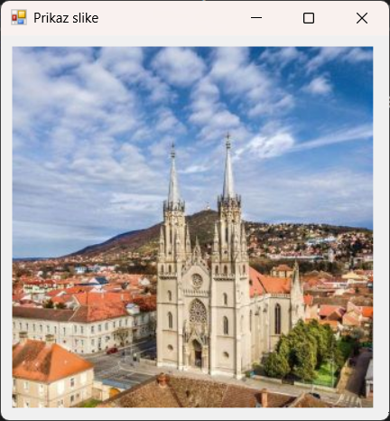
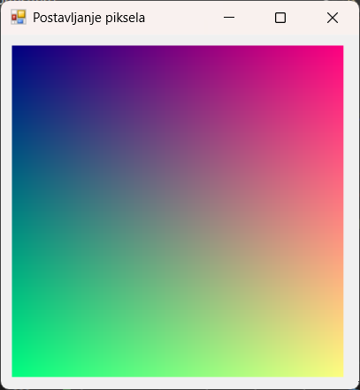

# Апстрактна класа Image и функционалности класе Bitmap

У програмском језику C#, рад са сликама и графиком олакшан је GDI+ библиотеком,
која пружа класе за манипулацију сликама, њихово приказивање и уређивање. Две
кључне класе у овој области су:

* класа `Image`, апстрактна класа која дефинише основни модел за рад са сликама и
* класа `Bitmap`, поткласа класе `Image`, која омогућава рад са растерским сликама.

## Апстрактна класа Image

Класом `Image` представљена је основна структура за рад са сликама у *.NET*-у.
Као апстрактна класа, не може се инстанцирати директно, већ се користи као
основа за друге класе, попут класа `Bitmap` и `Metafile`. Класа `Image` садржи
више метода и својстава за рад са сликама међу којима су најзначајнији:

* `Width`, враћа ширину слике у пикселима,
* `Height`, враћа висину слике у пикселима,
* `Size`, враћа димензије слике (ширина × висина),
* `Save(ImeFajla, Format)`, чува слику у датом формату (JPEG, PNG, BMP итд.),
* `FromFile(ImeFajla)`, учитава слику из фајла и враћа `Image` објекат,
* `RotateFlip(TipRotacijeObrtanja)`, ротира и/или обрће слику,
* `Clone()`, креира копију слике и др.

Сва својства и методе класе `Image` из именског простора
[`System.Drawing`](https://learn.microsoft.com/en-us/dotnet/api/system.drawing?view=netframework-4.8.1)
можеш пронаћи у
[званичној документацији](https://learn.microsoft.com/en-us/dotnet/api/system.drawing.image?view=netframework-4.8.1).

Пружа основну функционалност за учитавање, чување и манипулацију сликама у
различитим форматима, као што су BMP, JPEG, PNG, GIF и TIFF. Учитавање слика
могуће је из датотека, стримова или других ресурса. Подржава добијање основних
информација о слици, као што су висина, ширина, формат, резолуција и др.
Омогућава и промену формата слике и чување у различитим форматима, а подржава
основне трансформације слика, попут ротирања и промена величине.

Објекат класе `Image` имплементира `IDisposable` интерфејс, што значи да треба
да се ослободи након употребе. То се може урадити ручно позивањем `Dispose()`
или коришћењем `using` наредбе, што је препоручен начин.

Пример коришћења класе `Image` може да буде *Windows Forms* апликација којом се
учитава и приказује слику из фајла `slika.jpg` на форми:

```cs
protected override void OnPaint(PaintEventArgs e)
{
    this.Text = "Prikaz slike";
    this.Size = new Size(360, 380);
    using (Image img = Image.FromFile("slika.jpg"))
    {
        Graphics g = e.Graphics;
        g.DrawImage(img, 10, 10, img.Width, img.Height);
    }
}
```



## Класа Bitmap

Класа `Bitmap` је конкретна имплементација класе `Image` и омогућава рад са
растерским сликама. Ова класа омогућава приступ и манипулацију појединачним
пикселима слике и додаје могућност измене слика:

* `SetPixel(int x, int y, Color boja)`, на датој координати поставља пиксел
одређене боје,
* `GetPixel(int x, int y)`, враћа боју пиксела на датој координати,
* `Clone(Rectangle pravoug, PixelFormat format)`, креира копију дела слике,
* `LockBits()` и `UnlockBits()`, омогућава бржи приступ пикселима коришћењем
меморијског закључавања (закључавања у системској меморији) и др.

Сва својства и методе класе `Bitmap` из именског простора
[`System.Drawing`](https://learn.microsoft.com/en-us/dotnet/api/system.drawing?view=netframework-4.8.1)
можеш пронаћи у
[званичној документацији](https://learn.microsoft.com/en-us/dotnet/api/system.drawing.bitmap?view=netframework-4.8.1).

И објекти класе `Bitmap` користе системске ресурсе, па је препоручљиво
користити `using` или ручно позвати `Dispose()` за ослобађање ресурса:

```cs
protected override void OnPaint(PaintEventArgs e)
{
    this.Text = "Promena piksela";
    this.Size = new Size(640, 480);
    using (Bitmap bmp = new Bitmap(300, 300))
    {
        for (int x = 0; x < 300; x++)
        {
            for (int y = 0; y < 300; y++)
            {
                int red = (x * 255) / 300;
                int green = (y * 255) / 300;
                bmp.SetPixel(x, y, Color.FromArgb(red, green, 128));
            }
        }
        e.Graphics.DrawImage(bmp, 50, 50);
    }
}
```



Значи, класа `Bitmap` јесте одлична класа за рад са растерском графиком у
програмском језику C#, која омогућује манипулацију сликама, обраду пиксела и
цртање, али захтева пажљиво управљање меморијом због коришћења системских
ресурса.
