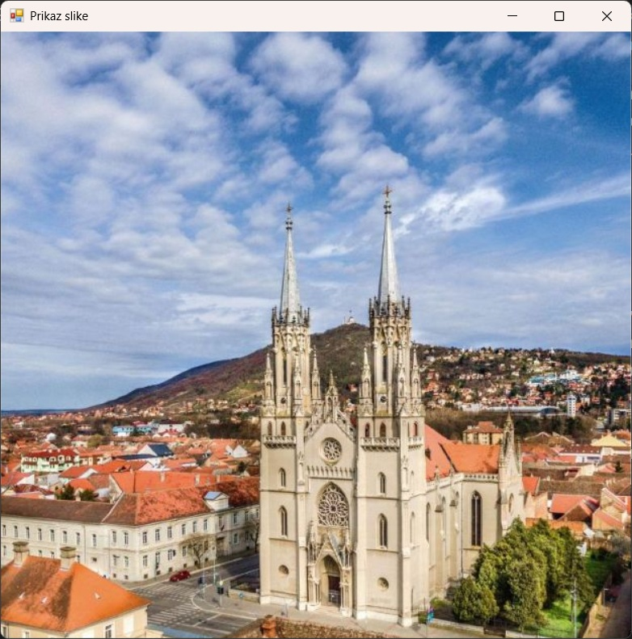

# Апстрактна класа Image и функционалности класе Bitmap

У програмском језику C#, рад са сликама и графиком олакшан је GDI+ библиотеком,
која пружа класе за манипулацију сликама, њихово приказивање и уређивање. Две
кључне класе у овој области су:

* класа `Image`, апстрактна класа која дефинише основни модел за рад са сликама и
* класа `Bitmap`, поткласа класе `Image`, која омогућава рад са растерским сликама.

## Апстрактна класа Image

Класом `Image` представљена је основна структура за рад са сликама у *.NET*-у.
Као апстрактна класа, не може се инстанцирати директно, већ се користи као
основа за друге класе, попут класа `Bitmap` и `Metafile`. Класа `Image` садржи
више метода и својстава за рад са сликама међу којима су најзначајнији:

* `Width`, враћа ширину слике у пикселима,
* `Height`, враћа висину слике у пикселима,
* `Size`, враћа димензије слике (ширина × висина),
* `Save(ImeFajla, Format)`, чува слику у датом формату (JPEG, PNG, BMP итд.),
* `FromFile(ImeFajla)`, учитава слику из фајла и враћа `Image` објекат,
* `RotateFlip(TipRotacijeObrtanja)`, ротира и/или обрће слику,
* `Clone()`, креира копију слике и др.

На пример, апликација којом се учитава и приказује слику из фајла `slika.jpg`
на форми:

```cs
protected override void OnPaint(PaintEventArgs e)
{
    this.Text = "Prikaz slike";
    this.Size = new Size(640, 640);
    Image img = Image.FromFile("slika.jpg");
    Graphics g = e.Graphics;
    g.DrawImage(img, 0, 0, img.Width, img.Height);
}
```



## Класа Bitmap

Класа `Bitmap` је конкретна имплементација класе `Image` и омогућава рад са
растерским сликама. Ова класа омогућава приступ и манипулацију појединачним
пикселима слике. Она додаје могућност измене слика:

* `SetPixel(int x, int y, Color boja)`, на датој координати поставља пиксел
одређене боје,
* `GetPixel(int x, int y)`, враћа боју пиксела на датој координати,
* `Clone(Rectangle pravoug, PixelFormat format)`, креира копију дела слике,
* `LockBits()` и `UnlockBits()`, омогућава бржи приступ пикселима коришћењем
меморијског закључавања (закључавања у системској меморији) и др.
