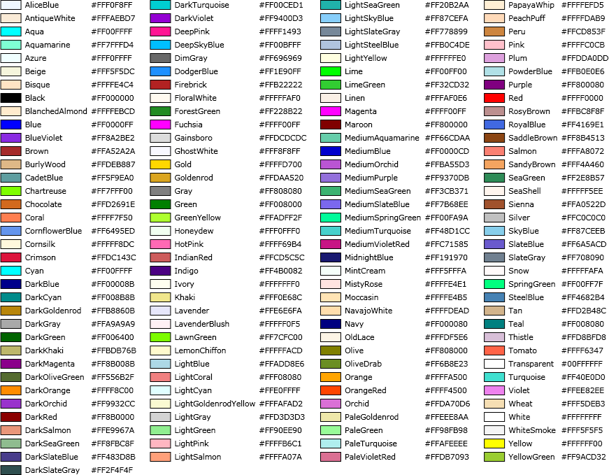
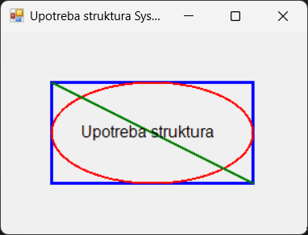

# Структура именског простора System.Drawing

Као што је у првој лекцији овог поглавља напоменуто, именски простор
`System.Drawing` у *.NET*-у садржи класе и структуре које се користе за рад са
графиком, сликама и геометријским облицима. Структуре у овом именском простору
су структуре `Color`, `Point`, `PointF`, `Size`, `SizeF`, `Rectangle` и
`RectangleF`. Ове структуре су непромењиве (енгл. *immutable*), што значи да се
њихове вредности не могу мењати након креирања.

## Боја

Структура
[`Color`](https://learn.microsoft.com/en-us/dotnet/api/system.drawing.color?view=netframework-4.8)
представља боју у простору ARGB (Alpha, Red, Green, Blue). Користи се за
дефинисање боја за цртање, попуњавање и друге графичке операције. Садржи и
унапред дефинисане боје (на пример `Color.Red`, `Color.Blue`) и омогућава
креирање прилагођених боја. Списак свих предефинисаних боја приказан је на
слици испод:



Боја сваког пиксела презентује се 32-битним бројем, где се користи по осам
битова за алфа, црвену, зелену и плаву компоненту. Алфа компонентом дефинише се
транспарентност – 0 потпуно провидно, а 255 потпуно непровидно. Боје које се
не налазе на списку боја можеш креирати `FromArgb()` методом. На пример, црвену
боју можеш креирати на следећи начин...

```cs
Color clr = Color.FromArgb(255, 0, 0);
```

...или:

```cs
Color poluprovidnaPlava = Color.FromArgb(128, 0, 0, 255);
```

У другом примеру, вредност 128 за алфа канал значи да је боја делимично
провидна, док у првом та вредност није наведена.

## Тачка

Структура
[`Point`](https://learn.microsoft.com/en-us/dotnet/api/system.drawing.point?view=netframework-4.8)
представља тачку у 2D простору са целобројним координатама $(X,Y)$. Користи се
за позиционирање објеката или дефинисање координата. Структура
[`PointF`](https://learn.microsoft.com/en-us/dotnet/api/system.drawing.pointf?view=netframework-4.8)
слична је структури `Point`, али са координатама типа `float`. Користи се за
прецизније позиционирање у простору са координатама дефинисаним бројевима са
покретним зарезом. На пример:

```cs
Point p1 = new Point(10, 10);
PointF p2 = new PointF(12.3f, 12.3f);
```

Ове структуре често ћеш користити у методама као што су `DrawLine()`,
`DrawString()` и другим графичким операцијама.

## Величина

Структура
[`Size`](https://learn.microsoft.com/en-us/dotnet/api/system.drawing.size?view=netframework-4.8)
представља димензије (ширину и висину) са целобројним вредностима и користи се
за дефинисање величина објеката или простора. Слично, структура
[`SizeF`](https://learn.microsoft.com/en-us/dotnet/api/system.drawing.sizef?view=netframework-4.8)
користи вредности типа `float` и користи се за прецизније дефинисање величина
са покретним зарезом. На пример:

```cs
Size s1 = new Size(123, 123);
SizeF s2 = new SizeF(123.45f, 123.45f);
```

## Правоугаоник

Структура
[`Rectangle`](https://learn.microsoft.com/en-us/dotnet/api/system.drawing.rectangle?view=netframework-4.8)
представља правоугаони регион са целобројним координатама $(X,Y)$ и димензијама
`(Width, Height)`. Користи се за дефинисање области на екрану или за рад са
деловима слике. Структура
[`RectangleF`](https://learn.microsoft.com/en-us/dotnet/api/system.drawing.rectanglef?view=netframework-4.8),
слична је структури `Rectangle`, користи `float` за координате и димензије за
прецизније дефинисање правоугаоних региона. На пример:

```cs
Rectangle r1 = new Rectangle(10, 10, 50, 50);
RectangleF r2 = new RectangleF(50.1f, 50.1f, 89.9f, 89.9f);
```

У следећем примеру...

```cs
protected override void OnPaint(PaintEventArgs e)
{
    base.OnPaint(e);
    Graphics g = e.Graphics;
    Color clrRec = Color.Blue;
    Color clrEll = Color.Red;
    Color clrLin = Color.Green;
    Color clrStr = Color.Black;
    using (Pen penRec = new Pen(clrRec, 3))
    using (Pen penEll = new Pen(clrEll, 2))
    using (Pen penLin = new Pen(clrLin, 2))
    using (Brush brsStr = new SolidBrush(clrStr))
    using (Font fntStr = new Font("Arial", 12))
    {
        Point pRec = new Point(50, 50);
        Size sRec = new Size(200, 100);
        Rectangle rec = new Rectangle(pRec, sRec);
        g.DrawRectangle(penRec, rec);
        g.DrawEllipse(penEll, rec);
        g.DrawLine(penLin, rec.Left, rec.Top, rec.Right, rec.Bottom);
        string str = "Upotreba struktura";
        g.DrawString(str, fntStr, brsStr, new PointF(rec.Left + 26.7f, rec.Top + 40.12f));
    }
}
```

...структуре из именског простора `System.Drawing` користе се за дефинисање
геометријских облика, боја, позиција и димензија. Оне омогућавају цртање
правоугаоника, елипсе, линије и текста на форми:


