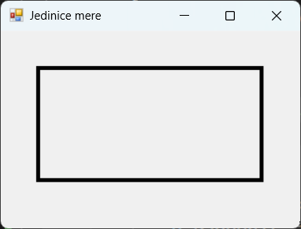

# Јединице мере димензија графичких објеката

У програмском језику C#, у Windows Forms апликацијама, када радиш са графичким
објектима, често је потребно подесити димензије тих објеката, као што су ширина
и висина. Јединице мере које се користе за димензије могу бити различите, али
најчешће се користе пиксели (енгл. *pixels*), тачке (енгл. *points*) или инчи
(енгл. *inches*). Пиксели (pixels) су најчешће јединице мере у графичким
апликацијама, где један пиксел представља најмању тачку на екрану. Тачке се
често користе у контексту штампе, где један инч има 72 тачке. Инчи се користе
за физичке димензије, нарочито у контексту штампања.

Поред наведених, доступне су и следеће јединице мере у оквиру енумерације
[System.Drawing.GraphicsUnit](https://learn.microsoft.com/en-us/dotnet/api/system.drawing.graphicsunit?view=netframework-4.8.1):

| Назив        | Вредност | Опис                                                               |
|--------------|----------|--------------------------------------------------------------------|
| `World`      | `0`      | Светски координатни систем као јединица мере                       |
| `Display`    | `1`      | Јединица мере уређаја – пиксели за екране и 1/100 инча за штампаче |
| `Pixel`      | `2`      | Пиксел уређаја као јединица мере                                   |
| `Point`      | `3`      | Тачка штампача (1/72 инча) као јединица мере                       |
| `Inch`       | `4`      | Инч као јединица мере                                              |
| `Document`   | `5`      | Јединица документа (1/300 инча) као јединица мере                  |
| `Millimeter` | `6`      | Милиметар као јединица мере                                        |

За промену јединице мере графичког објекта, користи се метода
`Graphics.PageUnit`. На пример, нека је задатак да на форми нацрташ
правоугаоник димензија $60\times{30}$ милиметара. Решење задатка може да
изгледа овако:

```cs
protected override void OnPaint(PaintEventArgs e)
{
    this.Size = new Size(320, 240);
    this.Text = "Jedinice mere";
    Graphics g = e.Graphics;
    g.PageUnit = GraphicsUnit.Millimeter;
    g.DrawRectangle(Pens.Black, 10, 10, 60, 30);
}
```



Води рачуна да ако промениш `PageUnit`, све координате и димензије које
на даље користиш у методама цртања биће интерпретиране у тој јединици. Такође,
приликом коришћења `PageUnit`, јединица `World` није подржана и покушај да је
подесиш резултираће изузетком.

## Јединице мере Windows Forms контрола

У *Windows Forms* апликацијама, димензије контрола (нпр. `Button`, `Label`,
`Panel` и др.) су подразумевано задате у пикселима. На пример:

```cs
Button dugme = new Button();
dugme.Width = 250;
dugme.Height = 50;
this.Controls.Add(dugme);
```

Ако желиш да користиш друге јединице мере, мораш извршити конверзију. На
пример, ако желиш да подесиш димензије у тачкама или инчима, можеш користити
следеће формуле:

```cs
int pikseli = (int)(tacke * 96 / 72);
int pikseli = (int)(inci * 96);
```

У следећем примеру...

```cs
double sirinaInci = 2.5;
double visinaInci = 0.5;
int sirinaPikseli = (int)(sirinaInci * 96);
int visinaPikseli = (int)(visinaInci * 96);
Button dugme = new Button();
dugme.Width = sirinaPikseli;
dugme.Height = visinaPikseli;
this.Controls.Add(dugme);
```

...дате димензије дугмета конвертују се из инча у пикселе.

У неким случајевима, можда ћеш морати да користиш `Graphics` објекат за тачније
мерење, нарочито ако треба да радиш са штампањем или ако желиш да прилагодиш
димензије према DPI (енгл. *Dots Per Inch*) одликама екрана. На пример:

```cs
Graphics g = this.CreateGraphics();
float dpiX = g.DpiX;
float dpiY = g.DpiY;
double sirinaInci = 2.5;
double visinaInci = 0.5;
int sirinaPikseli = (int)(sirinaInci * dpiX);
int visinaPikseli = (int)(visinaInci * dpiY);
Button dugme = new Button();
dugme.Width = sirinaPikseli;
dugme.Height = visinaPikseli;
this.Controls.Add(dugme);
```
