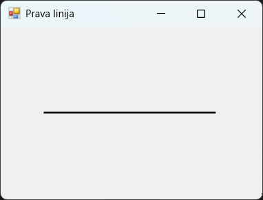
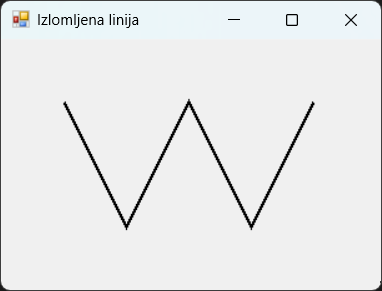
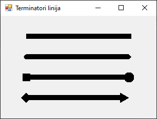
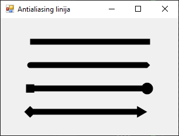

# Цртање линија

Када се ради са графиком у програмском језику C#, један од основних елемената
за цртање су линије. Оне могу бити праве или изломљене и могу имати различите
завршетке, тзв. терминаторе линија. Фокус у овој лекцији биће на коришћењу
класе `Graphics` за цртање ових облика.

## Права линија

За цртање праве линије користи се метода
[`DrawLine()`](https://learn.microsoft.com/en-us/dotnet/api/system.drawing.graphics.drawline?view=netframework-4.8)
класе `Graphics`. Дефинисана су четири преоптерећења методе `DrawLine()`:

```cs
DrawLine(Pen, int, int, int, int)
DrawLine(Pen, float, float, float, float)
DrawLine(Pen, Point, Point)
DrawLine(Pen, PointF, PointF)
```

У свом најједноставнијем облику, ова метода захтева оловку (`Pen`) и координате
две тачке које представљају почетну и крајњу координату линије...

```cs
protected override void OnPaint(PaintEventArgs e)
{
    base.OnPaint(e);
    Graphics g = e.Graphics;
    using (Pen olovka = new Pen(Color.Black, 2))
    {
        g.DrawLine(olovka, 50, 100, 250, 100);
    }
}
```

...а исти резултат добићеш и дефиницијом две структуре тачке (`Point`):

```cs
protected override void OnPaint(PaintEventArgs e)
{
    base.OnPaint(e);
    Graphics g = e.Graphics;
    Point tacka1 = new Point(50, 100);
    Point tacka2 = new Point(250, 100);
    using (Pen olovka = new Pen(Color.Black, 2))
    {
        g.DrawLine(olovka, tacka1, tacka2);
    }
}
```



За прецизније позиционирање у простору можеш да користиш координате са
дефинисаним бројевима са покретним зарезом...

```cs
protected override void OnPaint(PaintEventArgs e)
{
    base.OnPaint(e);
    Graphics g = e.Graphics;
    using (Pen olovka = new Pen(Color.Black, 2))
    {
        g.DrawLine(olovka, 50.0f, 100.0f, 250.0f, 100.0f);
    }
}
```

...или структурама тачке (`PointF`):

```cs
protected override void OnPaint(PaintEventArgs e)
{
    base.OnPaint(e);
    Graphics g = e.Graphics;
    PointF tacka1f = new PointF(50.0f, 100.0f);
    PointF tacka2f = new PointF(250.0f, 100.0f);
    using (Pen olovka = new Pen(Color.Black, 2))
    {
        g.DrawLine(olovka, tacka1f, tacka2f);
    }
}
```

## Изломљена линија

Изломљена линија представља низ повезаних линијских сегмената. За њено цртање
користи се метода
[`DrawLines()`](https://learn.microsoft.com/en-us/dotnet/api/system.drawing.graphics.drawlines?view=netframework-4.8),
којој се као аргумент прослеђује оловка и низ тачака `Point[]` или `PointF[]`:

```cs
DrawLines(Pen, Point[])
DrawLines(Pen, PointF[])
```

Прослеђени низ дефинише тачке кроз које пролази изломљена линија, а
`DrawLines()` повезује све тачке секвенцијално линијама.

```cs
protected override void OnPaint(PaintEventArgs e)
{
    base.OnPaint(e);
    Graphics g = e.Graphics;
    using (Pen olovka = new Pen(Color.Black, 2))
    {
        Point[] tacke = {
            new Point(50, 50),
            new Point(100, 150),
            new Point(150, 50),
            new Point(200, 150),
            new Point(250, 50)
        };
        g.DrawLines(olovka, tacke);
    }
}
```



За прецизније позиционирање у простору такође можеш да користиш координате са
дефинисаним бројевима са покретним зарезом:

```cs
protected override void OnPaint(PaintEventArgs e)
{
    base.OnPaint(e);
    Graphics g = e.Graphics;
    using (Pen olovka = new Pen(Color.Black, 2))
    {
        PointF[] tackef = {
            new PointF(50.0f, 50.0f),
            new PointF(100.0f, 150.0f),
            new PointF(150.0f, 50.0f),
            new PointF(200.0f, 150.0f),
            new PointF(250.0f, 50.0f)
        };
        g.DrawLines(olovka, tackef);
    }
}
```

## Терминатори линија

Терминатори линија одређују како ће се завршеци линија, односно `Pen` објекта
приказати. Подешавају се вредностима дефинисаним у енумерацији
[`LineCap`](https://learn.microsoft.com/en-us/dotnet/api/system.drawing.drawing2d.linecap?view=netframework-4.8):

| Назив           | Вредност | Опис                                |
|-----------------|----------|-------------------------------------|
| `Flat`          | `0`      | подразумевани завршетак             |
| `Square`        | `1`      | квадратни завршетак                 |
| `Round`         | `2`      | заобљени завршетак                  |
| `Triangle`      | `3`      | троугласти завршетак                |
| `NoAnchor`      | `16`     | без облика на завршетку             |
| `SquareAnchor`  | `17`     | квадратни облик на завршетку        |
| `RoundAnchor`   | `18`     | кружни облик на завршетку           |
| `DiamondAnchor` | `19`     | дијамантски облик на завршетку      |
| `ArrowAnchor`   | `20`     | облик стрелице на завршетку         |
| `AnchorMask`    | `240`    | за проверу да ли је завршетак облик |
| `Custom`        | `255`    | прилагођени завршетак               |

На пример:

```cs
protected override void OnPaint(PaintEventArgs e)
{
    base.OnPaint(e);
    Graphics g = e.Graphics;
    using (Pen olovka = new Pen(Color.Black, 10))
    {
        olovka.StartCap = LineCap.Flat;
        olovka.EndCap = LineCap.Square;
        e.Graphics.DrawLine(olovka, 50, 40, 250, 40);
        olovka.StartCap = LineCap.Round;
        olovka.EndCap = LineCap.Triangle;
        e.Graphics.DrawLine(olovka, 50, 80, 250, 80);
        olovka.StartCap = LineCap.SquareAnchor;
        olovka.EndCap = LineCap.RoundAnchor;
        e.Graphics.DrawLine(olovka, 50, 120, 250, 120);
        olovka.StartCap = LineCap.DiamondAnchor;
        olovka.EndCap = LineCap.ArrowAnchor;
        e.Graphics.DrawLine(olovka, 50, 160, 250, 160);
    }
}
```



## Антиалиасинг (углађивање линија)

Када се линије цртају на екрану, ивице могу изгледати назубљено због ограничене
резолуције приказа. Ова појава се зове **алиасинг**. Да би се линије приказале
глатко и визуелно пријатније, користи се техника **антиалиасинга**.
Антиалиасинг се постиже подешавањем особине `SmoothingMode` објекта `Graphics`,
тако што поставиш вредност `SmoothingMode.AntiAlias`. Такође, за примену
`SmoothingMode` потребно је да укључиш именски простор
`System.Drawing.Drawing2D`.

```cs
protected override void OnPaint(PaintEventArgs e)
{
    base.OnPaint(e);
    Graphics g = e.Graphics;
    g.SmoothingMode = SmoothingMode.AntiAlias;
    using (Pen olovka = new Pen(Color.Black, 10))
    {
        olovka.StartCap = LineCap.Flat;
        olovka.EndCap = LineCap.Square;
        e.Graphics.DrawLine(olovka, 50, 40, 250, 40);
        olovka.StartCap = LineCap.Round;
        olovka.EndCap = LineCap.Triangle;
        e.Graphics.DrawLine(olovka, 50, 80, 250, 80);
        olovka.StartCap = LineCap.SquareAnchor;
        olovka.EndCap = LineCap.RoundAnchor;
        e.Graphics.DrawLine(olovka, 50, 120, 250, 120);
        olovka.StartCap = LineCap.DiamondAnchor;
        olovka.EndCap = LineCap.ArrowAnchor;
        e.Graphics.DrawLine(olovka, 50, 160, 250, 160);
    }
}
```



Ако упоредиш ову и претходну слику форме, приметићеш да је десни крај треће
линије на претходној слици изразито пикселаризован, док на овој изгледа баш
онако како би очекивао да кружни облик треба да изгледа.
