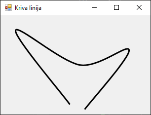
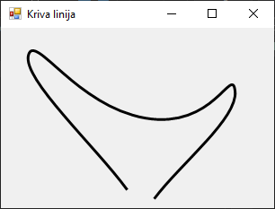
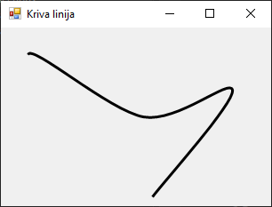
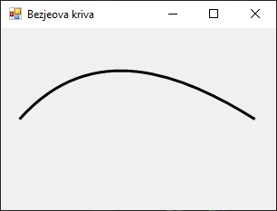
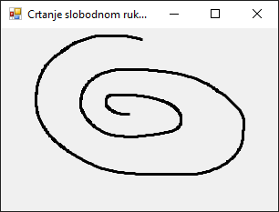

# Цртање кривих линија

Када се говори о цртању кривих линија, обично се мисли на цртање кривих методом
`DrawCurve()`, на цртање Безјеових кривих методом `DrawBezier()` или на тзв.
цртање слободном руком. Безјеове криве су подржане јер омогућавају једноставно
и прецизно дефинисање глатких кривих линија помоћу малог броја контролних
тачака, уз ефикасно израчунавање и визуелну стабилност.

## Цртање криве линије

Метода
[`DrawCurve()`](https://learn.microsoft.com/en-us/dotnet/api/system.drawing.graphics.drawcurve?view=netframework-4.8)
има више преоптерећења...

```cs
DrawCurve(Pen, Point[])
DrawCurve(Pen, PointF[])
DrawCurve(Pen, Point[], float)
DrawCurve(Pen, PointF[], float)
DrawCurve(Pen, PointF[], int, int)
DrawCurve(Pen, Point[], int, int, float)
DrawCurve(Pen, PointF[], int, int, float)
```

...а у свом најосновнијем облику омогућава ти да нацрташ криву линију која
пролази кроз дефинисани низ тачака (`Point[]`)...

```cs
protected override void OnPaint(PaintEventArgs e)
{
    base.OnPaint(e);
    Graphics g = e.Graphics;
    g.SmoothingMode = SmoothingMode.AntiAlias;
    using (Pen olovka = new Pen(Color.Black, 3))
    {
        Point p1 = new Point(140, 180);
        Point p2 = new Point(30, 30);
        Point p3 = new Point(160, 100);
        Point p4 = new Point(260, 70);
        Point p5 = new Point(170, 190);
        Point[] p = { p1, p2, p3, p4, p5 };
        g.DrawCurve(olovka, p);
    }
}
```



...односно, низ тачака (`PointF[]`), где се тачке дефинишу као реални бројеви
типа `float` (нпр. `PointF t1 = new PointF(10.0f, 10.0f);`).

Мало комплекснији облик навођења аргумената методе `DrawCurve()` подразумева
цртање криве која пролази кроз дефинисани низ тачака (`Point[]`) користећи
одређену затегнутост (енгл. *tension*) , односно цртање криве која пролази кроз
дефинисани низ тачака (`PointF[]`) користећи одређену затегнутост. На пример:

```cs
protected override void OnPaint(PaintEventArgs e)
{
    base.OnPaint(e);
    Graphics g = e.Graphics;
    g.SmoothingMode = SmoothingMode.AntiAlias;
    using (Pen olovka = new Pen(Color.Black, 3))
    {
        Point p1 = new Point(140, 180);
        Point p2 = new Point(30, 30);
        Point p3 = new Point(160, 100);
        Point p4 = new Point(260, 70);
        Point p5 = new Point(170, 190);
        Point[] p = { p1, p2, p3, p4, p5 };
        float t = 1.0f;
        g.DrawCurve(olovka, p, t);
    }
}
```



У методи `DrawCurve()` као аргументе можеш навести и низ тачака (`PointF[]`)
наводећи и два цела броја која представљају помак (енгл. *offset*) и број
сегмената. Вредност помака одређује број тачака које треба прескочити, где прва
тачка после прескочених тачака представља почетну тачку криве. Број сегмената
одређује број сегмената после почетне тачке које треба нацртати и мора бити
најмање 1. На пример:

```cs
protected override void OnPaint(PaintEventArgs e)
{
    base.OnPaint(e);
    Graphics g = e.Graphics;
    g.SmoothingMode = SmoothingMode.AntiAlias;
    using (Pen olovka = new Pen(Color.Black, 3))
    {
        PointF p1 = new PointF(140.0f, 180.0f);
        PointF p2 = new PointF(30.0f, 30.0f);
        PointF p3 = new PointF(160.0f, 100.0f);
        PointF p4 = new PointF(260.0f, 70.0f);
        PointF p5 = new PointF(170.0f, 190.0f);
        PointF[] p = { p1, p2, p3, p4, p5 };
        g.DrawCurve(olovka, p, 1, 3);
    }
}
```



Постоје још два преоптерећења методе `DrawCurve()`. Једно подразумева да као
аргументе наводиш низ тачака (`Point[]`), помак, број сегмената и затегнутост,
а друго, низ тачака (`PointF[]`), помак, број сегмената и затегнутост.

## Цртање Безјеове криве

Метода
[`DrawBezier()`](https://learn.microsoft.com/en-us/dotnet/api/system.drawing.graphics.drawbezier?view=netframework-4.8)
има три преоптерећења...

```cs
DrawBezier(Pen, Point, Point, Point, Point)
DrawBezier(Pen, PointF, PointF, PointF, PointF)
DrawBezier(Pen, float, float, float, float, float, float, float, float)
```

...а у свом најосновнијем облику омогућава ти да нацрташ криву линију која
пролази кроз четири тачке (`Point`):

```cs
protected override void OnPaint(PaintEventArgs e)
{
    base.OnPaint(e);
    Graphics g = e.Graphics;
    g.SmoothingMode = SmoothingMode.AntiAlias;
    using (Pen olovka = new Pen(Color.Black, 3))
    {
        Point p1 = new Point(20, 100);
        Point p2 = new Point(100, 10);
        Point p3 = new Point(200, 50);
        Point p4 = new Point(280, 100);
        g.DrawBezier(olovka, p1, p2, p3, p4);
    }
}
```



Уместо тачака `Point` можеш да дефинишеш четири тачке `PointF` или четири
координате које се представљају као парови реалних бројева типа `float`.

## Цртање слободном руком

У програмском језику C# "цртање слободном руком" подразумева праћење покрета
миша и чување путање као серије повезаних тачака. Овај концепт представља
основу многих графичких апликација за цртање и обраду слика. Да би нацртао
линију која прати кретање миша потребно је да пратиш `MouseDown`, `MouseMove` и
`MouseUp` догађаје, памтиш све тачке кроз које је курсор прошао док је тастер
миша притиснут и при сваком померању миша исцрташ линију између претходне и
тренутне тачке.

Пример једноставне Windows Forms апликације за цртање слободном руком може да
изгледа овако:

```cs
private List<Point> tacke = new List<Point>();
private bool crtanje = false;

public Form1()
{
    InitializeComponent();
    this.Size = new Size(320, 240);
    this.Text = "Crtanje slobodnom rukom";
    this.DoubleBuffered = true;
    this.MouseDown += new MouseEventHandler(this.Form_MouseDown);
    this.MouseMove += new MouseEventHandler(this.Form_MouseMove);
    this.MouseUp += new MouseEventHandler(this.Form_MouseUp);
}

private void Form_MouseDown(object sender, MouseEventArgs e)
{
    if (e.Button == MouseButtons.Left)
    {
        crtanje = true;
        tacke.Clear();
        tacke.Add(e.Location);
    }
}

private void Form_MouseMove(object sender, MouseEventArgs e)
{
    if (crtanje)
    {
        tacke.Add(e.Location);
        this.Invalidate();
    }
}

private void Form_MouseUp(object sender, MouseEventArgs e)
{
    if (e.Button == MouseButtons.Left)
    {
        crtanje = false;
    }
}

protected override void OnPaint(PaintEventArgs e)
{
    base.OnPaint(e);
    Graphics g = e.Graphics;
    g.SmoothingMode = SmoothingMode.AntiAlias;
    using (Pen olovka = new Pen(Color.Black, 3))
    {
        if (tacke.Count > 1)
        {
            g.DrawLines(olovka, tacke.ToArray());
        }
    }
}
```



У овој апликацији `List<Point> tacke` чува све тачке кроз које је миш прошао
током цртања, `MouseDown` активира почетак цртања, `MouseMove` бележи позиције
курсора и тражи да се форма поново нацрта `Invalidate()`, `MouseUp` завршава
цртање и `OnPaint` црта линију кроз све сачуване тачке. Да би се то постигло, у
конструктору форме додати су руковаоци догађајима, који су након тога
дефинисани као посебне методе. Овај приступ је класичан, читљив почетницима и
погодан када желиш да детаљније документујеш или проширујеш понашање у сваком
догађају.

## Остале методе за цртање кривих линија

У овој лекцији упознао си се са различитим методама за цртање кривих линија.
Без обзира да ли користиш унапред дефинисане методе попут `DrawCurve()` или сâм
пратиш кретање миша, C# ти пружа довољно алата за реализацију креативних
графичких решења. Поред метода са којима си се упознао, постоје и друге методе
за цртање кривих линија дефинисане у класи `Graphics`:

* [`DrawBeziers`](https://learn.microsoft.com/en-us/dotnet/api/system.drawing.graphics.drawbeziers?view=netframework-4.8)
за цртање серије Безјеових кривих дефинисане низом тачака,
* [`DrawClosedCurve`](https://learn.microsoft.com/en-us/dotnet/api/system.drawing.graphics.drawclosedcurve?view=netframework-4.8)
за цртање затворене криве линије дефинисане низом тачака, и
* [`FillClosedCurve`](https://learn.microsoft.com/en-us/dotnet/api/system.drawing.graphics.fillclosedcurve?view=netframework-4.8)
за испуњавање облика затворене криве.
