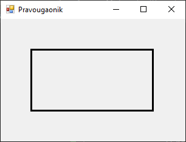
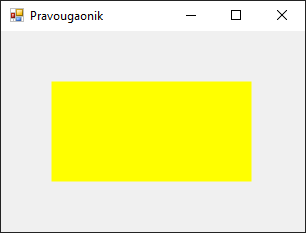
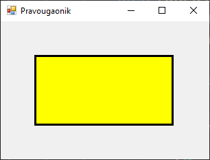

# Цртање правоугаоника и квадрата

Цртање правоугаоника и квадрата у Windows Forms апликацијама реализује се
помоћу метода класе `Graphics`. Исте методе користе се за оба облика, тако што
се квадрат црта као правоугаоник са једнаким страницама.

## Цртање ивица правоугаоника

Метода
[`DrawRectangle()`](https://learn.microsoft.com/en-us/dotnet/api/system.drawing.graphics.drawrectangle?view=netframework-4.8)
исцртава ивице правоугаоника и има три преоптерећења:

```cs
DrawRectangle(Pen, int, int, int, int)
DrawRectangle(Pen, float, float, float, float)
DrawRectangle(Pen, Rectangle)
```

У свом најједноставнијем облику, као параметри методе наводе се оловка и цели
бројеви типа `int` који представљају $x$ и $y$ координате горњег левог угла,
као и ширину и висину правоугаоника....

```cs
protected override void OnPaint(PaintEventArgs e)
{
    base.OnPaint(e);
    Graphics g = e.Graphics;
    g.SmoothingMode = SmoothingMode.AntiAlias;
    using (Pen olovka = new Pen(Color.Black, 3))
    {
        g.DrawRectangle(olovka, 50, 50, 200, 100);
    }
}
```



...или се наводе оловка и правоугаоник дефинисан структуром `Rectangle`:

```cs
protected override void OnPaint(PaintEventArgs e)
{
    base.OnPaint(e);
    Graphics g = e.Graphics;
    g.SmoothingMode = SmoothingMode.AntiAlias;
    Rectangle pravougaonik = new Rectangle(50, 50, 200, 100);
    using (Pen olovka = new Pen(Color.Black, 3))
    {
        g.DrawRectangle(olovka, pravougaonik);
    }
}
```

За прецизније позиционирање у простору можеш да користиш координате, висину и
ширину са бројевима са покретним зарезом типа `float`:

```cs
protected override void OnPaint(PaintEventArgs e)
{
    base.OnPaint(e);
    Graphics g = e.Graphics;
    g.SmoothingMode = SmoothingMode.AntiAlias;
    using (Pen olovka = new Pen(Color.Black, 3))
    {
        g.DrawRectangle(olovka, 50.0f, 50.0f, 200.0f, 100.0f);
    }
}
```

## Бојење правоугаоника

Метода
[`FillRectangle()`](https://learn.microsoft.com/en-us/dotnet/api/system.drawing.graphics.fillrectangle?view=netframework-4.8)
користи се за попуњавање унутрашњости правоугаоника. Постоје четири
преоптерећења ове методе:

```cs
FillRectangle(Brush, int, int, int, int)
FillRectangle(Brush, float, float, float, float)
FillRectangle(Brush, Rectangle)
FillRectangle(Brush, RectangleF)
```

Слично као у претходним примерима, у свом најједноставнијем облику, као
параметри методе наводе се четка и цели бројеви типа `int` који представљају
$x$ и $y$ координате горњег левог угла, као и ширину и висину правоугаоника...

```cs
protected override void OnPaint(PaintEventArgs e)
{
    base.OnPaint(e);
    Graphics g = e.Graphics;
    g.SmoothingMode = SmoothingMode.AntiAlias;
    using (Brush cetka = new SolidBrush(Color.Yellow))
    {
        g.FillRectangle(cetka, 50, 50, 200, 100);
    }
}
```



...или се наводе четка и правоугаоник дефинисан структуром `Rectangle`:

```cs
protected override void OnPaint(PaintEventArgs e)
{
    base.OnPaint(e);
    Graphics g = e.Graphics;
    g.SmoothingMode = SmoothingMode.AntiAlias;
    Rectangle pravougaonik = new Rectangle(50, 50, 200, 100);
    using (Brush cetka = new SolidBrush(Color.Yellow))
    {
        g.FillRectangle(cetka, pravougaonik);
    }
}
```

За прецизније позиционирање у простору можеш да користиш координате, висину и
ширину са бројевима са покретним зарезом типа `float`...

```cs
protected override void OnPaint(PaintEventArgs e)
{
    base.OnPaint(e);
    Graphics g = e.Graphics;
    g.SmoothingMode = SmoothingMode.AntiAlias;
    using (Brush cetka = new SolidBrush(Color.Yellow))
    {
        g.FillRectangle(cetka, 50.0f, 50.0f, 200.0f, 100.0f);
    }
}
```

...или структуру `RectangleF`:

```cs
protected override void OnPaint(PaintEventArgs e)
{
    base.OnPaint(e);
    Graphics g = e.Graphics;
    g.SmoothingMode = SmoothingMode.AntiAlias;
    RectangleF pravougaonikf = new RectangleF(50.0f, 50.0f, 200.0f, 100.0f);
    using (Brush cetka = new SolidBrush(Color.Yellow))
    {
        g.FillRectangle(cetka, pravougaonikf);
    }
}
```

## Цртање обојеног правоугаоника

Уколико желиш да комбинујеш више облика или слојева, редослед цртања је важан –
оно што се црта касније прекрива претходно. Пракса је да се прво попуњава облик,
па тек онда црта ивица облика, јер ако прво нацрташ ивице облика, па га после
попуњаваш, попуњавање облика може да прекрије ивице.

У следећем примеру...

```cs
protected override void OnPaint(PaintEventArgs e)
{
    base.OnPaint(e);
    Graphics g = e.Graphics;
    g.SmoothingMode = SmoothingMode.AntiAlias;
    Rectangle pravougaonik = new Rectangle(50, 50, 200, 100);
    using (Brush cetka = new SolidBrush(Color.Yellow))
    {
        g.FillRectangle(cetka, pravougaonik);
    }
    using (Pen olovka = new Pen(Color.Black, 3))
    {
        g.DrawRectangle(olovka, pravougaonik);
    }
}
```

...прво је обојена унутрашњост правоугаоника жутом бојом, па су потом исцртане
његове ивице црном бојом.


