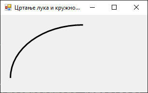
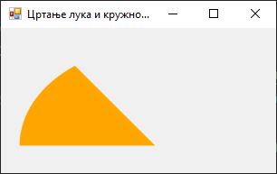

# Цртање лука и кружног исечка

Класа `Graphics` у .NET Framework-у омогућава цртање лукова и кружних исечака
помоћу метода
[`DrawArc()`](https://learn.microsoft.com/en-us/dotnet/api/system.drawing.graphics.drawarc?view=netframework-4.8)
и
[`FillPie()`](https://learn.microsoft.com/en-us/dotnet/api/system.drawing.graphics.fillpie?view=netframework-4.8).
Ови облици се дефинишу као делови елипсе уписане у правоугаоник. Поред
координата и димензија правоугаоника, наводе се и углови којима се дефинише део
елипсе који се црта.

## Цртање лука

Метода `DrawArc()` црта лучни део елипсе. Као параметри методе наводе се:
оловка којом се црта лук, координате и димензије правоугаоника у који је
уписана елипса, почетни угао у степенима (мерен од $0°$ на десно, у смеру
казаљке на сату) и угао кретања лука у степенима (који може бити и негативан).
На пример:

```cs
protected override void OnPaint(PaintEventArgs e)
{
    base.OnPaint(e);
    Graphics g = e.Graphics;
    g.SmoothingMode = SmoothingMode.AntiAlias;
    using (Pen olovka = new Pen(Color.Black, 3))
    {
        g.DrawArc(olovka, 20, 20, 300, 220, 180, 90);
    }
}
```



## Цртање кружног исечка

Метода `FillPie()` попуњава део елипсе између њеног лука и центра, формирајући
кружни исечак (енгл. *pie slice*). Овде уместо оловке треба да користиш четку,
а остали параметри су исти као код `DrawArc()`.

```cs
protected override void OnPaint(PaintEventArgs e)
{
    base.OnPaint(e);
    Graphics g = e.Graphics;
    g.SmoothingMode = SmoothingMode.AntiAlias;
    using (Brush cetka = new SolidBrush(Color.Orange))
    {
        g.FillPie(cetka, 20, 20, 300, 220, 180, 45);
    }
}
```


