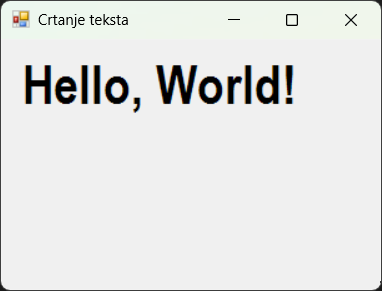
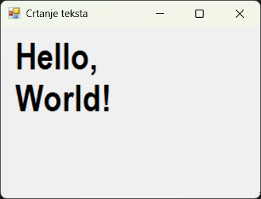
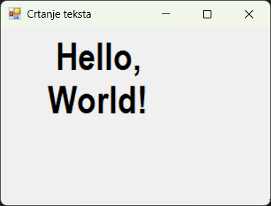

# Цртање текста

До сада си научио да се за цртање било ког графичког садржаја у Windows Forms
апликацијама користи неки објекат класе `Graphics`. Тако је омогућено да се
"нацрта" и текст методом
[`DrawString()`](https://learn.microsoft.com/en-us/dotnet/api/system.drawing.graphics.drawstring?view=netframework-4.8).
Једноставно речено, метода `DrawString()` црта задати текст на задатој локацији
задатом четком, задатим фонтом. Метода има више преоптерећења...

```cs
DrawString(string, Font, Brush, float, float);
DrawString(string, Font, Brush, PointF);
DrawString(string, Font, Brush, RectangleF);
DrawString(string, Font, Brush, float, float, StringFormat);
DrawString(string, Font, Brush, PointF, StringFormat);
DrawString(string, Font, Brush, RectangleF, StringFormat);
```

...али се најчешће користи облик који прима следеће параметре: стринг који се
исписује; објекат класе `Font` који одређује фонт, величину и стил текста;
објекат класе `Brush` којим се исписује текст; и координате горњег левог угла
где текст почиње да се црта.

## Цртање текста на координатама

У следећем примеру...

```cs
protected override void OnPaint(PaintEventArgs e)
{
    base.OnPaint(e);
    Graphics g = e.Graphics;
    g.SmoothingMode = SmoothingMode.AntiAlias;
    using (Brush b = new SolidBrush(Color.Black))
    {
        using (Font f = new Font("Arial Narrow", 32, FontStyle.Bold))
        {
            g.DrawString("Hello, World!", f, b, 10.0F, 10.0F);
        }
    }
}
```

...текст `Hello, World!` се исписује фонтом Arial Narrow, чија је величина 32,
који је подебљан и црне боје, почевши од координата (10, 10).



Метода `DrawString()` написана је унутар два `using` блока јер сви објекти који
имплементирају интерфејс `IDisposable`, као што су `Font` и `Brush`, треба да
се користе у `using` блоку или ручно ослободе после коришћења како би се
избегло цурење ресурса.

Координате тачке (10, 10) могу бити задате и у `PointF` структури, на пример:

```cs
protected override void OnPaint(PaintEventArgs e)
{
    base.OnPaint(e);
    Graphics g = e.Graphics;
    g.SmoothingMode = SmoothingMode.AntiAlias;
    using (Brush b = new SolidBrush(Color.Black))
    {
        using (Font f = new Font("Arial Narrow", 32, FontStyle.Bold))
        {
            PointF p = new PointF(10.0F, 10.0F);
            g.DrawString("Hello, World!", f, b, p);
        }
    }
}
```

## Цртање текста унутар правоугаоника

Уместо координата, можеш задати и правоугаоник унутар кога треба да се нацрта
текст. У следећем примеру...

```cs
protected override void OnPaint(PaintEventArgs e)
{
    base.OnPaint(e);
    Graphics g = e.Graphics;
    g.SmoothingMode = SmoothingMode.AntiAlias;
    using (Brush b = new SolidBrush(Color.Black))
    {
        using (Font f = new Font("Arial Narrow", 32, FontStyle.Bold))
        {
            RectangleF r = new RectangleF(10.0F, 10.0F, 200.0F, 100.0F);
            g.DrawString("Hello, World!", f, b, r);
        }
    }
}
```

...текст се исписује унутар правоугаоника ширине 200 и висине 100 пиксела.



## Центрирање текста

Помоћу објекта `StringFormat` можеш прецизно контролисати поравнање текста по
хоризонтали и вертикали у оквиру задатог правоугаоника. На пример:

```cs
protected override void OnPaint(PaintEventArgs e)
{
    base.OnPaint(e);
    Graphics g = e.Graphics;
    g.SmoothingMode = SmoothingMode.AntiAlias;
    using (Brush b = new SolidBrush(Color.Black))
    {
        using (Font f = new Font("Arial Narrow", 32, FontStyle.Bold))
        {
            StringFormat sf = new StringFormat();
            sf.Alignment = StringAlignment.Center;
            sf.LineAlignment = StringAlignment.Center;
            RectangleF r = new RectangleF(10.0F, 10.0F, 200.0F, 100.0F);
            g.DrawString("Hello, World!", f, b, r, sf);
        }
    }
}
```



Метода `DrawString()` је одлична за приказ текста у графичком контексту Windows
Forms апликација. Комбинујући различите фонтове, четке, координате и поравнања,
можеш креирати естетски и функционално прилагођен приказ текста.
