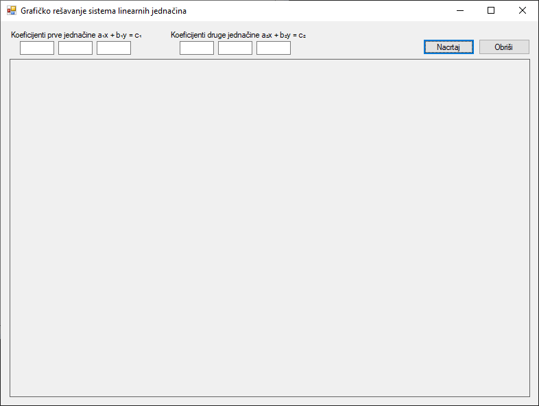

# Решавање система линеарних једначина

Циљ ове лекције је да примениш до сада научено да би направио апликацију за
графичко решавање система линеарних једначина облика

$$a_1 x + b_1 y = c_1$$
$$a_2 x + b_2 y = c_2$$

Свака од ових једначина у координатном систему представља једну праву. Решење
система је тачка у којој се ове две праве секу. Твоја апликација треба да
омогући кориснику да унесе коефицијенте $a$, $b$ и $c$ за обе једначине, па
затим да нацрта координатни систем, обе праве и означи њихову тачку пресека.

Да би решио овај задатак, на форму постави шест TextBox контрола, две Label
контроле, две Button контроле и једну Panel контролу, на пример овако:



Да би нацртао праву $ax + by = c$, потребно је да пронађеш координате две
тачке које јој припадају. Најлакши начин је да изразиш $y$ преко $x$:

$$by = c - ax => y = (c - ax) / b$$

Посебни случајеви су:

* ако је $a = 0$ једначина постаје $by = c$, односно $y = c/b$, што је
хоризонтална права.
* ако је $b = 0$ једначина постаје $ax = c$, односно $x = c/a$, што је
вертикална права.

Можеш да користиш Крамерово правило за решавање система. Детерминанта система
је:

$$D = a_1 b_2 - a_2 b_1$$
$$Dx = c_1 b_2 - c_2 b_1$$
$$Dy = a_1 c_2 - a_2 c_1$$

Решење система (координате пресечне тачке) су:

$$x = Dx / D$$
$$y = Dy / D$$

Ако је $D = 0$, праве су паралелне (нема решења) или се поклапају (бесконачно
много решења). У твом програму, у том случају не треба да црташ тачку пресека.

Програмско решење може да изгледа овако:

```cs
using System;
using System.Drawing;
using System.Drawing.Drawing2D;
using System.Windows.Forms;

namespace SistemLinearnihJna
{
    public partial class Form1 : Form
    {
        private struct Jednacina
        {
            public double A, B, C;
        }

        private Jednacina? jednacina1 = null;
        private Jednacina? jednacina2 = null;
        private PointF? tackaPreseka = null;
        private bool trebaCrtatiPrave = false;

        public Form1()
        {
            InitializeComponent();
            this.pnlCanvas.GetType().GetProperty("DoubleBuffered", System.Reflection.BindingFlags.NonPublic | System.Reflection.BindingFlags.Instance).SetValue(pnlCanvas, true, null);
        }

        private void pnlCanvas_Paint(object sender, PaintEventArgs e)
        {
            Graphics g = e.Graphics;
            g.SmoothingMode = SmoothingMode.AntiAlias;
            NacrtajKoordinatniSistem(g, pnlCanvas.ClientRectangle);
            if (trebaCrtatiPrave)
            {
                if (jednacina1.HasValue)
                {
                    NacrtajPravu(g, pnlCanvas.ClientRectangle, jednacina1.Value, new Pen(Color.Blue, 2));
                }
                if (jednacina2.HasValue)
                {
                    NacrtajPravu(g, pnlCanvas.ClientRectangle, jednacina2.Value, new Pen(Color.Red, 2));
                }
                if (tackaPreseka.HasValue)
                {
                    NacrtajPresek(g, pnlCanvas.ClientRectangle, tackaPreseka.Value);
                }
            }
        }

        private void NacrtajKoordinatniSistem(Graphics g, Rectangle granice)
        {
            float centarX = granice.Width / 2f;
            float centarY = granice.Height / 2f;
            float skala = 20f;
            Pen gridPen = new Pen(Color.LightGray, 1);
            for (float x = centarX; x < granice.Width; x += skala)
            {
                g.DrawLine(gridPen, x, 0, x, granice.Height);
                g.DrawLine(gridPen, centarX - (x - centarX), 0, centarX - (x - centarX), granice.Height);
            }
            for (float y = centarY; y < granice.Height; y += skala)
            {
                g.DrawLine(gridPen, 0, y, granice.Width, y);
                g.DrawLine(gridPen, 0, centarY - (y - centarY), granice.Width, centarY - (y - centarY));
            }
            Pen osaPen = new Pen(Color.Black, 2);
            g.DrawLine(osaPen, 0, centarY, granice.Width, centarY);
            g.DrawLine(osaPen, centarX, 0, centarX, granice.Height);
        }

        private void NacrtajPravu(Graphics g, Rectangle granice, Jednacina j, Pen olovka)
        {
            float centarX = granice.Width / 2f;
            float centarY = granice.Height / 2f;
            float skala = 20f;
            PointF p1 = new PointF();
            PointF p2 = new PointF();
            if (Math.Abs(j.B) < 1e-9)
            {
                if (Math.Abs(j.A) < 1e-9)
                {
                    return;
                }
                float x = (float)(j.C / j.A);
                p1.X = centarX + x * skala;
                p1.Y = 0;
                p2.X = centarX + x * skala;
                p2.Y = granice.Height;
            }
            else
            {
                float x1_math = -centarX / skala;
                float x2_math = (granice.Width - centarX) / skala;
                float y1_math = (float)((j.C - j.A * x1_math) / j.B);
                float y2_math = (float)((j.C - j.A * x2_math) / j.B);
                p1.X = centarX + x1_math * skala;
                p1.Y = centarY - y1_math * skala;
                p2.X = centarX + x2_math * skala;
                p2.Y = centarY - y2_math * skala;
            }
            g.DrawLine(olovka, p1, p2);
        }

        private void NacrtajPresek(Graphics g, Rectangle granice, PointF presek)
        {
            float centarX = granice.Width / 2f;
            float centarY = granice.Height / 2f;
            float skala = 20f;
            float screenX = centarX + presek.X * skala;
            float screenY = centarY - presek.Y * skala;
            g.FillEllipse(Brushes.DarkGreen, screenX - 5, screenY - 5, 10, 10);
            string text = $"Presek: ({presek.X:F2}, {presek.Y:F2})";
            Font font = new Font("Arial", 10);
            g.DrawString(text, font, Brushes.DarkGreen, screenX + 10, screenY - 10);
        }

        private PointF? IzracunajPresek(Jednacina j1, Jednacina j2)
        {
            double D = j1.A * j2.B - j2.A * j1.B;
            if (Math.Abs(D) < 1e-9)
            {
                return null;
            }
            double Dx = j1.C * j2.B - j2.C * j1.B;
            double Dy = j1.A * j2.C - j2.A * j1.C;
            float x = (float)(Dx / D);
            float y = (float)(Dy / D);
            return new PointF(x, y);
        }

        private void btnNacrtaj_Click(object sender, EventArgs e)
        {
            try
            {
                Jednacina j1 = new Jednacina
                {
                    A = double.Parse(txtA1.Text),
                    B = double.Parse(txtB1.Text),
                    C = double.Parse(txtC1.Text)
                };
                Jednacina j2 = new Jednacina
                {
                    A = double.Parse(txtA2.Text),
                    B = double.Parse(txtB2.Text),
                    C = double.Parse(txtC2.Text)
                };
                this.jednacina1 = j1;
                this.jednacina2 = j2;
                this.tackaPreseka = IzracunajPresek(j1, j2);
                this.trebaCrtatiPrave = true;
                pnlCanvas.Invalidate();
            }
            catch (FormatException)
            {
                MessageBox.Show("Unesite validne brojeve u sva polja.");
                Resetuj();
            }
        }

        private void Resetuj()
        {
            jednacina1 = null;
            jednacina2 = null;
            tackaPreseka = null;
            trebaCrtatiPrave = false;
            pnlCanvas.Invalidate();
        }

        private void btnObrisi_Click(object sender, EventArgs e)
        {
            txtA1.Clear(); txtB1.Clear(); txtC1.Clear();
            txtA2.Clear(); txtB2.Clear(); txtC2.Clear();
            Resetuj();
        }
    }
}
```

Променљиве на нивоу класе `jednacina1`, `jednacina2`, `tackaPreseka` чувају
податке о унетим једначинама и њиховом решењу. Оне су *Nullable* (са знаком
`?`), што значи да могу имати вредност `null` ако подаци нису унети.
`trebaCrtatiPrave` је `bool` променљива која служи као флег. Када је `false`,
црта се само координатни систем. Када корисник кликне дугме `Nacrtaj`, поставља
се на `true`, што `pnlCanvas_Paint` сигнализира да треба да нацрта праве.

Догађај `pnlCanvas_Paint(object sender, PaintEventArgs e)` је срце графичке
апликације. Овај догађај се аутоматски покреће сваки пут када треба освежити
изглед `pnlCanvas` контроле (нпр. при покретању апликације, промени величине
или када му се то експлицитно затражи). `e.Graphics` даје `Graphics` објекат,
који је алат за цртање. Увек се прво црта координатни систем, а затим, ако је
`trebaCrtatiPrave` тачно, цртају се и праве и пресек.

Трансформација координата се врши јер рачунарски екрани имају координатни
почетак (0,0) у горњем левом углу, док је у математици он у центру. У методама
за цртање дефинише се `centarX` и `centarY` као центар `Panel`-а и `skala` као
фактор зумирања. Формуле за конверзију из математичких (`x_m`, `y_m`) у
екранске (`x_e`, `y_e`) координате су:

* `x_e = centarX + x_m * skala`
* `y_e = centarY - y_m * skala` (минус је ту јер Y оса на екрану расте надоле).

`btnNacrtaj_Click` чита вредности из `TextBox`-ова. Користи `try-catch` блок да
ухвати грешке ако корисник унесе нешто што није број, израчунава пресечну
тачку, поставља `trebaCrtatiPrave` на `true` и позива `pnlCanvas.Invalidate()`.
Ова команда говори систему да је садржај панела застарео, те да позове `Paint`
догађај да га поново нацрта. Никада се не црта директно унутар `Click`
догађаја.

`btnObrisi_Click` чисти сва поља за унос, позива помоћну методу `Resetuj()`
која ресетује све податке и, такође, позива `pnlCanvas.Invalidate()`, што
резултира поновним цртањем само празног координатног система.

Након што си успешно направио апликацију која користи GDI+ за визуелизацију
математичког проблема и научио како да организујеш кôд за цртање, рукујеш
`Paint` догађајем и трансформишеш координате, можеш да размислиш о унапређењу
ове апликације. Ево неких идеја:

* Покушај да имплементираш зумирање помоћу точкића миша.
* Покушај да имплементираш померања координатног система превлачењем миша.
* Покушај да имплементираш бољи приказ информација исписивањем једначина
поред нацртаних правих, и исписивањем додатних порука (нпр. ако је $D=0$
прикажи поруку кориснику да су праве паралелне или да се поклапају).
* Покушај да имплементираш динамичко ажурирање графикона док корисник уноси
вредности у `TextBox`-ове коришћењем `TextChanged` догађаја.
