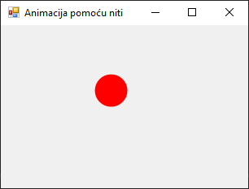

# Нити

У савременом развоју софтвера, потреба за извршавањем више задатака истовремено
(енгл. *multitasking*), односно паралелним извршавањем, постаје све израженија,
посебно када апликације обрађују велике количине података, комуницирају преко
мреже, или врше сложене визуелне операције као што су анимације. У програмском
језику C#, који се извршава унутар .NET Framework-а, мултитаскинг се остварује
употребом нити (енгл. *threads*), које омогућавају да се више различитих делова
програма извршавају истовремено или асинхроно.

Нит представља најмању јединицу извршавања унутар процеса. Док свака апликација
у Windows окружењу ради у оквиру једног процеса, тај процес може садржати више
нити. У основи, свака нит има свој ток извршавања, али све нити унутар једног
процеса деле исти меморијски простор. То омогућава комуникацију међу њима, али
истовремено захтева и пажљиву синхронизацију како би се избегли конфликти у
приступу подацима.

У .NET-у, нити се могу креирати и покренути коришћењем класа из именског
простора
[System.Threading.Thread](https://learn.microsoft.com/en-us/dotnet/api/system.threading?view=netframework-4.8)
и то конкретно класе
[Thread](https://learn.microsoft.com/en-us/dotnet/api/system.threading.thread?view=netframework-4.8).
Код Windows Forms апликација, рад са нитима добија додатну сложеност, јер само
главна (UI) нит сме директно да приступа контролама форме. Ако покушаш да
измениш неку контролу (на пример, `Label`, `PictureBox` или `Graphics` објекат)
из друге нити, јавиће се изузетак. Због тога се често користе технике као што
су `Invoke()` или `BeginInvoke()` за безбедну комуникацију са UI нитима.

Када се ради о креирању анимација помоћу GDI+, односно коришћењем класа као што
су `Graphics`, `Pen`, `Brush`, `Bitmap` и др., честа је потреба да се анимација
извршава у позадини како се главна форма не би замрзнула. На пример, ако желиш
да направиш анимацију круга који се креће по форми, једноставан приступ би био
да користиш контролу `Timer`. Међутим, за флексибилније и интензивније
анимације, често се користе нити које непрекидно ажурирају позицију објекта и
поново исцртавају садржај форме.

Следећи пример приказује како се у Windows Forms апликацији може користити
посебна нит за анимацију једноставног графичког објекта (црвени круг који се
креће са лева на десно):

```cs
using System;
using System.Drawing;
using System.Drawing.Drawing2D;
using System.Threading;
using System.Windows.Forms;

namespace AnimacijaPomocuNiti
{
    public partial class Form1 : Form
    {
        private int x = 0;
        private Thread nit;
        private volatile bool aktivna = true;

        public Form1()
        {
            this.DoubleBuffered = true;
            this.Width = 320;
            this.Height = 240;
            this.Text = "Animacija pomoću niti";
            this.FormClosing += new FormClosingEventHandler(ZatvoriFormu);
            nit = new Thread(new ThreadStart(PokreniAnimaciju));
            nit.IsBackground = true;
            nit.Start();
        }

        private void PokreniAnimaciju()
        {
            try
            {
                while (aktivna)
                {
                    x += 5;
                    if (x > this.Width)
                    {
                        x = 0;
                    }
                    if (this.IsHandleCreated && !this.IsDisposed)
                    {
                        this.Invoke(new MethodInvoker(this.Invalidate));
                    }
                    Thread.Sleep(50);
                }
            }
            catch (ObjectDisposedException) { }
            catch (InvalidOperationException) { }
        }

        private void ZatvoriFormu(object sender, FormClosingEventArgs e)
        {
            aktivna = false;
        }

        protected override void OnPaint(PaintEventArgs e)
        {
            base.OnPaint(e);
            Graphics g = e.Graphics;
            g.SmoothingMode = SmoothingMode.AntiAlias;
            g.FillEllipse(Brushes.Red, x, 60, 40, 40);
        }
    }
}
```

У датом примеру креирана је форма (`Form1`) димензија 320×240 пиксела и
насловом "Animacija pomoću niti". Поља `x`, `nit` и `aktivna` служе за контролу
анимације. Поље `x` одређује хоризонталну позицију црвеног круга, поље `nit`
представља позадинску нит која ажурира анимацију, а поље `aktivna` је флег који
контролише да ли се анимација наставља. `DoubleBuffered = true` омогућава
глатко исцртавање без треперења.

У конструктору, нова нит `nit` се покреће са методом `PokreniAnimaciju`. Ова
нит је подешена као позадинска `IsBackground = true`, што значи да ће се
аутоматски завршити када се главни програм затвори.

У бесконачној петљи `while (aktivna)`, нит помера круг за 5 пиксела удесно. Ако
круг изађе из форме, враћа га на почетак. Позива `Invalidate()` преко
`Invoke()` да би се форма поново исцртала што је неопходно јер се графички
елементи могу мењати само у главној нити. На крају успорава петљу са
`Thread.Sleep(50)` што значи ажурирање око 20 пута у секунди. Обрађени су
изузеци `ObjectDisposedException` и `InvalidOperationException` јер ће форма
бити затворена док нит ради.

Метода `OnPaint` исцртава црвени круг на позицији $(x, 60)$ са пречником 40
пиксела. `SmoothingMode.AntiAlias` осигурава глатке ивице.

При затварању форме, `ZatvoriFormu` поставља `aktivna = false`, што прекида
петљу у нити. Будући да је нит позадинска, она се аутоматски зауставља када се
главна нит, односно форма, затвори.

Значи, у датом примеру креирана је позадинска нит тј. анимација се одвија
независно од главне нити. Користи се *Thread-Safe* ажурирање тако што
`Invoke()` осигурава да се `Invalidate()` изврши у главној нити. Врши се
контрола животног циклуса помоћу флега `aktivna`, а обраа изузетака спречава
грешке при затварању форме. Дупли бафер спречава треперење при цртању. Резултат
извршавања програма је глатка анимација црвеног круга који се креће
хоризонтално.



Могао си да приметиш да је претходни пример прилично компликован. Коришћење
нити подразумева да се изузетно води рачуна о тзв. *deadlock*-у, где две или
више нити чекају једна другу и никада не завршавају, као и о синхронизацији,
где више нити приступају истим подацима, што може да доведе до конфликата.

За разумевање ове теме и конкуретног програмирања потребно је одвојити много
више времена од једног или два школска часа, а дати пример можеш да искористиш
као шаблон за креирање једноставних анимација.
