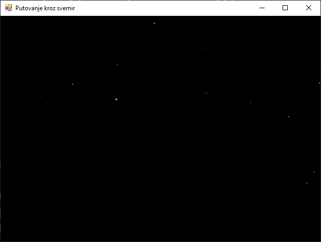

# Сложене анимације

У овој лекцији научићеш како можеш да створиш сложеније визуелне ефекте,
конкретно, како да симулираш кретање кроз тродимензионални простор користећи
само 2D алате. Креираћеш класичан "starfield" ефекат, који ствара убедљиву
илузију путовања кроз свемир.

Овај пројекат ће те научити како да управљаш великим бројем анимираних објеката
и како да користиш једноставну математику за стварање перспективне пројекције –
технике која чини да удаљени објекти изгледају мањи, а ближи већи, чиме се
постиже осећај дубине.

Пре него што почнеш са кодирањем, упознај се са принципима који омогућавају
овај ефекат.

**Псеудо-3D (или 2.5D)** подразумева рад у 2D окружењу (Windows Forms), где се
може симулирати трећа димензија (дубина). То се ради тако што се сваком објекту
(звезди) додели Z координата, која представља његову удаљеност од "камере" или
посматрача. Значи, не користи се прави 3D модел и рендеринг, већ само
математички трик за стварање илузије.

**Перспективна пројекција** је кључна техника. У стварном свету, објекти који
су даље изгледају мањи и као да се крећу спорије. Можеш симулирати ово
једноставним правилом: позицију објекта на 2D екрану добијаш дељењем његових
X и Y координата у простору са његовом удаљеношћу (Z координатом).

* x_na_ekranu = x_u_prostoru / z_udaljenost
* y_na_ekranu = y_u_prostoru / z_udaljenost

Када је Z велика вредност (звезда је далеко), резултат дељења ће бити мали, па
ће се звезда на екрану приказати близу центра. Како се Z смањује (звезда се
приближава), резултат дељења расте, па се звезда помера ка ивицама екрана, и
делује веће и брже.

**Управљање већим бројем објеката** подразумева рад са стотинама звезда. Да би
ефикасно управљао њима, можеш да користиш листу (`List<zvezda>`), која
омогућава да лако додајеш, уклањаш и пролазиш кроз све звезде у анимационој
петљи.

**Рециклирање објеката** је неопходно јер стално креирање нових и уништавање
старих објеката може бити захтевно за перформансе. Ефикаснији приступ је
"рециклирање" - када звезда прође поред постамтрача и нестане са екрана (када
јој Z координата постане нула или негативна), уместо да је уништиш, ти ћеш је
једноставно "ресетовати" – поставити је поново негде у даљину са новим
насумичним X и Y координатама.

Моделовање звезде дефинисано је у класи `zvezda`. Прво, потребан је начин да се
представи једна звезду. Уместо гомиле одвојених променљивих, користи се класа
која једноставно групише све податке везане за једну звезду.

```cs
private class zvezda
{
    public float X { get; set; }      // Позиција у 3D простору по X оси
    public float Y { get; set; }      // Позиција у 3D простору по Y оси
    public float Z { get; set; }      // Удаљеност од посматрача (дубина)
    public float Brzina { get; set; } // Индивидуална брзина "приближавања"
}
```

Овде је `Z` кључна вредност која даје илузију дубине.

Иницијализација свемира врши се у конструктору форме где се постављама сцена -
дефинише се изглед прозора, креира почетна популација звезда и покреће
анимациона петљу (тајмер).

```cs
private readonly List<zvezda> zvezde = new List<zvezda>();
private readonly Random rand = new Random();
private Timer timer;

public Form1()
{
    InitializeComponent();
    this.DoubleBuffered = true; // За глатку анимацију
    this.Width = 640;
    this.Height = 480;
    this.Text = "Putovanje kroz svemir";
    this.BackColor = Color.Black;

    // Креирамо 500 звезда са насумичним почетним позицијама
    for (int i = 0; i < 500; i++)
    {
        zvezde.Add(KreirajZvezdu(true)); // `true` омогућава насумичну Z вредност
    }

    // Подешавање и покретање тајмера
    timer = new Timer();
    timer.Interval = 50; // Ажурирање ~20 пута у секунди, за овај ефекат је довољно
    timer.Tick += Timer_Tick;
    timer.Start();
}
```

Генерисање звезда врши се у помоћној методи која креира и враћа нови објекат
звезде. Ово чини кôд чистијим јер је логика за креирање звезде на једном месту.

```cs
private zvezda KreirajZvezdu(bool randomZ = false)
{
    return new zvezda
    {
        X = rand.Next(-this.Width, this.Width),
        Y = rand.Next(-this.Height, this.Height),
        // Ако је `randomZ` тачно, дајемо јој насумичну дубину на почетку.
        // Иначе, постављамо је на максималну удаљеност (Z=1).
        Z = randomZ ? (float)rand.NextDouble() : 1, 
        Brzina = 2 + (float)rand.NextDouble() * 5 // Насумична брзина за ефекат паралаксе
    };
}
```

Параметар `randomZ` је користан да на почетку програма не би све звезде биле на
истој удаљености. Када се "рециклира" звезда, она ће увек поћи из највеће
даљине (Z=1).

Анимациона петља `Timer_Tick`  је "мотор" симулације. Сваки пут када се тајмер
активира, ова метода пролази кроз све звезде и ажурира њихово стање.

```cs
private void Timer_Tick(object sender, EventArgs e)
{
    for (int i = 0; i < zvezde.Count; i++)
    {
        // Померамо звезду "ка нама" смањујући њену Z координату
        zvezde[i].Z -= zvezde[i].Brzina * 0.001f;

        // Провера да ли је звезда прошла поред нас (Z <= 0)
        if (zvezde[i].Z <= 0)
        {
            // Ако јесте, "рециклирамо" је тако што је заменимо новом у даљини
            zvezde[i] = KreirajZvezdu();
        }
    }
    // Захтевамо поновно исцртавање сцене са новим позицијама
    this.Invalidate();
}
```

Визуелизација односно цртање сцене `OnPaint` је најзанимљивији део, где се
математика претвара у визуелни ефекат.

```cs
protected override void OnPaint(PaintEventArgs e)
{
    base.OnPaint(e);
    var g = e.Graphics;
    g.SmoothingMode = SmoothingMode.AntiAlias; // За глатке ивице кругова
    
    // Тачка нестајања (Vanishing Point) је у центру екрана
    float centarX = this.Width / 2f;
    float centarY = this.Height / 2f;

    foreach (var zvezda in zvezde)
    {
        // 1. Примена перспективне пројекције
        // Делимо X/Y са Z да добијемо 2D позицију на екрану
        float zvezdaX = centarX + (zvezda.X / zvezda.Z);
        float zvezdaY = centarY + (zvezda.Y / zvezda.Z);

        // 2. Израчунавање величине звезде
        // Како се Z приближава 0, (1 - Z) се приближава 1, и звезда постаје већа
        float velicina = 5 * (1 - zvezda.Z);
        if (velicina < 1) velicina = 1; // Минимална величина да се види

        // 3. Израчунавање провидности (Алфа канал)
        // Ближе звезде (мали Z) су јасније (већа алфа вредност)
        int alfa = (int)(255 * (1 - zvezda.Z));
        alfa = Math.Max(0, Math.Min(255, alfa)); // Осигуравамо да је вредност између 0 и 255

        // Креирање боје са израчунатом провидношћу
        Color bojaZvezde = Color.FromArgb(alfa, 255, 255, 255);

        // Користимо 'using' да се четкица аутоматски обрише из меморије
        using (var b = new SolidBrush(bojaZvezde))
        {
            g.FillEllipse(b, zvezdaX, zvezdaY, velicina, velicina);
        }
    }
}
```

На крају је важно зауставити тајмер када се апликација затвори како не би
наставио да ради у позадини и троши ресурсе.

```cs
protected override void OnFormClosing(FormClosingEventArgs e)
{
    base.OnFormClosing(e);
    timer.Stop();
    timer.Dispose();
}
```

Комплетан кôд може да изгледа овако:

```cs
using System;
using System.Collections.Generic;
using System.Drawing;
using System.Drawing.Drawing2D;
using System.Windows.Forms;

namespace PutovanjeKrozSvemir
{
    public partial class Form1 : Form
    {
        private class zvezda
        {
            public float X { get; set; }
            public float Y { get; set; }
            public float Z { get; set; }
            public float Brzina { get; set; }
        }

        private readonly List<zvezda> zvezde = new List<zvezda>();
        private readonly Random rand = new Random();
        private Timer timer;

        public Form1()
        {
            InitializeComponent();
            this.DoubleBuffered = true;
            this.Width = 640;
            this.Height = 480;
            this.Text = "Putovanje kroz svemir";
            this.BackColor = Color.Black;
            for (int i = 0; i < 500; i++)
            {
                zvezde.Add(KreirajZvezdu(true));
            }
            timer = new Timer();
            timer.Interval = 50;
            timer.Tick += Timer_Tick;
            timer.Start();
        }

        private zvezda KreirajZvezdu(bool randomZ = false)
        {
            return new zvezda
            {
                X = rand.Next(-this.Width, this.Width),
                Y = rand.Next(-this.Height, this.Height),
                Z = randomZ ? (float)rand.NextDouble() : 1,
                Brzina = 2 + (float)rand.NextDouble() * 5
            };
        }

        private void Timer_Tick(object sender, EventArgs e)
        {
            for (int i = 0; i < zvezde.Count; i++)
            {
                zvezde[i].Z -= zvezde[i].Brzina * 0.001f;
                if (zvezde[i].Z <= 0)
                {
                    zvezde[i] = KreirajZvezdu();
                }
            }
            this.Invalidate();
        }

        protected override void OnPaint(PaintEventArgs e)
        {
            base.OnPaint(e);
            var g = e.Graphics;
            g.SmoothingMode = SmoothingMode.AntiAlias;
            float centarX = this.Width / 2f;
            float centarY = this.Height / 2f;
            foreach (var zvezda in zvezde)
            {
                float zvezdaX = centarX + (zvezda.X / zvezda.Z);
                float zvezdaY = centarY + (zvezda.Y / zvezda.Z);
                float velicina = 5 * (1 - zvezda.Z);
                if (velicina < 1) velicina = 1;
                int alfa = (int)(255 * (1 - zvezda.Z));
                alfa = Math.Max(0, Math.Min(255, alfa));
                Color bojaZvezde = Color.FromArgb(alfa, 255, 255, 255);
                using (var b = new SolidBrush(bojaZvezde))
                {
                    g.FillEllipse(b, zvezdaX, zvezdaY, velicina, velicina);
                }
            }
        }

        protected override void OnFormClosing(FormClosingEventArgs e)
        {
            base.OnFormClosing(e);
            timer.Stop();
            timer.Dispose();
        }
    }
}
```



Овај ефекат је одлична основа за експериментисање. Ево неколико идеја:

* **Интеракција са мишем** - промена `centarX` и `centarY` на основу позиције
миша. Тиме ћеш створити ефекат "гледања" у различитим правцима док "путујеш".
* **"Warp" брзина** - додај догађај за притисак тастера (нпр. тастера Space).
Када је тастер притиснут, драстично повећај брзину свих звезда тако што ћеш
множити `zvezde[i].Brzina` већим фактором у `Timer_Tick` методи.
* **Обојене звезде** - у `KreirajZvezdu` методи, поред позиције и брзине,
генериши и насумичну боју за сваку звезду (нпр. суптилне нијансе плаве, жуте и
беле). Сачувај ту боју као ново својство у класи `zvezda` и користите је
приликом цртања.
* **Комете или астероиди** - повремено, уместо тачке, нацртајте малу линију или
сличицу астероида која се креће кроз поље звезда.

Кроз овај пример, видео си како једноставна математика и добро управљање
објектима могу створити визуелно импресивне ефекте. Научио си како да симулираш
3D дубину у 2D окружењу, како да користиш перспективну пројекцију за
реалистичан приказ удаљености, и како да ефикасно управљаш и "рециклираш"
велики број објеката. Ове технике су темељ за многе специјалне ефекте у играма
и симулацијама.
