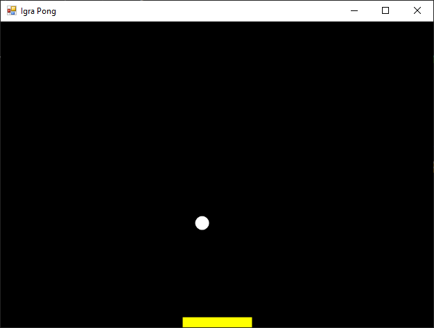

# Примена анимација у рачунарским играма

Анимација у рачунарској графици је илузија покрета која се ствара брзим
приказивањем низа статичних слика. Овај принцип је у срцу сваке видео-игре. У
овој лекцији, научићеш како да имплементираш основне механизме анимације и
интеракције кроз израду поједностављене верзије легендарне игре Понг.

Креираћемо апликацију у којој се лоптица креће по екрану и одбија од ивица и
рекета којим управља играч. Овај једноставан пројекат је савршен за разумевање
фундаменталних концепата као што су петља игре (енгл. *game loop*), исцртавање
(енгл. *rendering*), обрада уноса (енгл *input handling*) и детекција колизије
(енгл. *collision detection*).

Нека је задатак да креираш поједностављену верзију чувене игре Понг. Лоптица
треба да се креће по екрану и одбија од горње, леве и десне ивице форме. Када
удари у рекет (правоугаоник на дну), одбија се нагоре. Играч контролише рекет
користећи тастере лево и десно на тастатури. Рекет се креће само хоризонтално
уз доњу ивицу форме. Ако лоптица прође поред рекета и додирне доњу ивицу форме,
игра треба да се заврши и прикаже порука о губитку. Перформансе игре треба да
оптимизујеш коришћењем `DoubleBuffered` својства за глатко приказивање и
тајмером који ажурира игру око 60 пута у секунди.

Пре него што пређеш на кодирање, треба да разумеш неколико кључних концепата
који омогућавају да наша игра ради.

**Петља игре** је срце сваке игре. То је бесконачна петља која константно:

* Проверава унос играча (притисак на тастер).
* Ажурира стање игре (помера лоптицу, проверава колизије).
* Исцртава тренутно стање на екрану.

У овом случају, улогу петље игре вршиће `System.Windows.Forms.Timer`. Његов
догађај `Tick` ће се покретати у правилним интервалима (нпр. сваких 16
милисекунди) и у њему ће се ажурирати логика игре.

**Стање игре** подразумева праћење свих променљивих које дефинишу тренутну
ситуацију у игри. У овој верзији Понга, то су позиција лоптице (lopticaX,
lopticaY), њена брзина (lopticaBrzinaX, lopticaBrzinaY) и позиција играчевог
рекета (igracX).

**Исцртавање** је процес претварања стања игре (бројева и променљивих) у
видљиву слику на екрану. У Windows Forms апликацијама, ово се ради унутар
`OnPaint` догађаја. Када се позове метода `this.Invalidate()`, оперативном
систему се говори: "Садржај овог прозора више није валидан, молим те позови
`OnPaint` методу да га поново исцрташ." **Двоструко баферовање** спречава
треперење које се дешава приликом директног цртања на екран, јер се на
тренутак види празан екран пре него што се исцртају нови положаји објеката.
Двоструко баферовање решава овај проблем тако што се цела сцена прво исцртава у
меморији (на "скривеном" баферу), а затим се та комплетна слика одједном
приказује на екрану. У Windows Forms-у, ово се лако активира постављањем
својства форме `this.DoubleBuffered = true;`.

**Детекција колизије** представља логику којом се проверава да ли се два
објекта у игри додирују. У овом случају, то су једноставне математичке провере:

* Да ли је координата лоптице прешла границе екрана?
* Да ли се правоугаоник лоптице преклапа са правоугаоником рекета?

На почетку класе Form1 треба да дефинишеш све променљиве које ће чувати стање
игре:

```cs
      
private int lopticaX = 100;         // Тренутна X позиција лоптице
private int lopticaY = 100;         // Тренутна Y позиција лоптице
private int lopticaBrzinaX = 3;     // Померај лоптице по X оси у сваком фрејму
private int lopticaBrzinaY = 3;     // Померај лоптице по Y оси у сваком фрејму
private int lopticaVelicina = 20;   // Пречник лоптице у пикселима
private int igracSirina = 100;      // Ширина рекета
private int igracVisina = 15;       // Висина рекета
private int igracX;                 // Тренутна X позиција рекета
private int igracBzina = 10;        // Брзина померања рекета
private bool aktivna = true;        // Да ли је игра у току?
```

У конструктору форме треба да подесиш све почетне параметре форме и покренеш
петљу игре (тајмер):

```cs
public Form1()
{
    InitializeComponent();
    // Оптимизација за глатку анимацију
    this.DoubleBuffered = true; 

    // Подешавање изгледа прозора
    this.Width = 640;
    this.Height = 480;
    this.Text = "Igra Pong";
    this.BackColor = Color.Black;

    // Постављање рекета на средину на почетку игре
    igracX = (this.ClientSize.Width - igracSirina) / 2;

    // Креирање и подешавање тајмера (петље игре)
    Timer timer = new Timer();
    timer.Interval = 16; // ~60 фрејмова у секунди (1000ms / 16ms ≈ 62.5 FPS)
    timer.Tick += Timer_Tick; // Повезивање тајмера са методом која ажурира игру
    timer.Start(); // Покретање тајмера

    // Регистровање догађаја за притисак тастера
    this.KeyDown += Pomeranje;
}
```

Петља игре се налази у методи која се позива сваких 16 милисекунди и у њој се
налази сва логика игре:

```cs
private void Timer_Tick(object sender, EventArgs e)
{
    // Ако игра није активна (нпр. након губитка), не ради ништа
    if (!aktivna) return;

    // 1. Ажурирање позиције лоптице
    lopticaX += lopticaBrzinaX;
    lopticaY += lopticaBrzinaY;

    // 2. Детекција колизије са левом и десном ивицом
    if (lopticaX <= 0 || lopticaX + lopticaVelicina >= this.ClientSize.Width)
    {
        lopticaBrzinaX *= -1; // Обрни смер кретања по X оси
    }

    // 3. Детекција колизије са горњом ивицом
    if (lopticaY <= 0)
    {
        lopticaBrzinaY *= -1; // Обрни смер кретања по Y оси
    }

    // 4. Детекција колизије са рекетом играча
    // Проверава да ли је лоптица у висини рекета и да ли је унутар распона рекета по X оси
    if (lopticaY + lopticaVelicina >= this.ClientSize.Height - igracVisina &&
        lopticaX + lopticaVelicina >= igracX &&
        lopticaX <= igracX + igracSirina)
    {
        lopticaBrzinaY *= -1; // Одбиј лоптицу нагоре
    }

    // 5. Детекција губитка (лоптица је прошла поред рекета)
    if (lopticaY >= this.ClientSize.Height)
    {
        aktivna = false; // Заустави игру
        MessageBox.Show("Изгубио си!"); // Прикажи поруку
        this.Close(); // Затвори апликацију
    }

    // 6. Захтевај поновно исцртавање
    // Ово ће индиректно позвати OnPaint методу
    this.Invalidate(); 
}
```

Обрада уноса са тастатуре налази се у методи која реагује када играч притисне
тастер и помера рекет лево или десно.

```cs
private void Pomeranje(object sender, KeyEventArgs e)
{
    if (e.KeyCode == Keys.Left && igracX > 0)
    {
        igracX -= igracBzina; // Помери улево
    }
    else if (e.KeyCode == Keys.Right && igracX < this.ClientSize.Width - igracSirina)
    {
        igracX += igracBzina; // Помери удесно
    }
}
```

Провере `igracX > 0` и `igracX < this.ClientSize.Width - igracSirina`
спречавају да рекет изађе ван граница екрана.

Исцртавање на екрану (OnPaint) дефинисано је у методи која се позива сваки пут
када је потребно поново исцртати прозор. Она користи тренутне вредности
променљивих (стање игре) да нацрта лоптицу и рекет на њиховим новим позицијама:

```cs
protected override void OnPaint(PaintEventArgs e)
{
    base.OnPaint(e);
    Graphics g = e.Graphics;
    // Ова опција чини ивице облика глатким (anti-aliasing)
    g.SmoothingMode = SmoothingMode.AntiAlias;

    // Исцртај лоптицу (бела елипса)
    g.FillEllipse(Brushes.White, lopticaX, lopticaY, lopticaVelicina, lopticaVelicina);
    
    // Исцртај рекет (жути правоугаоник)
    g.FillRectangle(Brushes.Yellow, igracX, this.ClientSize.Height - igracVisina, igracSirina, igracVisina);
}
```

Када спојиш све до сада објашњено, доћи ћеш до функционалног кода игре Понг:

```cs
using System;
using System.Drawing;
using System.Drawing.Drawing2D;
using System.Windows.Forms;

namespace Grafika
{
    public partial class Form1 : Form
    {
        private int lopticaX = 100;
        private int lopticaY = 100;
        private int lopticaBrzinaX = 3;
        private int lopticaBrzinaY = 3;
        private int lopticaVelicina = 20;
        private int igracSirina = 100;
        private int igracVisina = 15;
        private int igracX;
        private int igracBzina = 10;
        private bool aktivna = true;

        public Form1()
        {
            InitializeComponent();
            this.DoubleBuffered = true;
            this.Width = 640;
            this.Height = 480;
            this.Text = "Igra Pong";
            this.BackColor = Color.Black;
            igracX = (this.ClientSize.Width - igracSirina) / 2;
            Timer timer = new Timer();
            timer.Interval = 16;
            timer.Tick += Timer_Tick;
            timer.Start();
            this.KeyDown += Pomeranje;
        }

        private void Timer_Tick(object sender, EventArgs e)
        {
            if (!aktivna) return;
            lopticaX += lopticaBrzinaX;
            lopticaY += lopticaBrzinaY;
            if (lopticaX <= 0 || lopticaX + lopticaVelicina >= this.ClientSize.Width)
            {
                lopticaBrzinaX *= -1;
            }
            if (lopticaY <= 0)
            {
                lopticaBrzinaY *= -1;
            }
            if (lopticaY + lopticaVelicina >= this.ClientSize.Height - igracVisina &&
                lopticaX + lopticaVelicina >= igracX &&
                lopticaX <= igracX + igracSirina)
            {
                lopticaBrzinaY *= -1;
            }
            if (lopticaY >= this.ClientSize.Height)
            {
                aktivna = false;
                MessageBox.Show("Izgubio si!");
                this.Close();
            }
            this.Invalidate();
        }

        private void Pomeranje(object sender, KeyEventArgs e)
        {
            if (e.KeyCode == Keys.Left && igracX > 0)
            {
                igracX -= igracBzina;
            }
            else if (e.KeyCode == Keys.Right && igracX < this.ClientSize.Width - igracSirina)
            {
                igracX += igracBzina;
            }
        }
        protected override void OnPaint(PaintEventArgs e)
        {
            base.OnPaint(e);
            Graphics g = e.Graphics;
            g.SmoothingMode = SmoothingMode.AntiAlias;
            g.FillEllipse(Brushes.White, lopticaX, lopticaY, lopticaVelicina, lopticaVelicina);
            g.FillRectangle(Brushes.Yellow, igracX, this.ClientSize.Height - igracVisina, igracSirina, igracVisina);
        }
    }
}
```



Ово је основна верзија игре коју можеш да прошириш и унапредиш. Ево неколико идеја:

1. Систем бодовања:
    * Додај променљиву private `int rezultat = 0;`.
    * Сваки пут када лоптица удари у рекет играча (унутар `if` услова за
    колизију са рекетом), повећај резултат: `rezultat++;`.
    * Прикажи резултат на екрану. У `OnPaint` методи, додај:
    `g.DrawString("Rezultat: " + rezultat, new Font("Arial", 16), Brushes.White, 10, 10);`.
    * Када играч изгуби, прикажи коначан резултат у `MessageBox`-у.
2. Повећање тежине:
    * Убрзавај лоптицу током времена. На пример, након сваког одбијања од рекета,
    можеш мало повећати њену брзину.
    * Додај бројач одбијања. Када достигне `5`, повећај `lopticaBrzinaY` и/или
    `lopticaBrzinaX` и ресетуј бројач.
3. Противник којим управља рачунар (AI):
    * Додај други рекет на врху екрана. Дефиниши променљиве за њега, нпр.
    `aiReketX`, `aiReketSirina`, итд.
    * У `Timer_Tick` методи, имплементирај једноставну "вештачку
    интелигенцију": нека AI рекет прати X позицију лоптице
    `aiReketX = lopticaX - (aiReketSirina / 2);`
    * Ово ће створити "савршеног" противника који никада не греши. Можеш га
    учинити мање савршеним тако што ћеш ограничити брзину којом прати лоптицу.

У овој лекцији успешно си креирао своју прву анимирану игру. Кроз овај донекле
једноставан пример, научио си фундаменталне принципе који покрећу готово све
модерне видео-игре: петљу игре за константно ажурирање, управљање стањем кроз
променљиве, исцртавање на екрану и обраду интеракције са играчем. Ови концепти
су основа за израду много комплекснијих и занимљивијих игара. Настави да
експериментишеш и надограђујеш свој пројекат!
