# Трансформације графичког објекта

Трансформације графичког објекта су скуп операција којима се мења положај,
оријентација и величина објекта у координатном систему. Ове операције су
дефинисане у класи
[`Graphics`](https://learn.microsoft.com/en-us/dotnet/api/system.drawing.graphics?view=netframework-4.8),
а често се користе у комбинацији са трансформационим матрицама
[`Matrix`](https://learn.microsoft.com/en-us/dotnet/api/system.drawing.drawing2d.matrix?view=netframework-4.8).

Основне трансформације су:

- **Транслација** (енгл. *Translation*) представља померање објекта,
- **Ротација** (енгл. *Rotation*) представља ротирање објекта,
- **Скалирање** (енгл. *Scaling*) представља промену величине објекта и
- **Ресет** (енгл. *Reset*) представља враћање у почетно стање.

Нека је задат правоугаоник са координатама $(100, 50)$ и $(100, 60)$:

```cs
protected override void OnPaint(PaintEventArgs e)
{
    base.OnPaint(e);
    Graphics g = e.Graphics;
    g.SmoothingMode = SmoothingMode.AntiAlias;
    using (Pen p = new Pen(Color.Black, 3))
    {
        Rectangle r = new Rectangle(100, 50, 100, 60);
        g.DrawRectangle(p, r);
    }
}
```

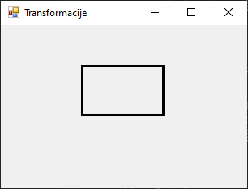

## Транслација

Транслација је графичка трансформација која **помера објекат по X и Y оси**. За
реализацију транслације користи се метода
[`TranslateTransform()`](https://learn.microsoft.com/en-us/dotnet/api/system.drawing.graphics.translatetransform?view=netframework-4.8)
из класе `Graphics`. Постоје два преоптерећења ове методе...

```cs
TranslateTransform(float, float);
TranslateTransform(float, float, MatrixOrder);
```

...где се у првом најједноставнијем наводе само параметри за померање по X и по
Y оси. У следећем примеру...

```cs
protected override void OnPaint(PaintEventArgs e)
{
    base.OnPaint(e);
    Graphics g = e.Graphics;
    g.SmoothingMode = SmoothingMode.AntiAlias;
    using (Pen p = new Pen(Color.Black, 3))
    {
        Rectangle r = new Rectangle(100, 50, 100, 60);
        g.DrawRectangle(p, r);
        g.TranslateTransform(20, 20); // ili (20.0F, 20.0F)
        g.DrawRectangle(p, r);
    }
}
```

...правоугаоник се помера за 20 пиксела удесно и 20 пиксела надоле..

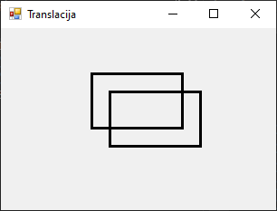

У другом преоптерећењу, поред параметара за померање по X и по Y оси, наводи се
и `MatrixOrder` којим се дефинише редослед у којем се трансформације
примењују на графички објекат. `MatrixOrder` вредности могу бити
`MatrixOrder.Prepend` када нова трансформација треба да се примени пре
постојећих и `MatrixOrder.Append` када нова трансформација треба да се примени
после постојећих (што је и подразумевана вредност). Редослед трансформација је
важан, јер матрице трансформација нису комутативне тј. редослед утиче на
резултат! У овом примеру ће се објекат прво ротирати па онда померати...

```cs
protected override void OnPaint(PaintEventArgs e)
{
    base.OnPaint(e);
    Graphics g = e.Graphics;
    g.SmoothingMode = SmoothingMode.AntiAlias;
    using (Pen p = new Pen(Color.Black, 3))
    {
        Rectangle r = new Rectangle(100, 50, 100, 60);
        g.DrawRectangle(p, r);
        g.RotateTransform(30);
        g.TranslateTransform(20, 20, MatrixOrder.Append);
        g.DrawRectangle(p, r);
    }
}
```

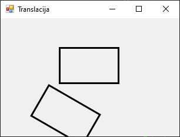

...док ће се у овом објекат прво померати па онда ротирати:

```cs
protected override void OnPaint(PaintEventArgs e)
{
    base.OnPaint(e);
    Graphics g = e.Graphics;
    g.SmoothingMode = SmoothingMode.AntiAlias;
    using (Pen p = new Pen(Color.Black, 3))
    {
        Rectangle r = new Rectangle(20, 20, 120, 80);
        g.DrawRectangle(p, r);
        g.RotateTransform(30);
        g.TranslateTransform(20, 20, MatrixOrder.Prepend);
        g.DrawRectangle(p, r);
    }
}
```

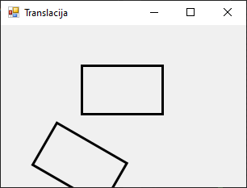

За једноставне задатке, `TranslateTransform(float, float)` без `MatrixOrder` је
довољан. За комбинацију више трансформација (нпр. скалирање са ротацијом и
транслацијом), увек треба да експлицитно наведеш `MatrixOrder` ради прецизније
контроле.

## Ротација

Ротација је трансформација која ротира графички објекат око почетка
координатног система за одређени угао у степенима, у смеру супротном од кретања
казаљке на сату. За реализацију ротације користи се метода
[`RotateTransform`](https://learn.microsoft.com/en-us/dotnet/api/system.drawing.graphics.rotatetransform?view=netframework-4.8)
из класе `Graphics`. Постоје два преоптерећења ове методе...

```cs
RotateTransform(float);
RotateTransform(float, MatrixOrder);
```

...где се у првом најједноставнијем наводи само угао ротације у степенима. У
следећем примеру...

```cs
protected override void OnPaint(PaintEventArgs e)
{
    base.OnPaint(e);
    Graphics g = e.Graphics;
    g.SmoothingMode = SmoothingMode.AntiAlias;
    using (Pen p = new Pen(Color.Black, 3))
    {
        Rectangle r = new Rectangle(100, 50, 100, 60);
        g.DrawRectangle(p, r);
        g.RotateTransform(30); // ili (30.0F)
        g.DrawRectangle(p, r);
    }
}
```

правоугаоник ће се ротирати за $30°$ око почетка координатног система $(0,0)$.

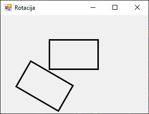

У другом преоптерећењу, наводи се и параметар `MatrixOrder`, који ти, као и код
транслације, омогућава ти да одредиш када се ротација примењује у односу на
остале трансформације. У првом примеру...

```cs
protected override void OnPaint(PaintEventArgs e)
{
    base.OnPaint(e);
    Graphics g = e.Graphics;
    g.SmoothingMode = SmoothingMode.AntiAlias;
    using (Pen p = new Pen(Color.Black, 3))
    {
        Rectangle r = new Rectangle(100, 50, 100, 60);
        g.DrawRectangle(p, r);
        g.RotateTransform(30);
        g.TranslateTransform(20, 20, MatrixOrder.Append);
        g.DrawRectangle(p, r);
    }
}
```

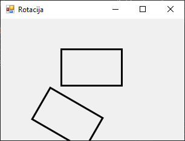

...прво се извршава ротација, па онда транслација, тј. прво се објекат ротира у
месту, па се тек онда помера, док се у другом примеру...

```cs
protected override void OnPaint(PaintEventArgs e)
{
    base.OnPaint(e);
    Graphics g = e.Graphics;
    g.SmoothingMode = SmoothingMode.AntiAlias;
    using (Pen p = new Pen(Color.Black, 3))
    {
        Rectangle r = new Rectangle(100, 50, 100, 60);
        g.DrawRectangle(p, r);
        g.RotateTransform(30);
        g.TranslateTransform(20, 20, MatrixOrder.Prepend);
        g.DrawRectangle(p, r);
    }
}
```

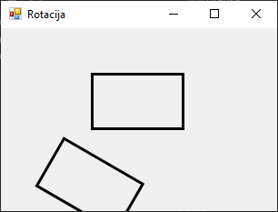

...објекат се прво помера, па онда ротира око почетка координатног система.

Ротација се увек извршава око координатног почетка $(0, 0)$, па ако желиш да
ротираш објекат око његовог центра, прво га мораш преместити, као у следећем
примеру...

```cs
protected override void OnPaint(PaintEventArgs e)
{
    base.OnPaint(e);
    Graphics g = e.Graphics;
    g.SmoothingMode = SmoothingMode.AntiAlias;
    using (Pen p = new Pen(Color.Black, 3))
    {
        Rectangle r = new Rectangle(100, 50, 100, 60);
        g.DrawRectangle(p, r);
        g.TranslateTransform(r.X + r.Width / 2, r.Y + r.Height / 2);
        g.RotateTransform(30);
        g.DrawRectangle(p, -r.Width / 2, -r.Height / 2, r.Width, r.Height);
    }
}
```

...где је ротација извршена око центра правоугаоника.

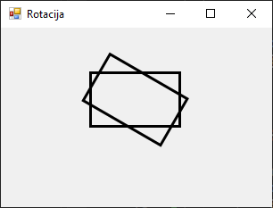

Значи, ротација увек ротира цео координатни систем, не само објекат. Да би
ротација била око центра објекта, треба да користиш методу `TranslateTransform`
пре ротације, ради померања центра око којег се објекат ротира!

## 3. Скалирање (Scaling)

Скалирање је трансформација која мења **величину графичког објекта** – може да
га увећа или умањи по X и/или Y оси. За реализацију скалирања користи се метода
[`ScaleTransform`](https://learn.microsoft.com/en-us/dotnet/api/system.drawing.graphics.scaletransform?view=netframework-4.8)
из класе `Graphics`. Постоје два преоптерећења ове методе...

```cs
ScaleTransform(float, float);
ScaleTransform(float, float, MatrixOrder);
```

...где се у првом најједноставнијем наводи само фактор скалирања по X и по Y
оси. У следећем примеру...

```cs
protected override void OnPaint(PaintEventArgs e)
{
    base.OnPaint(e);
    Graphics g = e.Graphics;
    g.SmoothingMode = SmoothingMode.AntiAlias;
    using (Pen p = new Pen(Color.Black, 3))
    {
        Rectangle r = new Rectangle(100, 50, 100, 60);
        g.DrawRectangle(p, r);
        g.ScaleTransform(1.5F, 0.5F);
        g.DrawRectangle(p, r);
    }
}
```

...нацртаће се правоугаоник који је 1.5 пута шири, а 2 пута нижи (0.5 пута мањи
по Y оси).

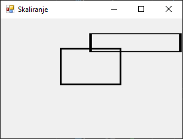

У другом преоптерећењу, наводи се и параметар `MatrixOrder`, који ти, као и у
претходнмим примерима омогућује да одредиш када се скалирање примењује у односу
на друге трансформације. У овом примеру...

```cs
protected override void OnPaint(PaintEventArgs e)
{
    base.OnPaint(e);
    Graphics g = e.Graphics;
    g.SmoothingMode = SmoothingMode.AntiAlias;
    using (Pen p = new Pen(Color.Black, 3))
    {
        Rectangle r = new Rectangle(100, 50, 100, 60);
        g.DrawRectangle(p, r);
        g.TranslateTransform(50, 50);
        g.ScaleTransform(1.5F, 0.5F, MatrixOrder.Append);
        g.DrawRectangle(p, r);
    }
}
```

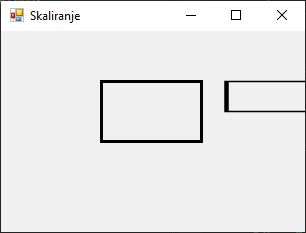

...прво се врши померање, па након тога скалирање, док се у овом примеру...

```cs
protected override void OnPaint(PaintEventArgs e)
{
    base.OnPaint(e);
    Graphics g = e.Graphics;
    g.SmoothingMode = SmoothingMode.AntiAlias;
    using (Pen p = new Pen(Color.Black, 3))
    {
        Rectangle r = new Rectangle(100, 50, 100, 60);
        g.DrawRectangle(p, r);
        g.TranslateTransform(50, 50);
        g.ScaleTransform(1.5F, 0.5F, MatrixOrder.Prepend);
        g.DrawRectangle(p, r);
    }
}
```

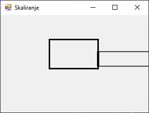

...прво врши скалирање, па након тога померање.

Да би се објекат увећао или умањио око свог центра, потребно је да прво извршиш
транслацију и помериш координатни систем у центар објекта, па затим скалираш
објекат и на крају вратиш координатни почетак у горњи леви угао. У следећем
примеру...

```cs
protected override void OnPaint(PaintEventArgs e)
{
    base.OnPaint(e);
    Graphics g = e.Graphics;
    g.SmoothingMode = SmoothingMode.AntiAlias;
    using (Pen p = new Pen(Color.Black, 3))
    {
        Rectangle r = new Rectangle(100, 50, 100, 60);
        g.DrawRectangle(p, r);
        g.TranslateTransform(r.X + r.Width / 2, r.Y + r.Height / 2);
        g.ScaleTransform(1.5F, 1.5F);
        g.TranslateTransform(-r.Width / 2, -r.Height / 2);
        g.DrawRectangle(p, 0, 0, r.Width, r.Height);
    }
}
```

...правоугаоник се увећава тачно око своје средине.

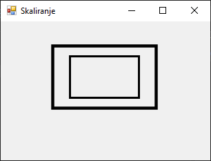

Вредност параметара методе `ScaleTransform` 1.0F значи без промене, вредност
већа од 1.0F увећава, а мања од 1.0F умањује. Негативна вредност обрће објекат,
на пример, -1 по X оси обрће објекат уназад. Ако желиш да скалирање утиче и на
касније трансформације, онда треба да користиш `MatrixOrder.Prepend`.

## Ресетовање трансформација

Након што примениш једну или више трансформација, координатни систем се трајно
мења унутар исте `Paint` операције. Ако не вратиш тај систем у почетно стање,
све наредне операције цртања биће измењене. За враћање систена у почетно стање
користи се метода
[ResetTransform](https://learn.microsoft.com/en-us/dotnet/api/system.drawing.graphics.resettransform?view=netframework-4.8).
Ова метода користи се без параметара и нема преоптерећења:

```cs
ResetTransform();
```

Метода `ResetTransform()` ресетује све трансформације примењене на Graphics
објекат и враћа координатни систем у подразумевано стање. Ово је корисно ако
желиш да црташ нови објекат без утицаја претходних трансформација. У следећем
примеру...

```cs
protected override void OnPaint(PaintEventArgs e)
{
    base.OnPaint(e);
    Graphics g = e.Graphics;
    g.SmoothingMode = SmoothingMode.AntiAlias;
    using (Pen p = new Pen(Color.Black, 3))
    {
        g.TranslateTransform(100, 50);
        g.DrawRectangle(p, 0, 0, 80, 50);
        g.ResetTransform();
        g.DrawRectangle(p, 0, 0, 80, 50);
    }
}
```

...први правоугаоник ће бити померен, док ће други бити у координатном почетку,
иако су за цртање оба правоугаоника коришћење исте наредбе.

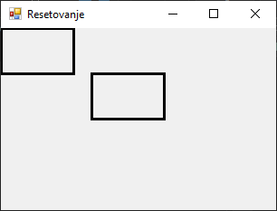

Значи, Graphics објекат задржава све трансформације током свог животног века
унутар Paint догађаја. Ако их не ресетујеш, ефекти ће се гомилати и утицати на
све наредне елементе.

У следећем примеру са више трансформација...

```cs
protected override void OnPaint(PaintEventArgs e)
{
    base.OnPaint(e);
    Graphics g = e.Graphics;
    g.SmoothingMode = SmoothingMode.AntiAlias;
    using (Pen p = new Pen(Color.Black, 3))
    {
        Rectangle r = new Rectangle(0, 0, 100, 60);
        g.ScaleTransform(2.0f, 2.0f);
        g.DrawRectangle(p, r);
        g.ResetTransform();
        g.RotateTransform(30);
        g.DrawRectangle(p, r);
        g.ResetTransform();
        g.TranslateTransform(100, 100);
        g.DrawRectangle(p, r);
        g.ResetTransform();
        g.DrawRectangle(p, r);
    }
}
```

...сваки објекат се црта у засебном координатном систему, захваљујући методи
`ResetTransform()`.

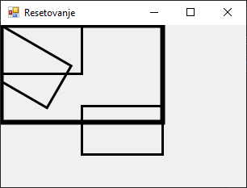

Уколико креираш сопствени координатни систем за сваки графички елемент,
обавезно користи `ResetTransform()` пре нове серије трансформација. То
повећава читљивост и предвидљивост кода.

Да резимирамо. Трансформације у графици омогућавају лако премештање, ротирање и
скалирање објеката. Редослед трансформација је битан и одређује се параметром
`MatrixOrder`. Све трансформације утичу на координатни систем, а не на сам
објекат. Метод `ResetTransform()` враћа координатни систем у почетно стање.
