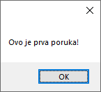
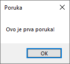
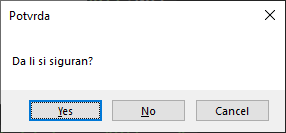

# Дијалог за приказ поруке

Када се говори о дијалогу за приказ поруке у Windows Forms апликацијама, мисли
се на `MessageBox` - једноставан, али веома користан дијалошки прозор који се
користи за приказивање информација кориснику, постављање питања или добијање
једноставне потврде. Он је модалан, што значи да корисник мора да одговори на
поруку пре него што може да настави интеракцију са остатком апликације.

`MessageBox` ћеш обично користити за: **обавештења** - информисање корисника о
неком догађају; **упозорења** - скретање пажње кориснику на потенцијални
проблем; **грешке** - приказивање поруке о грешци која се догодила; и
**потврде** - питање корисника да потврди неку акцију. Најједноставнији начин
да се прикаже `MessageBox` је позивањем статичке методе `Show()` класе
[`MessageBox`](https://learn.microsoft.com/en-us/dotnet/api/system.windows.forms.messagebox?view=netframework-4.8).
из именског простора `System.Windows.Forms`.

## Основни облик

Најједноставнији облик методе `Show()` подразумева да се као параметар наведе
један стринг који представља текст који ће се приказати у `MessageBox` прозору.
На пример:

```cs
MessageBox.Show("Ovo je prva poruka!");
```



Мало комплекснији облик подразумева да се као параметар наведу два стринга,
први који представља текст за приказивање и други који представља наслов у
насловној линији `MessageBox` прозора. На пример:

```cs
MessageBox.Show("Ovo je prva poruka!", "Poruka");
```



## Додавање дугмади

`MessageBox` може имати различите комбинације дугмади. Ово можеш да контролишеш
трећим аргументом, који је типа `MessageBoxButtons` енумерације:

| Име                | Вредност | Опис                                          |
|--------------------|----------|-----------------------------------------------|
| `OK`               | 0        | Приказује само "OK" дугме.                    |
| `OKCancel`         | 1        | Приказује "OK" и "Cancel" дугмад.             |
| `AbortRetryIgnore` | 2        | Приказује "Abort", "Retry" и "Ignore" дугмад. |
| `YesNoCancel`      | 3        | Приказује "Yes", "No" и "Cancel" дугмад.      |
| `YesNo`            | 4        | Приказује "Yes" и "No" дугмад.                |
| `RetryCancel`      | 5        | Приказује "Retry" и "Cancel" дугмад.          |



Како да сазнаш које је дугме корисник притиснуо? Метода `MessageBox.Show()`
враћа вредност типа `DialogResult` која омогућава проверу притиснутог дугмета.
На пример:

```cs
DialogResult rezultat = MessageBox.Show(
    "Da li si siguran?",
    "Potvrda",
    MessageBoxButtons.YesNoCancel);
if (rezultat == DialogResult.Yes)
{
    // Ako je korisnik kliknuo "Da"
}
else if (rezultat == DialogResult.No)
{
    // Ako je korisnik kliknuo "Ne"
}
else
{
    // Ako je korisnik kliknuo "Otkaži"
}
```

## Додавање иконица

`MessageBox` може приказати иконицу поред текста како би визуелно указао на тип
поруке. Ово можеш да контролишеш четвртим аргументом, који је типа
`MessageBoxIcon` енумерације:

| Име                | Вредност | Опис                                          |
|--------------------|----------|-----------------------------------------------|
| `None`             | 0        | Без иконице.                                  |
| `Error`            | 16       | Бело **Х** у црвеном кругу.                   |
| `Hand`             | 16       | Бело **Х** у црвеном кругу.                   |
| `Stop`             | 16       | Бело **Х** у црвеном кругу.                   |
| `Question`         | 32       | Бео **?** у плавом кругу.                     |
| `Exclamation`      | 48       | Црни **!** у жутом обрнутом троуглу.          |
| `Warning`          | 48       | Црни **!** у жутом обрнутом троуглу.          |
| `Asterisk`         | 64       | Бело **i** у плавом кругу.                    |
| `Information`      | 64       | Бело **i** у плавом кругу.                    |

На пример:

```cs
DialogResult rezultat = MessageBox.Show(
    "Da li si siguran?",
    "Potvrda",
    MessageBoxButtons.YesNoCancel,
    MessageBoxIcon.Warning);
```


Метода `Show()` класе `MessageBox` има још много преоптерећења која су наведена
у [званичној документацији](https://learn.microsoft.com/en-us/dotnet/api/system.windows.forms.messagebox.show?view=netframework-4.8),
и било би превише наводити их све на овом месту. Поменута преоптерећења
омогућују да се као параметар наведе и подразумевано дугме, путања до *Help*
фајла, кључна реч за приказ након клика на *Help* дугме, *Help* навигатор,
опције за поравнање текста итд.

`MessageBox` је свакако моћан алат за једноставну комуникацију са корисником.
Познавањем различитих преоптерећења методе `Show()`, можеш лако прилагодити
изглед и функционалност порука потребама сваке апликације. Уколико ти је
потребна напреднија интеракција са корисником, на пример унос текста, онда
уместо `MessageBox`-а можеш користити прилагођене форме тј. дијалоге о којима
ћеш учити у наредним лекцијама.
