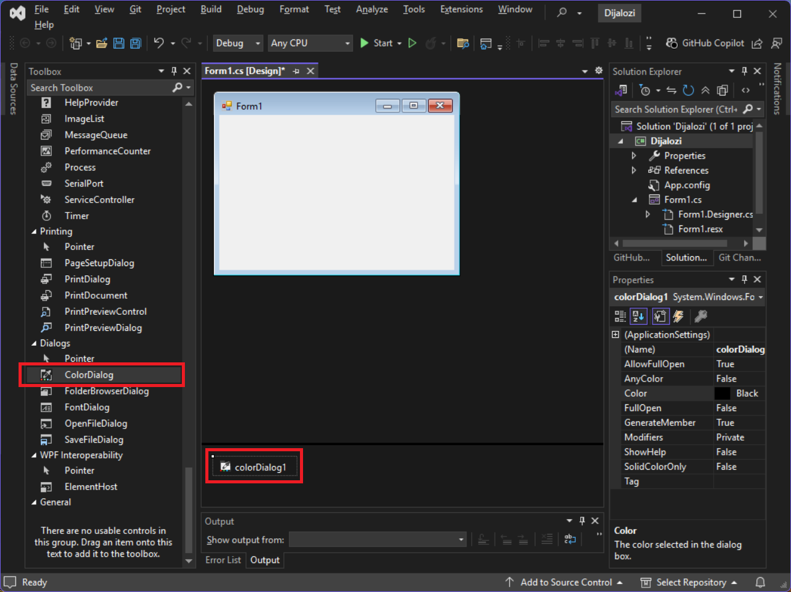
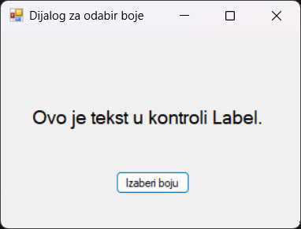
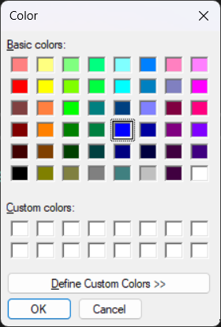
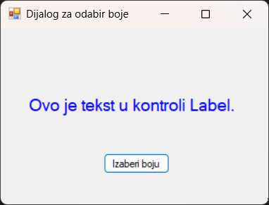
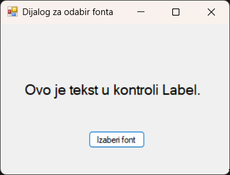
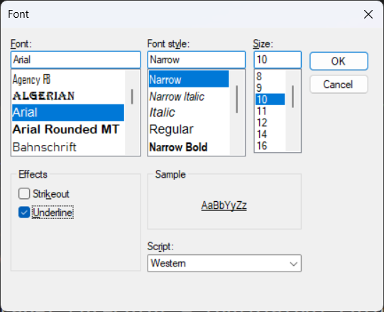
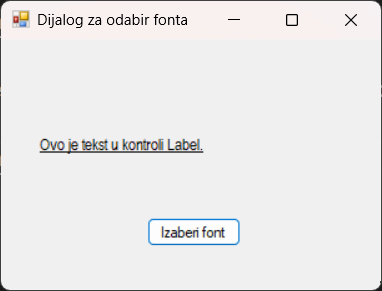

# Рад са дијалозима

Приликом развоја Windows Forms апликација, често је потребно омогућити
кориснику избор боје или фонта за одређене елементе корисничког интерфејса.
.NET Framework нуди уграђене дијалоге који пружају стандардни и познат начин за
обављање ових задатака. Два таква важна дијалога су
[`ColorDialog`](https://learn.microsoft.com/en-us/dotnet/api/system.windows.forms.colordialog?view=netframework-4.8)
и
[`FontDialog`](https://learn.microsoft.com/en-us/dotnet/api/system.windows.forms.fontdialog?view=netframework-4.8).
Ови дијалози су део System.Windows.Forms именског простора.

## Дијалог за одабир боје

`ColorDialog` контрола приказује стандардни дијалог који омогућава кориснику
да изабере боју из палете основних боја, дефинише боје које нису основне и одабере
боју помоћу RGB (енгл. *Red*, *Green*, *Blue*) или HSL (енгл. *Hue*,
*Saturation*, *Lightness*) вредности.

Да би користио `ColorDialog` на форми, у Visual Studio дизајнеру форме, отвори
Toolbox, пронађи ColorDialog контролу у секцији Dialogs и превуци је на
форму. Компонента ће се појавити у доњем делу дизајнера, јер нема визуелни
приказ на самој форми током дизајна:



Други начин је да креираш објекат класе `ColorDialog` у самом коду.

```cs
ColorDialog colorDialog1 = new ColorDialog();
```

Када се дијалози креирају директно у коду (нпр.
`ColorDialog colorDialog1 = new ColorDialog();` унутар методе), добра је пракса
да користиш `using` како би се осигурало да се ресурси које дијалог користи
правилно ослободе (посредством `Dispose()` методе). Ово је посебно важно ако се
инстанца дијалога креира и користи само унутар једне методе.

```cs
using (ColorDialog colorDialog1 = new ColorDialog())
{
    // Kod za rad sa dijalogom...
}
```

Уколико је дијалог додат на форму преко дизајнера, .NET Framework ће се
побринути за његово ослобађање.

Након додавања дијалога за одабир боје на форму, нека је задатак да промениш
боју фонта једне лабеле на форми одабиром боје из дијалога за одабир боје.



```cs
private void IzaberiBojuBtn_Click(object sender, EventArgs e)
{
    DialogResult r = colorDialog1.ShowDialog();
    if (r == DialogResult.OK)
    {
        TekstLabel.ForeColor = colorDialog1.Color;
    }
}
```

Уколико је потребно, дијалог можеш иницијализовати почетним вредностима:

```cs
private void IzaberiBojuBtn_Click(object sender, EventArgs e)
{
    colorDialog1.Color = TekstLabel.ForeColor;
    DialogResult r = colorDialog1.ShowDialog();
    if (r == DialogResult.OK)
    {
        TekstLabel.ForeColor = colorDialog1.Color;
    }
}
```

Дијалог за одабир боје ће се приказати када се кликне на дугме...



...па ако је одабрана боја и притиснуто дугме OK, боја фонта у лабели ће се
променити:



Метод `ShowDialog()` враћа вредност типа `DialogResult`, која показује како је
корисник затворио дијалог. Ако је враћена вредност `DialogResult.OK`, значи да
је избор потврђен.

Важна својства дијалога за одабир боје су:

* Својство `Color` добија или поставља боју коју је корисник изабрао. Ово је
својство које користиш да би добио изабрану боју након што корисник кликне
"OK". Такође, можеш поставити ову вредност пре позивања `ShowDialog()` да би
предефинисао почетну боју у дијалогу.
* Својство `AllowFullOpen` добија или поставља вредност која указује да ли
корисник може користити дијалог за дефинисање прилагођених боја. Подразумевано
је `true`. Ако је `false`, дугме за креирање прилагођених боја (Define Custom
Colors) биће онемогућено.
* Својство `FullOpen` добија или поставља вредност која указује да ли је
контрола за креирање прилагођених боја видљива када се дијалог отвори.
Подразумевано је `false`. Ако је `true`, дијалог ће се одмах отворити са
проширеним делом за прилагођене боје.
* Својство `CustomColors` добија или поставља скуп прилагођених боја приказаних
у дијалогу. Ово је низ целих бројева који представљају ARGB вредности боја.
* Својство `SolidColorOnly` добија или поставља вредност која указује да ли
дијалог ограничава кориснике на одабир само пуних боја (solid colors).
Подразумевано је `false`.

ARGB вредности боја представљају начин дефинисања боје помоћу четири компоненте:
**Alpha** (прозирност), **Red** (црвена), **Green** (зелена) и **Blue**
(плава). Свака од ових компоненти је нумеричка вредност, најчешће у опсегу од 0
до 255. Више о бојама учићеш у следећем поглављу.

## Дијалог за одабир фонта

`FontDialog` контрола приказује стандардни дијалог који омогућава кориснику да
изабере фонт, стил фонта, величину, боју (опционо) и ефекте. Дијалог за одабир
фонта можеш да додаш на форму на исти начин као и дијалог за одабир боје –
превлачењем `FontDialog` контроле из Toolbox-а или креирањем објекта класе
`FontDialog` у самом коду:

```cs
FontDialog fontDialog1 = new FontDialog();
```

За `FontDialog` такође важи да када дијалоге креираш директно у коду, добра је
пракса да користиш `using` како би се осигурало да се ресурси које дијалог
користи правилно ослободе.

```cs
using (FontDialog fontDialog1 = new FontDialog())
{
    // Kod za rad sa dijalogom...
}
```

Након додавања дијалога за одабир фонта на форму, нека је задатак да промениш
фонт једне лабеле на форми одабиром фонта из дијалога за одабир фонта.



```cs
private void IzaberiFontBtn_Click(object sender, EventArgs e)
{
    DialogResult r = fontDialog1.ShowDialog();
    if (r == DialogResult.OK)
    {
        TekstLabel.Font = fontDialog1.Font;
        if (fontDialog1.ShowColor)
        {
            TekstLabel.ForeColor = fontDialog1.Color;
        }
    }
}
```

Уколико је потребно, дијалог можеш иницијализовати са почетним вредностима:

```cs
private void IzaberiFontBtn_Click(object sender, EventArgs e)
{
    fontDialog1.Font = TekstLabel.Font;
    if (fontDialog1.ShowColor) // ako je opcija za boju uključena
    {
        fontDialog1.Color = TekstLabel.ForeColor;
    }
    DialogResult r = fontDialog1.ShowDialog();
    if (r == DialogResult.OK)
    {
        TekstLabel.Font = fontDialog1.Font;
        if (fontDialog1.ShowColor)
        {
            TekstLabel.ForeColor = fontDialog1.Color;
        }
    }
}
```

Дијалог за одабир фонта ће се приказати када се кликне на дугме...



...па ако је одабран фонт и притиснуто дугме OK, фонт ће се у лабели променити:



Важна својства дијалога за одабир фонта су:

* Својство `Font` добија или поставља фонт који је корисник изабрао. Слично као
`Color` код `ColorDialog`, ово својство треба да користиш за добијање изабраног
фонта или за постављање почетног фонта.
* Својство `Color` добија или поставља боју текста коју је корисник изабрао.
Ово својство је релевантно само ако је `ShowColor` постављено на `true`.
* Својство `ShowColor` добија или поставља вредност која указује да ли дијалог
приказује опцију за одабир боје фонта. Подразумевано је `false`.
* Својство `ShowEffects` добија или поставља вредност која указује да ли
дијалог приказује опције за ефекте текста. Подразумевано је `true`.
* Својство `ShowApply` добија или поставља вредност која указује да ли дијалог
садржи дугме "Apply". Подразумевано је `false`. Ако је `true`, мораш руковати
"Apply" догађајем.
* Својства `MinSize` и `MaxSize` добијају или постављају минималну и максималну
величину фонта коју корисник може изабрати. Подразумевано је `0` – без ограничења.
* Својство `FontMustExist` добија или поставља вредност која указује да ли се
приказује порука о грешци ако корисник покуша да изабере фонт или стил који не
постоји. Подразумевано је `false`.
