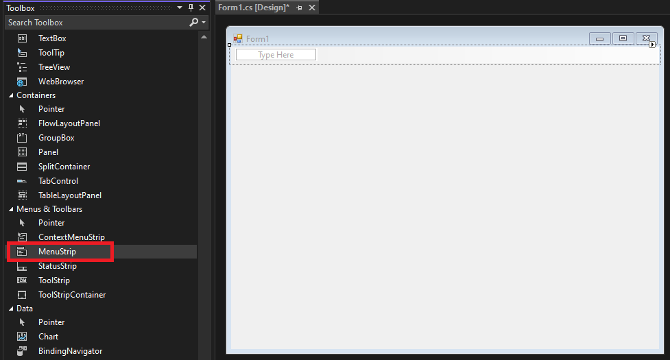
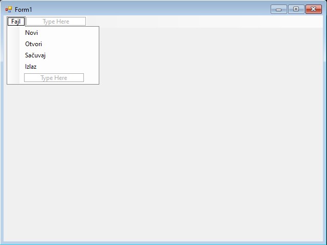
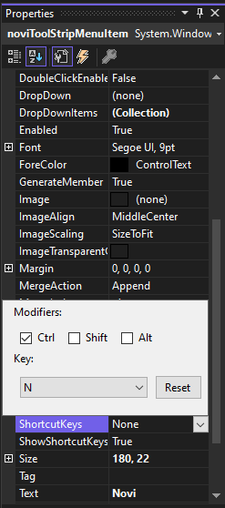
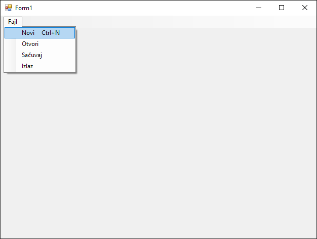
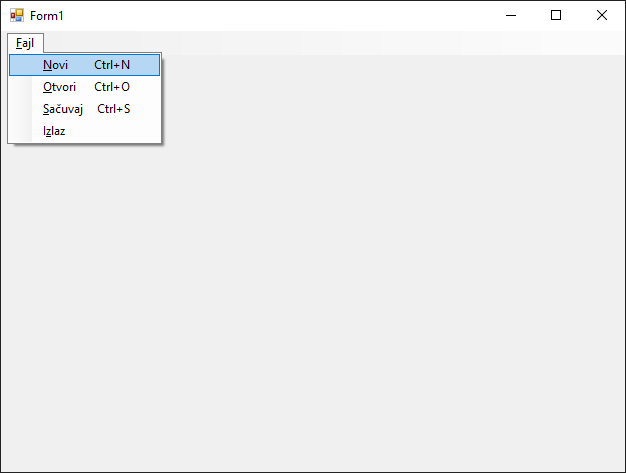
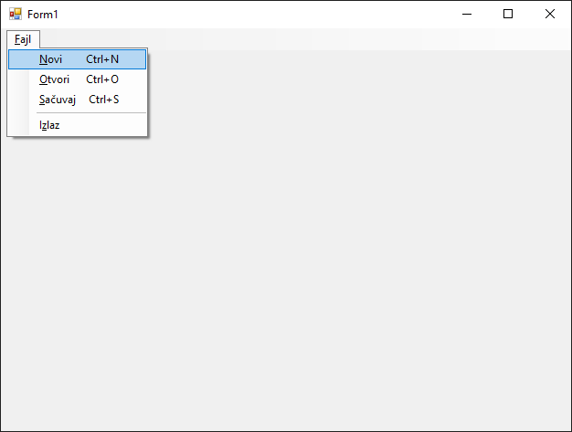
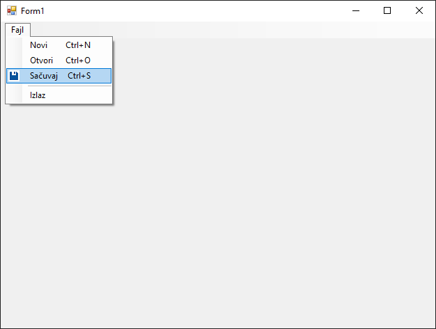

# Додавање менија

У већини десктоп апликација кориснички интерфејс садржи меније који омогућавају
једноставан приступ најважнијим функционалностима програма. У Windows Forms
апликацијама, за креирање менија користи се контрола `MenuStrip`. У овој
лекцији научићеш како се додају и конфигуришу ове контроле, како се дефинишу
команде унутар менија и како се повезују са логиком програма.

`MenuStrip` је визуелна контрола која се поставља на врх форме и омогућава
креирање хоризонталног менија са ставкама и подставкама. Представља модеран
начин рада са менијима и замењује старију контролу `MainMenu`. Да би додао
контролу `MainMenu`, из *Toolbox*-а превуци контролу `MenuStrip` на форму.



У горњем делу форме појавиће се празна трака менија са ознаком *Type Here*.
Унеси назив прве ставке менија (нпр. `Fajl`) и притисни Enter. Испод ставке
`Fajl` можеш додавати подставке, односно ставке вертикалног менија који се
појављује испод ставке хоризонталног менија, нпр: `Novi`, `Otvori`, `Sačuvaj` и
`Izlaz`.



За сваку ставку или подставку менија можеш да дефинишеш шта треба да се догоди
када се кликне на њу. На пример, двапут кликни на подставку `Izlaz` у дизајнеру
и дефиниши метод на следећи начин:

```cs
private void izlazToolStripMenuItem_Click(object sender, EventArgs e)
{
    Application.Exit();
}
```

Наравно, све ово можеш урадити и динамички из кода, без коришћења дизајера, у
неколико корака:

1. Креирање нове инстанце класе `MenuStrip`.
2. Креирање ставки и подставки менија (објеката класе `ToolStripMenuItem`).
3. Дефинисање обрађивача догађаја за клик на ставке и подставке.
4. Додавање подставки у ставке.
5. Додавање ставки у контролу `MenuStrip`.
6. Додавање контроле `MenuStrip` на форму.

На пример:

```cs
private void Form1_Load(object sender, EventArgs e)
{
    MenuStrip glavniMeni = new MenuStrip();

    ToolStripMenuItem fajlMeni = new ToolStripMenuItem("Fajl");
    ToolStripMenuItem noviStavka = new ToolStripMenuItem("Novi");
    ToolStripMenuItem otvoriStavka = new ToolStripMenuItem("Otvori");
    ToolStripMenuItem sacuvajStavka = new ToolStripMenuItem("Sačuvaj");
    ToolStripMenuItem izlazStavka = new ToolStripMenuItem("Izlaz");

    izlazStavka.Click += IzlazStavka_Click;

    fajlMeni.DropDownItems.Add(noviStavka);
    fajlMeni.DropDownItems.Add(otvoriStavka);
    fajlMeni.DropDownItems.Add(sacuvajStavka);
    fajlMeni.DropDownItems.Add(izlazStavka);

    glavniMeni.Items.Add(fajlMeni);

    this.MainMenuStrip = glavniMeni;
    this.Controls.Add(glavniMeni);
}

private void IzlazStavka_Click(object sender, EventArgs e)
{
    Application.Exit();
}
```

Ако је мени веома сложен, савет је да креирање менија издвојиш у посебну методу!

## Дефинисање пречица

Као и друге Windows Forms контроле, поред текста, ставке и подставке у менију
могу имати и друга својства. На пример, својством `ShortcutKeys` можеш да
дефинишеш пречицу са тастатуре којом се активира ставка или подставка менија,
својством `Enabled` можеш да дефинишеш да ли је ставка активна итд.

Обично су стандардне пречице за креирање новог фајла `CTRL+N`, за отварање
фајла `CTRL+O` и за чување фајла `CTRL+S`. Пречице можеш да дефинишеш у
*Solution Explorer*-у, или у самом коду. На пример, за креирање новог фајла,
у *Solution Explorer*-у можеш да штиклираш `CTRL` и одабереш тастер `N`...



...или у самом коду дефинишеш пречицу на следећи начин:

```cs
noviToolStripMenuItem.ShortcutKeys = Keys.Control | Keys.N;
```

Овим поступком ће се у апликацији аутоматски, поред ставке менија Novi,
приказати и пречица CTRL+N.



## Дефинисање тастера за приступ

Када у имену ставке менија ставиш карактер `&` испред неког слова, тај карактер
постаје тастер за приступ (енгл. *access key*) који омогућава кориснику да
приступи тој ставки путем тастатуре, помоћу комбинације тастера `Alt` и
карактер. Дефинисањем тастера за приступ додаје се могућност унапређења
приступачности и унапређује корисничко искуство, посебно за кориснике који
преферирају коришћење тастатуре уместо миша. На пример, ако ставиш карактер `&`
испред слова `F` у тексту `Fajl`, онда се `Fajl` менију може приступити
комбинацијом тастера `ALT+F`. Након тога, ако ставиш карактер `&` испред слова
`N` у тексту подставке `Novi`, онда се тој подставки може приступити
комбинацијом тастера `ALT+F+N`.



## Додавање сепаратора

Сепаратор у менију служи за визуелно раздвајање група повезаних ставки. Он није
интерактиван и не реагује на клик. У претходном примеру, логично је да
подставке `Novi`, `Otvori` и `Sačuvaj` одвојиш од подставке `Izlaz`. Кликни
десним тастером миша на подставку `Izlaz` и одабери *Insert* па *Separator*,
или у коду додај:

```cs
ToolStripSeparator separator = new ToolStripSeparator();
// ...
fajlMeni.DropDownItems.Add(noviStavka);
fajlMeni.DropDownItems.Add(otvoriStavka);
fajlMeni.DropDownItems.Add(sacuvajStavka);
fajlMeni.DropDownItems.Add(new ToolStripSeparator());
fajlMeni.DropDownItems.Add(izlazStavka);
// ...
```

Овим си јасно одвојио групу подставки од подставке излаз:



Значи, сепаратор нема својство `Text` нити је видљив представља ставку коју
корисник може да одабере, па због тога ни не треба за њега да додајеш обрађивач
догађаја.

## Додавање икона

Да би кориснички интерфејс био визуелно прегледнији и интуитивнији, у ставке
менија, поред текста, можеш додати и иконе, које посебно доприносе бољој
уочљивости функција менија. Како су иконе слике малих формата, већина популаних
формата слика попут png, bmp, jpg, gif су подржани, а препоручена величина је
16x16 пиксела.

Ако креираш мени из дизајнера, иконе можеш да додајеш као и све остале слике,
а ако га креираш из кода, иконе можеш доделити ставкама и подставкама менија
постављањем својства `Image`...

```cs
// ...
ToolStripMenuItem sacuvajStavka = new ToolStripMenuItem("Sačuvaj");
sacuvajStavka.Image = Image.FromFile("save.png");
// ...
```

...водећи рачуна о путањи где се икона налази. Ако си иконе убацио у ресурсе
пројекта, онда ће кôд за додавање изгледати овако:

```cs
// ...
ToolStripMenuItem sacuvajStavka = new ToolStripMenuItem("Sačuvaj");
sacuvajStavka.Image = Properties.Resources.sacuvaj;
// ...
```

Додата икона појавиће се лево од ставке, односно подставке менија:



Контрола `MenuStrip` је основна компонента за организацију команди у Windows
Forms апликацијама. Правилним креирањем ставки, коришћењем пречица, тастера за
приступ, сепаратора и икона, можеш значајно унапредити употребљивост своје
апликације.
