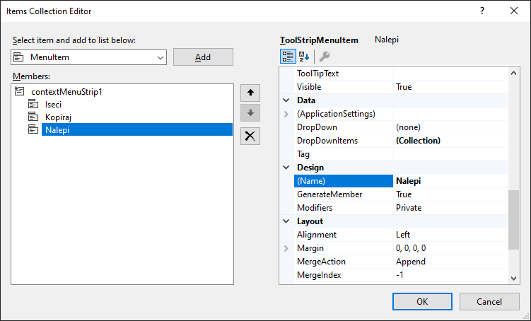
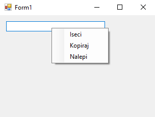

# Контекстни мени

Контекстни мени (енгл. *context menu*) представља падајући мени који се
појављује када корисник кликне десним тастером миша на неки елемент на форми.
Најчешће садржи опције које се односе искључиво на тај елемент или контекст у
коме се налази. У Windows Forms апликацијама, контекстни мени се креира помоћу
контроле `ContextMenuStrip`.

Помоћу дизајнера потребно је да превучеш контролу `ContextMenuStrip` на форму.
Контрола ће се појавити у доњем делу прозора, пошто је невизуелна. Кликни на
њу, у прозору *Properties* пронађи својство `Items`, па унеси ставке које
желиш, на пример `Iseci`, `Kopiraj` и `Nalepi`:



Након тога, треба да дефинишеш контролу на којој желиш да се примени контекстни
мени, нпр. на контролу `textBox1` која је постављена на форми. Кликни на њу, па
у *Solution Explorer*-у постави својство `ContextMenuStrip` на креирани
контекстни мени. На крају, за сваку ставку контекстног менија треба да дефинишеш
догађаје на клик, као и у претходној лекцији. У доњем делу прозора кликни на
додати контекстни мени, па два пута кликни на жељену ставку контекстног менија у
дизајнеру. На пример, методе за догађај на клик на ставке `Iseci`, `Kopiraj` и
`Nalepi` можеш да дефинишеш овако:

```cs
private void Iseci_Click(object sender, EventArgs e)
{
    textBox1.Cut();
}

private void Kopiraj_Click(object sender, EventArgs e)
{
    textBox1.Copy();
}

private void Nalepi_Click(object sender, EventArgs e)
{
    textBox1.Paste();
}
```

Овим си креирао контекстни мени за оквир за текст који је постављен на форми са
функцијама `Iseci`, `Kopiraj` и `Nalepi`:



Овај исти контекстни мени можеш да користиш за више контрола на форми, на
пример за све оквире за текст. Такође треба да знаш да одређене Windows Forms
контроле, попут контроле `TextBox`, већ имају подразумевани контекстни мени
(*Cut/Copy/Paste/Undo/Select All*). Када таквој контроли доделиш сопствени
`ContextMenuStrip`, подразумевани нестаје.

Као и у претходној лекцији, комплетан поступак можеш урадити помоћу кода:

```cs
private void Form1_Load(object sender, EventArgs e)
{
    ContextMenuStrip kontekstniMeni = new ContextMenuStrip();

    ToolStripMenuItem stavkaIseci = new ToolStripMenuItem("Iseci");
    ToolStripMenuItem stavkaKopiraj = new ToolStripMenuItem("Kopiraj");
    ToolStripMenuItem stavkaNalepi = new ToolStripMenuItem("Nalepi");

    kontekstniMeni.Items.Add(stavkaIseci);
    kontekstniMeni.Items.Add(stavkaKopiraj);
    kontekstniMeni.Items.Add(stavkaNalepi);

    textBox1.ContextMenuStrip = kontekstniMeni;

    stavkaIseci.Click += Iseci_Click;
    stavkaKopiraj.Click += Kopiraj_Click;
    stavkaNalepi.Click += Nalepi_Click;
}

private void Iseci_Click(object sender, EventArgs e)
{
    textBox1.Cut();
}

private void Kopiraj_Click(object sender, EventArgs e)
{
    textBox1.Copy();
}

private void Nalepi_Click(object sender, EventArgs e)
{
    textBox1.Paste();
}
```

Ако планираш да исти контекстни мени делиш између више контрола, препорука је
да `ContextMenuStrip` и његове ставке буду поља форме, а не локалне променљиве
у `Form1_Load` методи, како би њима имао приступ и у другим методама. У том
случају можеш у `Opening` догађају динамички омогућити/онемогућити ставке
менија – на пример, ако на клипборду нема текста, онемогући ставку `Nalepi`:

```cs
private void KontekstniMeni_Opening(object sender, System.ComponentModel.CancelEventArgs e)
{
    stavkaNalepi.Enabled = Clipboard.ContainsText();
}
```

Пречице, тастере за приступ, сепараторе и иконе у контекстном менију можеш
додавати како је описано у претходној лекцији за контролу `MenuStrip`.

Контекстни мени је користан када желиш да кориснику понудиш функције везане
само за одређене контроле на форми. Коришћењем класе `ContextMenuStrip` и
`ToolStripMenuItem`, можеш лако организовати интуитивне и прилагођене меније у
апликацији.
