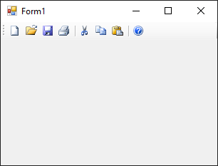

# Трака са алатима

Трака са алатима (енгл. *toolbar*) представља ред визуелних елемената, најчешће
икона, које представљају кратке пречице до често коришћених функција. У Windows
Forms апликацијама, за прављење траке са алатима користи се контрола
`ToolStrip`.

Да би додао `ToolStrip` контролу у дизајнеру, потребно је да је превучеш из
*Toolbox*-а на форму. Она ће се појавити као хоризонтална трака у горњем делу
форме. Кликни на стрелицу у горњем десном углу траке и изабери
**Insert Standard Items** ако желиш основне дугмиће New, Open, Save, Print,
Cut, Copy, Paste и Help.



Можеш и ручно додавати ставке преко стрелице `>` на самом крају траке, где се
појављује мени *Edit Items...*. Одатле можеш додати:

* ToolStripButton – дугме (најчешће са иконом)
* ToolStripLabel – текстуална ознака
* ToolStripSeparator – сепаратор између ставки
* ToolStripTextBox – унос текста у траци
* ToolStripComboBox – падајућа листа

Након тога, потребно је да за свако додато дугме појединачно дефинишеш својства
и догађаје. На пример, за дугме Cut можеш подесити својство `Name` са текстом
`btnIseci` и својство `ToolTipText` са текстом `Iseci`. Ако је на форми
постављен оквир са текстом, догађај клика миша на дугме `btnIseci` можеш да
дефинишеш овако:

```cs
private void btnIseci_Click(object sender, EventArgs e)
{
    textBox1.Cut();
}
```

Уместо рада у дизајнеру, траку са алатима можеш креирати и у коду. На пример:

```cs
private void Form1_Load(object sender, EventArgs e)
{
    ToolStrip trakaSaAlatima = new ToolStrip();

    ToolStripButton dugmeIseci = new ToolStripButton();
    dugmeIseci.Text = "Iseci";
    dugmeIseci.Image = Image.FromFile("cut.png");
    dugmeIseci.DisplayStyle = ToolStripItemDisplayStyle.Image;
    dugmeIseci.ToolTipText = "Iseci изабрани текст";
    dugmeIseci.Click += DugmeIseci_Click;

    ToolStripButton dugmeKopiraj = new ToolStripButton();
    dugmeKopiraj.Text = "Kopiraj";
    dugmeKopiraj.Image = Image.FromFile("copy.png");
    dugmeKopiraj.DisplayStyle = ToolStripItemDisplayStyle.Image;
    dugmeKopiraj.ToolTipText = "Копирај изабрани текст";
    dugmeKopiraj.Click += DugmeKopiraj_Click;

    ToolStripButton dugmeNalepi = new ToolStripButton();
    dugmeNalepi.Text = "Nalepi";
    dugmeNalepi.Image = Image.FromFile("paste.png");
    dugmeNalepi.DisplayStyle = ToolStripItemDisplayStyle.Image;
    dugmeNalepi.ToolTipText = "Налепи из клипборда";
    dugmeNalepi.Click += DugmeNalepi_Click;

    trakaSaAlatima.Items.Add(dugmeIseci);
    trakaSaAlatima.Items.Add(dugmeKopiraj);
    trakaSaAlatima.Items.Add(dugmeNalepi);

    Controls.Add(trakaSaAlatima);
}

private void DugmeIseci_Click(object sender, EventArgs e)
{
    textBox1.Cut();
}

private void DugmeKopiraj_Click(object sender, EventArgs e)
{
    textBox1.Copy();
}

private void DugmeNalepi_Click(object sender, EventArgs e)
{
    textBox1.Paste();
}
```

`ToolStripButton` сам по себи не подржава директно пречице као што је `Ctrl+S`.
Међутим, пречице можеш да дефинишеш на нивоу форме помоћу својства
`Form.KeyPreview = true;` и догађаја `KeyDown` или `KeyUp`. На пример, можеш да
креираш симулацију клика на дугме `btnSnimi` када се притисне `Ctrl+S`:

```cs
private void Form1_Load(object sender, EventArgs e)
{
    this.KeyPreview = true;
}

private void Form1_KeyDown(object sender, KeyEventArgs e)
{
    if (e.Control && e.KeyCode == Keys.S)
    {
        btnSnimi.PerformClick();
        e.SuppressKeyPress = true;
    }
}
```

Иако `ToolStripButton` подржава ALT-пречице као део текста, нпр. `&Otvori`, оне
се ретко користе, јер је фокус на иконама, а не на текстуалном садржају. Ако
дугме btnOpen дефинишеш овако...

```cs
ToolStripButton btnOpen = new ToolStripButton("&Otvori");
```

...теоретски ће се омогућити да се дугме активира притиском на `Alt+O`, али
само ако трака има фокус, што се у пракси не дешава често. Због тога се ове
ALT-пречице више користе у `MenuStrip` негу у `ToolStrip` менијима.

Уколико користиш `MenuStrip` и `ToolStrip` истовремено, што је уобичајено,
можеш повезати функционалност тако да иста радња може бити везана и за
ставку менија и за дугме у траци. На пример, и `ToolStripButton` и
`ToolStripMenuItem` могу делити исти метод:

```cs
private void DugmeIseci_Click(object sender, EventArgs e)
{
    textBox1.Cut();
}
```

Ако желиш да корисник може да помера траку или да имаш више трака на различитим
местима (горе, доле, лево и десно), можеш користити `ToolStripContainer`. То је
контрола која има дефинисане области за смештај трака око главног дела форме.
