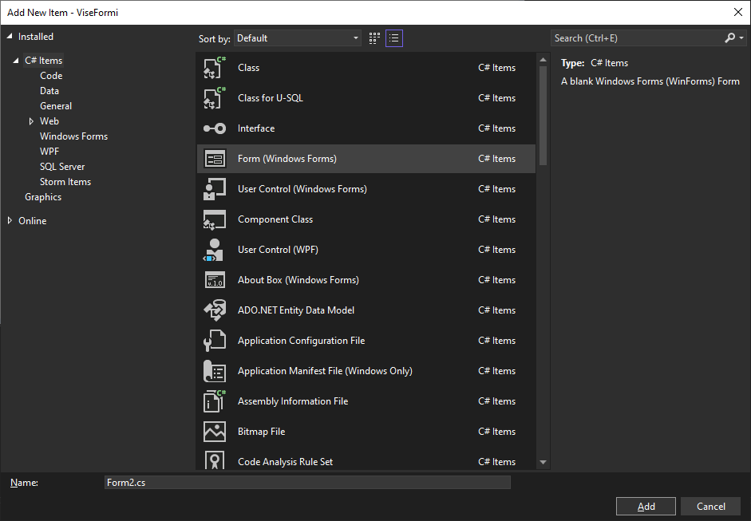
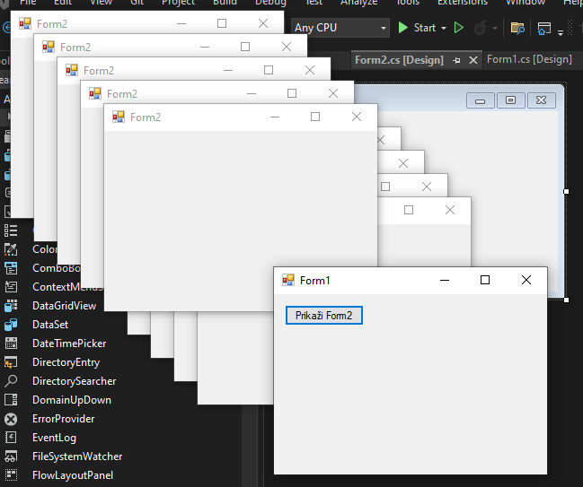
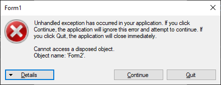

# Рад са више форми

У једноставним апликацијама, довољна је само једна форма. Међутим, много
апликација користи више форми. У овој лекцији научићеш како се у Windows Forms
апликацијама ради са више форми, како се оне приказују, затварају и контролишу.

Да би додао нову форму у пројекат, у *Solution Explorer*-у кликни десним
тастером миша на пројекат, па одабери *Add*, па *Form (Windows Forms)...*.
Унеси назив нове форме и кликни *Add*.



Visual Studio ће креирати нову форму, са одговарајућим кодом, коју можеш
уређивати као и основну, додавањем контрола и писањем кода.

## Неправилан приступ

Да би се нова форма приказала, потребно је да направиш њену инстанцу и позовеш
методу `Show()`. На пример, ако је кликом на дугме које је постављено на
`Form1`, потребно да се прикаже `Form2`, онда метода за догађај клика на дугме
може да изгледа овако:

```cs
private void btnPrikaziForm2_Click(object sender, EventArgs e)
{
    Form2 novaForma = new Form2();
    novaForma.Show();
}
```

Извршавањем ове методе `Form2` ће се приказати као немодална форма, што значи
да корисник може да ради и у `Form1` и у `Form2`. Међутим, ако корисник више
пута да кликне на дугме, креираће се више независних инстанци `Forma2`. То може
да доведе до разних проблема, неочекиваног понашања апликације, па и губитка
података, ако се са више форми приступа истим подацима. Ово је свакако
неприхватљиво понашање апликације **које не смеш у пракси имплементирати!**



Наизглед прихватљиво решење, у којем се из методе измешта линија кода којом се
креира инстанца `Form2`...

```cs
Form2 novaForma = new Form2();

private void btnPrikaziForm2_Click(object sender, EventArgs e)
{
    novaForma.Show();
}
```

...доводи до неких других проблема. Корисник сада може више пута да кликне на
дугме, али се при томе неће креирати додатне инстанце `Form2`. Проблем настаје
када се једном прикаже `Form2`, затвори `Form2`, па потом поново кликне на
дугме за приказ `Form2` што проузрокује грешку приступа непостојећем објекту:



## Правилан приступ

Једно од добрих решења овог проблема је чување референце на форму:

```cs
private Form2 novaForma;

private void btnPrikaziForm2_Click(object sender, EventArgs e)
{
    if (novaForma == null || novaForma.IsDisposed)
    {
        novaForma = new Form2();
        novaForma.Show();
    }
    else
    {
        novaForma.Activate();
    }
}
```

Својство `IsDisposed` проверава да ли је форма већ затворена и уништена, па је
у том случају потребно направити нову инстанцу. Сада, ако корисник више пута
кликне на дугме, `Form2` ће се само сваки пут појавити у фокусу, а неће се
креирати њена нова инстанца.

Друго решење је да се, кликом на дугме за приказ друге форме, креира нова
инстанца `Form2`, сакрије прва форма и прикаже друга, тако да корисник не може
више пута да кликне на дугме. Креира се и догађај који ће јавити када је друга
форма затворена, те се тада поново приказује прва форма.

```cs
private Form2 novaForma;

private void btnPrikaziForm2_Click(object sender, EventArgs e)
{
    if (novaForma == null || novaForma.IsDisposed)
    {
        novaForma = new Form2();
        novaForma.FormClosed += novaFormaZatvorena;
    }
    this.Hide();
    novaForma.Show();
    novaForma.Activate();
}

void novaFormaZatvorena(object sender, FormClosedEventArgs e)
{
    this.Show();
    this.Activate();
}
```

## Модалне форме

Питање је да ли ти баш увек требају две немодалане форме? Чешћи је случај да
корисник треба да отвори другу форму и заврши неки рад у тој другој форми, пре
него што се врати у прву. За реализацију оваквог приступа, модалне форме су
једноставније и безбедније. Оне блокирају рад других прозора апликације све док
се не затворе. Обично се користе за потврде (да/не), за унос параметара и за
дијалоге са корисником.

Да би `Form2` била модална, потребно је да направиш њену инстанцу и позовеш
метод `ShowDialog()`:

```cs
private void btnPrikaziForm2_Click(object sender, EventArgs e)
{
    Form2 modalnaForma = new Form2();
    modalnaForma.ShowDialog();
}
```

Када корисник кликне на дугме и када се прикаже `Form2` као модална форма,
`Form1` ће бити онемогућена све док се не затвори `Form2`.

Модалне форме враћају вредност `DialogResult` којом се може проверити шта је
корисник "урадио". Више о томе у следећој лекцији.

При раду са више форми важно је да контролишеш колико инстанци се креира, када
се форме затварају и на који начин се враћа контрола над апликацијом. У
зависности од сценарија, можеш користити модалне или немодалне форме. У
наредној лекцији научићеш како форме могу да комуницирају једна са другом —
размењују податке, постављају вредности и реагују на догађаје.
