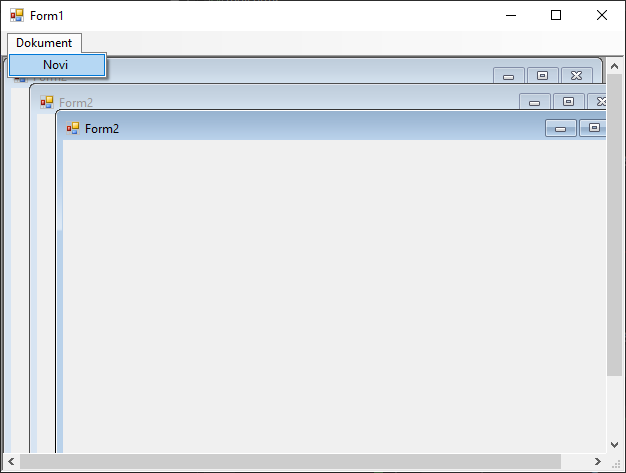
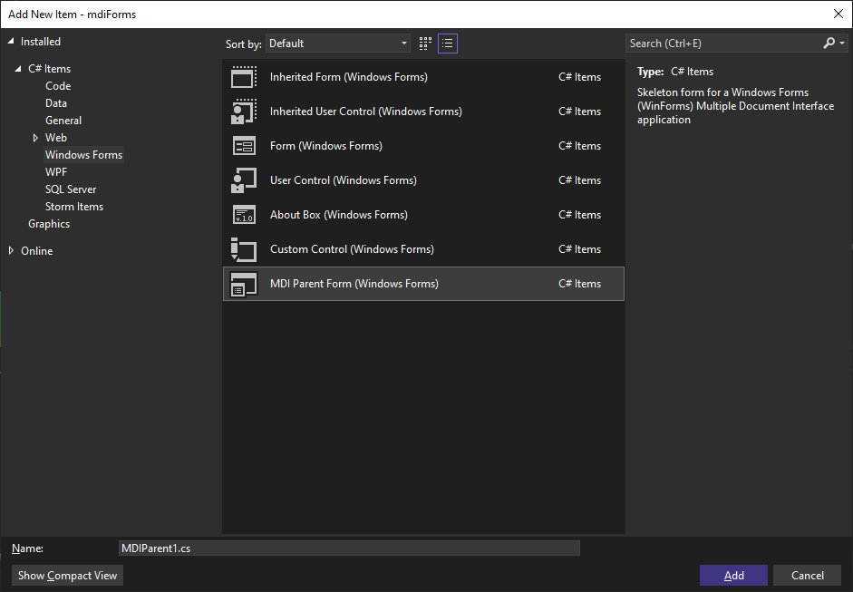
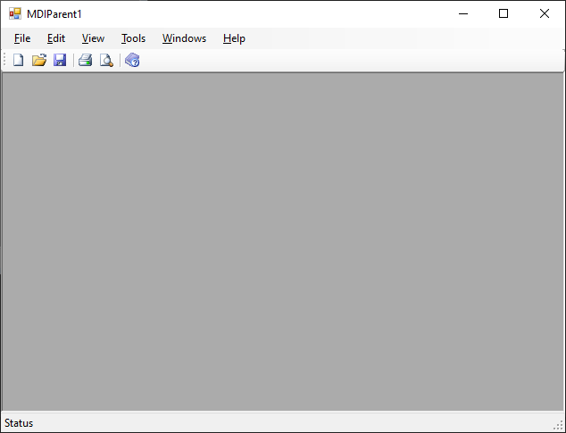

# MDI апликације

До сада си креирао само SDI (енгл. *Single Document Interface*) апликације,
односно апликације у којима може бити отворен само један документ. У пракси је
често потребно да апликација треба да има могућност да отвори више докумената
истовремено (као нпр. *Visual Studio*). Апликације које могу да отворе више
докумената истовремено називају се MDI (енгл. *Multiple Document Interface*)
апликације. MDI апликације састоје се од родитељске форме тј. контејнера, у
оквиру којег се отварају форме деце. За MDI апликације карактеристично је
следеће:

* постоји једна главна, родитељска форма (MDI родитељ),
* остале се форме отварају унутар родитељске форме (MDI деца),
* дечије форме могу бити померане, затваране, минимизоване и максимизоване
унутар родитељске форме, и
* MDI дете не може да постоји ван родитељске форме.

Да би основна форма, на пример `Form1` постала MDI родитељска форма, у
*Properties* прозору постави својство `IsMdiContainer` на `True`, или то уради
у коду:

```cs
this.IsMdiContainer = true;
```

Овим си означио да је форма MDI контејнер и да може да садржи друге форме.

Нека је на `Form1` која је дефинисана као MDI контејнер постављен мени и нека
се кликом на ставку `Dokument` и подставку `Novi` треба отворити `Form2` као
MDI дете. Догађај клика на подставку менија `Novi` може да изгледа овако:

```cs
private void noviToolStripMenuItem_Click(object sender, EventArgs e)
{
    Form2 f2 = new Form2();
    f2.MdiParent = this;
    f2.Show();
}
```

Сада кликом на подставку `Novi` можеш отворити више примерака `Form2` и сваки
ће се налазити унутар `Form1`:



MDI родитељска форма може да организује дечје форме на различите начине, као
што су каскадно, хоризонтално или вертикално:

```cs
this.LayoutMdi(MdiLayout.Cascade);
this.LayoutMdi(MdiLayout.TileHorizontal);
this.LayoutMdi(MdiLayout.TileVertical);
```

Ове наредбе за распоређивање можеш користити након што се MDI дечје форме
прикажу.

## MDI шаблони

Како је рад са MDI апликацијама честа пракса, у оквиру развојног окружења
Visual Studio направљен је шаблон за MDI родитељске форме. Када креираш нови
Windows Forms Apps пројекат, у Solution Explorer-у десним кликом на *Add*
одабери *New Item*, па у *Add New Item* прозору одаберите **MDI Parent** и
кликни *Add*.



`Form1` који је иницијално креиран можеш избрисати у *Solution Explorer*-у, а
потребно је да у `Program.cs` замениш `Form1` називом нове MDI родитељске форме
коју си креирао, на пример овако:

```cs
using System;
using System.Windows.Forms;

namespace mdiForms
{
    internal static class Program
    {
        /// <summary>
        /// The main entry point for the application.
        /// </summary>
        [STAThread]
        static void Main()
        {
            Application.EnableVisualStyles();
            Application.SetCompatibleTextRenderingDefault(false);
            Application.Run(new MDIParent1());
        }
    }
}
```

Креирани MDI родитељски шаблон, поред дизајна...



...садржи и следећи кôд:

```cs
using System;
using System.Collections.Generic;
using System.ComponentModel;
using System.Data;
using System.Drawing;
using System.Linq;
using System.Text;
using System.Threading.Tasks;
using System.Windows.Forms;

namespace mdiForms
{
    public partial class MDIParent1 : Form
    {
        private int childFormNumber = 0;

        public MDIParent1()
        {
            InitializeComponent();
        }

        private void ShowNewForm(object sender, EventArgs e)
        {
            Form childForm = new Form();
            childForm.MdiParent = this;
            childForm.Text = "Window " + childFormNumber++;
            childForm.Show();
        }

        private void OpenFile(object sender, EventArgs e)
        {
            OpenFileDialog openFileDialog = new OpenFileDialog();
            openFileDialog.InitialDirectory = Environment.GetFolderPath(Environment.SpecialFolder.Personal);
            openFileDialog.Filter = "Text Files (*.txt)|*.txt|All Files (*.*)|*.*";
            if (openFileDialog.ShowDialog(this) == DialogResult.OK)
            {
                string FileName = openFileDialog.FileName;
            }
        }

        private void SaveAsToolStripMenuItem_Click(object sender, EventArgs e)
        {
            SaveFileDialog saveFileDialog = new SaveFileDialog();
            saveFileDialog.InitialDirectory = Environment.GetFolderPath(Environment.SpecialFolder.Personal);
            saveFileDialog.Filter = "Text Files (*.txt)|*.txt|All Files (*.*)|*.*";
            if (saveFileDialog.ShowDialog(this) == DialogResult.OK)
            {
                string FileName = saveFileDialog.FileName;
            }
        }

        private void ExitToolsStripMenuItem_Click(object sender, EventArgs e)
        {
            this.Close();
        }

        private void CutToolStripMenuItem_Click(object sender, EventArgs e)
        {
        }

        private void CopyToolStripMenuItem_Click(object sender, EventArgs e)
        {
        }

        private void PasteToolStripMenuItem_Click(object sender, EventArgs e)
        {
        }

        private void ToolBarToolStripMenuItem_Click(object sender, EventArgs e)
        {
            toolStrip.Visible = toolBarToolStripMenuItem.Checked;
        }

        private void StatusBarToolStripMenuItem_Click(object sender, EventArgs e)
        {
            statusStrip.Visible = statusBarToolStripMenuItem.Checked;
        }

        private void CascadeToolStripMenuItem_Click(object sender, EventArgs e)
        {
            LayoutMdi(MdiLayout.Cascade);
        }

        private void TileVerticalToolStripMenuItem_Click(object sender, EventArgs e)
        {
            LayoutMdi(MdiLayout.TileVertical);
        }

        private void TileHorizontalToolStripMenuItem_Click(object sender, EventArgs e)
        {
            LayoutMdi(MdiLayout.TileHorizontal);
        }

        private void ArrangeIconsToolStripMenuItem_Click(object sender, EventArgs e)
        {
            LayoutMdi(MdiLayout.ArrangeIcons);
        }

        private void CloseAllToolStripMenuItem_Click(object sender, EventArgs e)
        {
            foreach (Form childForm in MdiChildren)
            {
                childForm.Close();
            }
        }
    }
}
```

Ово је потпуно функционалан UI шаблон, а на теби је да дефинишеш логику
програма.

MDI апликације су корисне када желиш да истовремено радиш са више докумената у
једној апликацији. За разлику од стандардних форми, овде се све дечје форме
налазе унутар једне родитељске форме, што чини апликацију прегледнијом и
организованијом.
