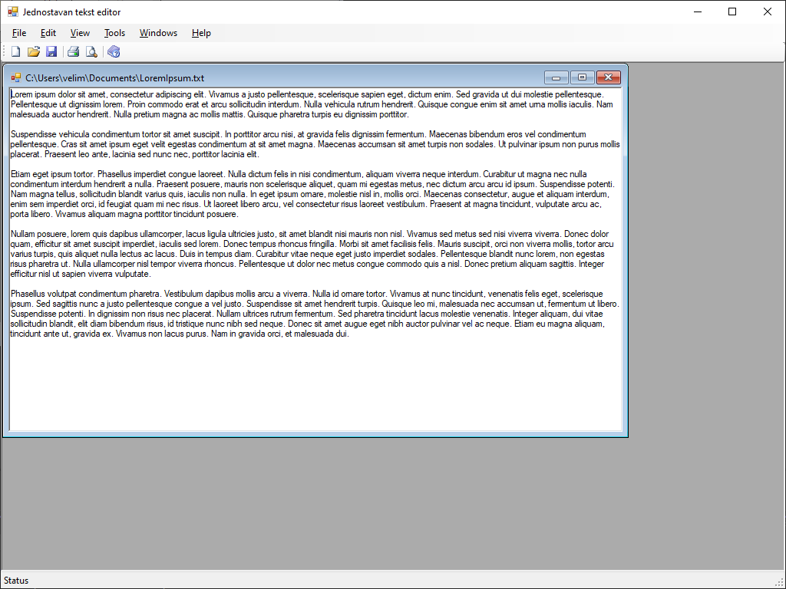

# Пример: MDI текст едитор

У претходној лекцији научио си основе рада са MDI апликацијама и како да
користиш уграђени Visual Studio шаблон за MDI родитељску форму. Сада ћеш то
знање применити у пракси и направити једноставан, али функционалан текст едитор
који омогућава рад са више докумената истовремено.

Едитор треба да има следеће функционалности:

* Креирање новог празног документа у новом прозору.
* Отварање постојећег текстуалног фајла у новом прозору.
* Чување тренутно активног документа.
* Основне операције са текстом: Iseci, Kopiraj, Nalepi.

За почетак, креирај нови Windows Forms пројекат. Као у претходној лекцији,
додај нову MDI родитељску форму и подеси Program.cs да покреће ту форму уместо
`Form1`. Шаблон је већ креирао меније и траку са алатима, али је потребна форма
која ће представљати један документ. Дечија форма ће служити као контејнер за
текст сваког појединачног документа.

У Solution Explorer-у, кликни десним тастером на пројекат и изабери Add -> Form
(Windows Forms). На новокреирану форму превуци из Toolbox-а контролу
`RichTextBox`. Ова контрола је боља од `TextBox`-а јер подржава веће количине
текста и форматирање. Кликни на `RichTextBox` контролу, у Properties прозору
пронађи својство `Dock` и постави га на `Fill`. Ово ће учинити да поље за унос
текста заузима целу површину форме.

Овде настаје мали проблем на нивоу приступа. Када превучеш контролу као што је
`RichTextBox` на форму у дизајнеру, Visual Studio је аутоматски декларише као
`private` поље унутар те класе форме. То значи да је поље `richTextBox1` у
дечијој класи видљиво само унутар кода дечије класе. Класа `MDIParent1` је
спољашња класа и због тога не може директно да "види" и приступа приватним
члановима дечије класе. Исправно решење није да `richTextBox1` учиниш јавним
(public), јер то нарушава принцип енкапсулације. Родитељска форма не треба да
зна како дечија форма рукује текстом (да ли користи `RichTextBox` или неку
другу контролу), већ само треба да може да јој затражи да изврши одређену
акцију. Да би то решио, отвори кôд дечије форме и додај:

```cs
using System.IO;
using System.Windows.Forms;

public partial class FormaDokument : Form
{
    public FormaDokument()
    {
        InitializeComponent();
    }

    public void UcitajFajl(string putanja)
    {
        richTextBox1.LoadFile(putanja, RichTextBoxStreamType.PlainText);
    }

    public void SacuvajFajl(string putanja)
    {
        richTextBox1.SaveFile(putanja, RichTextBoxStreamType.PlainText);
    }

    public void Iseci()
    {
        richTextBox1.Cut();
    }

    public void Kopiraj()
    {
        richTextBox1.Copy();
    }

    public void Nalepi()
    {
        richTextBox1.Paste();
    }
}
```

Све акције (New, Open, Save) треба да се покрећу из родитељске форме, али се
извршавају над активном дечијом формом. Измени метод `ShowNewForm` који је већ
креиран у шаблону тако да уместо генеричке `Form` класе, креираш инстанцу
дечије форме.

```cs
private void ShowNewForm(object sender, EventArgs e)
{
    FormaDokument childForm = new FormaDokument();
    childForm.MdiParent = this;
    childForm.Text = "Dokument " + childFormNumber++;
    childForm.Show();
}
```

Сада сваки клик на File -> New (или на дугме на траци са алатима) отвара нову
дечију форму унутар главног прозора.

Метод `OpenFile` треба да учита садржај текстуалног фајла у нову дечију форму.

```cs
private void OpenFile(object sender, EventArgs e)
{
    OpenFileDialog openFileDialog = new OpenFileDialog();
    openFileDialog.Filter = "Text Files (*.txt)|*.txt|All Files (*.*)|*.*";
    if (openFileDialog.ShowDialog(this) == DialogResult.OK)
    {
        string FileName = openFileDialog.FileName;
        FormaDokument childForm = new FormaDokument();
        childForm.MdiParent = this;
        childForm.UcitajFajl(FileName);
        childForm.Text = FileName;
        childForm.Show();
    }
}
```

Пре него што имплементираш чување и операције са текстом, мораш знати како да
приступиш тренутно активној дечијој форми. MDI родитељска форма има својство
`ActiveMdiChild` које враћа референцу на форму која је тренутно у фокусу. Ако
ниједан прозор није отворен или активан, ово својство ће бити `null`. Зато је
увек потребна провера:

```cs
FormaDokument aktivniDokument = this.ActiveMdiChild as FormaDokument;
if (aktivniDokument == null)
{
    return;
}
```

Логика за чување (Save) је мало сложенија. Мора да се сачува садржај
`RichTextBox`-а из активне форме у фајл. Можеш да искористиш
`SaveAsToolStripMenuItem_Click` који је већ припремљен у шаблону. Метода за
Save (не Save As) би проверавала да ли је фајл већ једном сачуван (нпр.
памћењем путање у `Tag` својству форме) и ако јесте, сачувала би га без
поновног питања за локацију. Ако није, позвала би логику за Save As. Ради
једноставности, у овом примеру имплементираћеш само Save As.

```cs
private void SaveAsToolStripMenuItem_Click(object sender, EventArgs e)
{
    FormaDokument aktivniDokument = this.ActiveMdiChild as FormaDokument;
    if (aktivniDokument == null) return;
    SaveFileDialog saveFileDialog = new SaveFileDialog();
    saveFileDialog.Filter = "Text Files (*.txt)|*.txt|All Files (*.*)|*.*";
    if (saveFileDialog.ShowDialog(this) == DialogResult.OK)
    {
        string FileName = saveFileDialog.FileName;
        aktivniDokument.SacuvajFajl(FileName);
        aktivniDokument.Text = FileName;
    }
}
```

Потребно је још да имплементираш Cut, Copy и Paste у MDI форми:

```cs
private void CutToolStripMenuItem_Click(object sender, EventArgs e)
{
    FormaDokument aktivniDokument = this.ActiveMdiChild as FormaDokument;
    if (aktivniDokument != null)
    {
        aktivniDokument.Iseci();
    }
}

private void CopyToolStripMenuItem_Click(object sender, EventArgs e)
{
    FormaDokument aktivniDokument = this.ActiveMdiChild as FormaDokument;
    if (aktivniDokument != null)
    {
        aktivniDokument.Kopiraj();
    }
}

private void PasteToolStripMenuItem_Click(object sender, EventArgs e)
{
    FormaDokument aktivniDokument = this.ActiveMdiChild as FormaDokument;
    if (aktivniDokument != null)
    {
        aktivniDokument.Nalepi();
    }
}
```



Управо си направио основни MDI текст едитор. Кроз овај пројекат научио си кључни
концепт MDI програмирања: родитељска форма служи као главни контролер који
управља дечијим формама. Сва логика која се односи на документе (отварање,
чување, уређивање) мора прво да идентификује активни документ `ActiveMdiChild`
пре него што изврши жељену акцију над њим. Такође, увек треба да водиш рачуна о
нивоу приступа и принципу енкапсулације.
