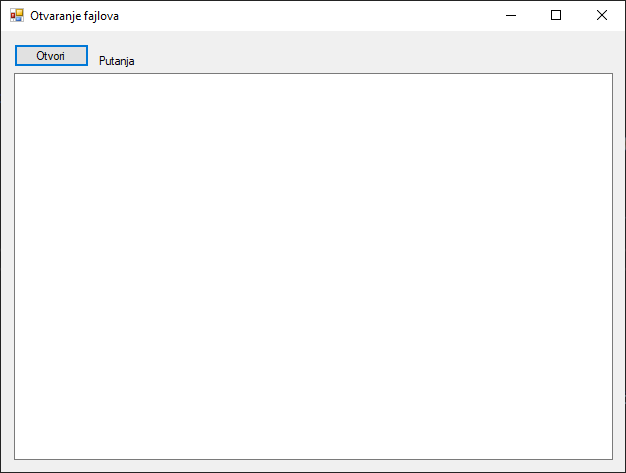
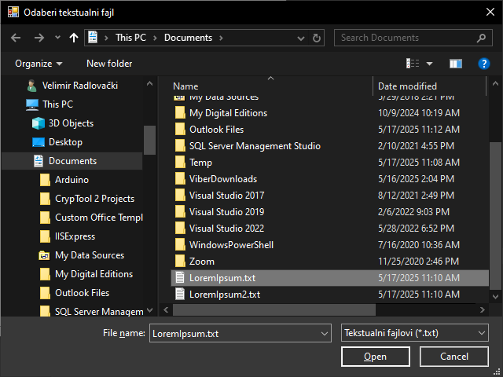
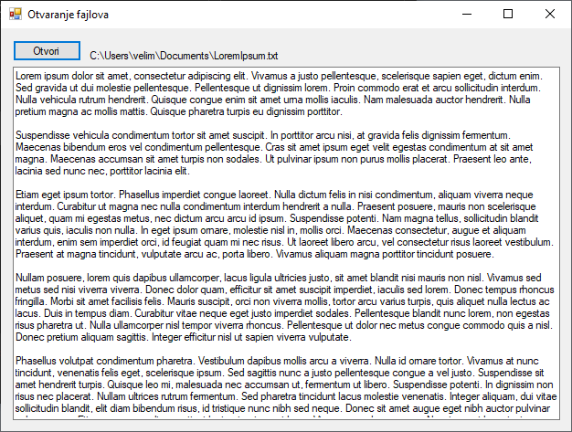
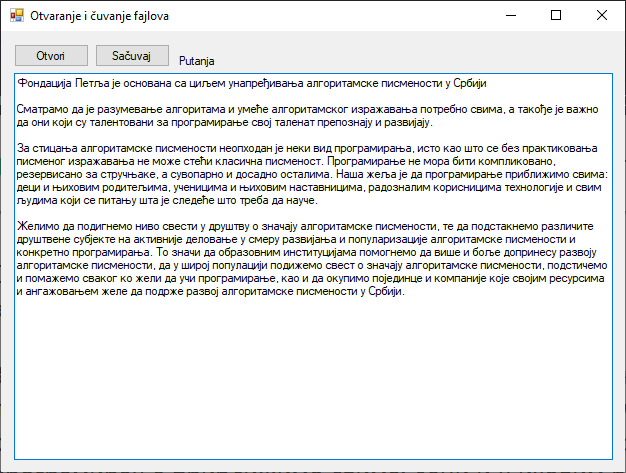
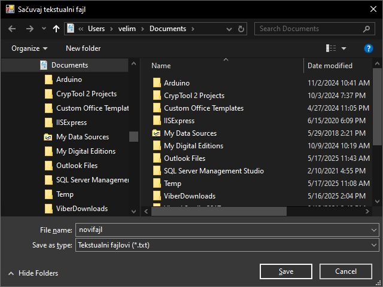
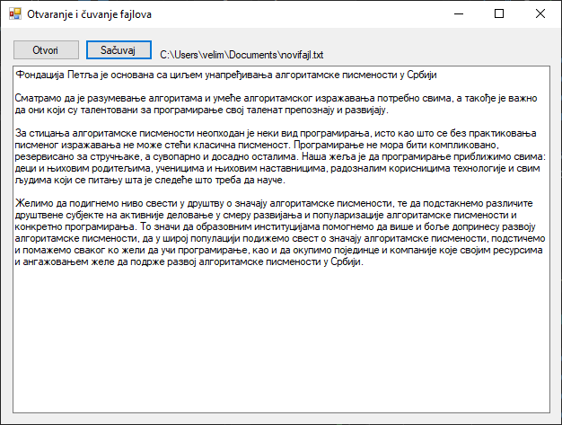
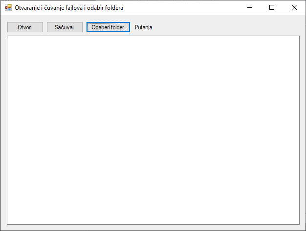
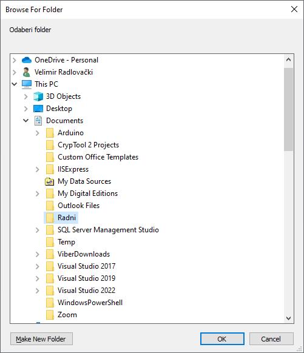
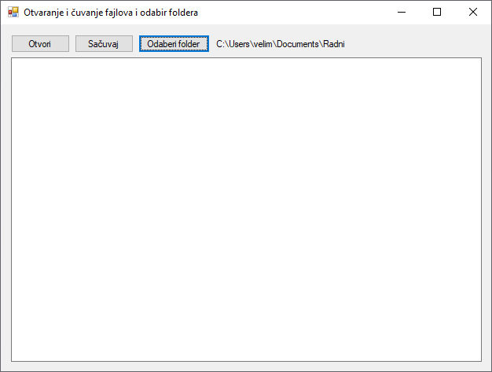

# Дијалози за рад са фајловима и фолдерима

Претходне школске године учио си о:
[фајловима и директоријумима](https://petlja.org/sr-Latn-RS/kurs/14469/2/9864),
[раду са текстуалним фајловима](https://petlja.org/sr-Latn-RS/kurs/14469/2/9865),
[раду са токовима](https://petlja.org/sr-Latn-RS/kurs/14469/2/9866) и
[раду са бинарним фајловима](https://petlja.org/sr-Latn-RS/kurs/14469/2/9867).
У Windows Forms апликацијама, рад са фајловима и директоријумима често
подразумева да кориснику понудиш дијалошки прозор за отварање или чување фајла,
као и за избор фолдера, па тако .NET Framework има већ дефинисане дијалоге који
се лако користе и прилагођавају, где су најчешће коришћени:

* [`OpenFileDialog`](https://learn.microsoft.com/en-us/dotnet/api/system.windows.forms.openfiledialog?view=netframework-4.8)
који омогућава кориснику да изабере један или више фајлова за отварање,
* [`SaveFileDialog`](https://learn.microsoft.com/en-us/dotnet/api/system.windows.forms.savefiledialog?view=netframework-4.8)
који омогућава кориснику да изабере локацију и унесе назив фајла за чување и
* [`FolderBrowserDialog`](https://learn.microsoft.com/en-us/dotnet/api/system.windows.forms.folderbrowserdialog?view=netframework-4.8)
који омогућава кориснику да изабере фолдер.

Слично као `ColorDialog` и `FontDialog`, ове дијалоге можеш додати на форму на
два начина:

1. **преко Visual Studio дизајнера** тако што из Toolbox-а из секције Dialogs
на форму превучеш OpenFileDialog, SaveFileDialog или FolderBrowserDialog, након
чега ће се контрола појавити у доњем делу дизајнера, јер нема визуелни приказ
на самој форми током дизајна, или
2. **Креирањем инстанце у коду** тако што креираш објекат одговарајуће класе
директно у коду, најчешће унутар методе која ће покренути дијалог.

Ако креираш објекат одговарајуће класе у коду унутар неке методе...

```cs
OpenFileDialog openFileDialog1 = new OpenFileDialog();
SaveFileDialog saveFileDialog1 = new SaveFileDialog();
FolderBrowserDialog folderBrowserDialog1 = new FolderBrowserDialog();
```

препоручљиво је користиш `using` блокове, јер ове класе имплементирају
`IDisposable` интерфејс:

```cs
using (OpenFileDialog openFileDialog1 = new OpenFileDialog())
{
    // Kod za rad sa dijalogom...
}
using (SaveFileDialog saveFileDialog1 = new SaveFileDialog())
{
    // Kod za rad sa dijalogom...
}
using (FolderBrowserDialog folderBrowserDialog1 = new FolderBrowserDialog())
{
    // Kod za rad sa dijalogom...
}
```

Путање до специјалних фолдера оперативног система Windows можеш сазнати и
користити захваљујући класи
[Environment](https://learn.microsoft.com/en-us/dotnet/api/system.environment?view=netframework-4.8).
На пример, ако желиш да добијеш путању до Documents фолдера...

```cs
Environment.GetFolderPath(Environment.SpecialFolder.MyDocuments);
```

...или до свог десктопа:

```cs
Environment.GetFolderPath(Environment.SpecialFolder.Desktop);
```

Путање до осталих системских фолдера можеш добити преко набрајања
[`Environment.SpecialFolder`](https://learn.microsoft.com/en-us/dotnet/api/system.environment.specialfolder?view=netframework-4.8).

## Дијалог за отварање фајлова

`OpenFileDialog` приказује стандардни Windows дијалог који кориснику омогућава
навигацију кроз фајл систем и одабир једног или више фајлова.

Нека је на форми постављено једно дугме `OtvoriFajlBtn`, једна лабела
`PutanjaLabel` и један оквир за текст `SadrzajFajlaTextBox` са својством
`Multiline` постављеним на `true`:



Кликом на дугме кориснику треба приказати дијалог за одабир текстуалног фајла:



Када корисник одабере фајл, путања до фајла треба да буде приказана у лабели, а
садржај фајла у оквиру за текст:



Захваљујући дијалозима за отварање фајлова, решење овог задатка је прилично
једноставно:

```cs
private void OtvoriFajlBtn_Click(object sender, EventArgs e)
{
    using (OpenFileDialog openFileDialog = new OpenFileDialog())
    {
        openFileDialog.Title = "Odaberi tekstualni fajl";
        openFileDialog.Filter = "Tekstualni fajlovi (*.txt)|*.txt|Svi fajlovi (*.*)|*.*";
        openFileDialog.FilterIndex = 1;
        openFileDialog.Multiselect = false;
        openFileDialog.InitialDirectory = Environment.GetFolderPath(Environment.SpecialFolder.MyDocuments);
        openFileDialog.RestoreDirectory = true;
        if (openFileDialog.ShowDialog() == DialogResult.OK)
        {
            PutanjaLabel.Text = openFileDialog.FileName;
            SadrzajFajlaTextBox.Text = File.ReadAllText(openFileDialog.FileName);
        }
    }
}
```

Кликом на дугме креиран је објекат класе `OpenFileDialog` у `using` блоку.
Постављена су следећа својства дијалога за отварање фајлова:

* `Title` представља наслов дијалога,
* `Filter` представља тренутни стринг филтера за типове фајлова у формату
(Опис|.екстензија|Други опис|.другаЕкстензија),
* `FilterIndex` представља подразумевани филтер (1 за први наведен),
* `Multiselect` постављен на `true` дозвољава вишеструку селекцију фајлова, а
постављен на `false` је забрањује,
* `InitialDirectory` представља почетни директоријум, а
* `RestoreDirectory` ако је постављено на `true`, након затварања дијалога
враћа радни директоријум на стање пре отварања дијалога.

Ако је корисник одабрао фајл и притиснуо дугме Open, путања до фајла приказаће
се у лабели, а садржај фајла у оквиру за текст. Потсети се из претходних
лекција да метода `ShowDialog()` враћа вредност набрајања `DialogResult` —
најчешће проверавамо да ли је резултат `DialogResult.OK`, што значи да је
корисник притиснуо дугме `OK` или `Open`/`Save`.

## Дијалог за чување фајлова

`SaveFileDialog` је веома сличан претходном, али је намењен за одређивање
локације и назива фајла где ће се подаци сачувати.

Нека је на истој форми сада постављено и дугме `SacuvajFajlBtn`.



Кликом на то дугме користику треба приказати дијалог за чување текстуалног
фајла у којем ће се сачувати садржај оквира за текст:



Када корисник сачува фајл, путања до фајла сачуваног фајла треба да буде
приказана у лабели:



Опет, захваљујући дијалозима за чување фајлова, решење овог задатка је прилично
једноставно:

```cs
private void SacuvajFajlBtn_Click(object sender, EventArgs e)
{
    using (SaveFileDialog saveFileDialog = new SaveFileDialog())
    {
        saveFileDialog.Title = "Sačuvaj tekstualni fajl";
        saveFileDialog.DefaultExt = "txt";
        saveFileDialog.Filter = "Tekstualni fajlovi (*.txt)|*.txt|Svi fajlovi (*.*)|*.*";
        saveFileDialog.FilterIndex = 1;
        saveFileDialog.InitialDirectory = Environment.GetFolderPath(Environment.SpecialFolder.MyDocuments);
        saveFileDialog.RestoreDirectory = true;
        if (saveFileDialog.ShowDialog() == DialogResult.OK)
        {
            File.WriteAllText(saveFileDialog.FileName, SadrzajFajlaTextBox.Text);
            PutanjaLabel.Text = saveFileDialog.FileName;
        }
    }
}
```

Скоро сва својства упознао си већ приликом коришћења дијалога за отварање, а
специфично својство за овај дијалог је `DefaultExt` које представља
подразумевану екстензију фајла уколико је корисник не унесе.

Ако је корисник унео име фајла и притиснуо дугме Save, путања до фајла приказаће
се у лабели, а садржај оквира за текст биће сачуван у задатом фајлу.

## Дијалог за одабир фолдера

`FolderBrowserDialog` омогућава кориснику да прегледа и изабере фолдер.

Нека је сада задатак да на форми постоји и дугме `OdaberiFolderBtn`.



Кликом на то дугме користику треба приказати дијалог за одабир фолдера...



...чија ће се путања уписати у лабели:



Решење задатка је опет прилично једноставно:

```cs
private void OdaberiFolderBtn_Click(object sender, EventArgs e)
{
    string putanja = string.Empty;
    using (FolderBrowserDialog folderBrowserDialog = new FolderBrowserDialog())
    {
        folderBrowserDialog.Description = "Odaberi folder";
        folderBrowserDialog.ShowNewFolderButton = true;
        folderBrowserDialog.SelectedPath = putanja;
        if (folderBrowserDialog.ShowDialog() == DialogResult.OK)
        {
            putanja = folderBrowserDialog.SelectedPath;
            PutanjaLabel.Text = putanja;
        }
    }    
}
```

Овде су коришћена својства `Description` за наслов дијалога,
`ShowNewFolderButton` за омогућавање приказа дугмета New Folder у дијалогу и
`SelectedPath` за чување изабране путање. Изабрана путања се може касније
користити као подразумевана путања до радног фолдера у претходне две методе.

Ако је задатак да креираш апликацију која има могућност...

* отварања и приказа садржаја текстуалног фајлова,
* чувања текстуалног фајла и
* одабира подразумеваног "радног" фолдера за отварање и чување,

...решење задатка би могло да изгледа овако:

```cs
using System;
using System.IO;
using System.Windows.Forms;

namespace Dijalozi
{
    public partial class Form1 : Form
    {
        public string putanja { get; set; } = string.Empty;

        public Form1()
        {
            InitializeComponent();
            putanja = Environment.GetFolderPath(Environment.SpecialFolder.MyDocuments);
            PutanjaLabel.Text = putanja;
        }

        private void OtvoriFajlBtn_Click(object sender, EventArgs e)
        {
            using (OpenFileDialog openFileDialog = new OpenFileDialog())
            {
                openFileDialog.Title = "Odaberi tekstualni fajl";
                openFileDialog.Filter = "Tekstualni fajlovi (*.txt)|*.txt|Svi fajlovi (*.*)|*.*";
                openFileDialog.FilterIndex = 1;
                openFileDialog.Multiselect = false;
                openFileDialog.InitialDirectory = putanja;
                openFileDialog.RestoreDirectory = true;
                if (openFileDialog.ShowDialog() == DialogResult.OK)
                {
                    PutanjaLabel.Text = openFileDialog.FileName;
                    SadrzajFajlaTextBox.Text = File.ReadAllText(openFileDialog.FileName);
                }
            }
        }

        private void SacuvajFajlBtn_Click(object sender, EventArgs e)
        {
            using (SaveFileDialog saveFileDialog = new SaveFileDialog())
            {
                saveFileDialog.Title = "Sačuvaj tekstualni fajl";
                saveFileDialog.DefaultExt = "txt";
                saveFileDialog.Filter = "Tekstualni fajlovi (*.txt)|*.txt|Svi fajlovi (*.*)|*.*";
                saveFileDialog.InitialDirectory = putanja;
                saveFileDialog.RestoreDirectory = true;
                if (saveFileDialog.ShowDialog() == DialogResult.OK)
                {
                    File.WriteAllText(saveFileDialog.FileName, SadrzajFajlaTextBox.Text);
                    PutanjaLabel.Text = saveFileDialog.FileName;
                }
            }
        }

        private void OdaberiFolderBtn_Click(object sender, EventArgs e)
        {
            using (FolderBrowserDialog folderBrowserDialog = new FolderBrowserDialog())
            {
                folderBrowserDialog.Description = "Odaberi folder";
                folderBrowserDialog.ShowNewFolderButton = true;
                folderBrowserDialog.SelectedPath = putanja;
                if (folderBrowserDialog.ShowDialog() == DialogResult.OK)
                {
                    putanja = folderBrowserDialog.SelectedPath;
                    PutanjaLabel.Text = putanja;
                }
            }    
        }
    }
}
```

У апликацијама које би израђивао за кориснике, требао би додати и try-catch
блокове приликом рада са фајловима како би се адекватно руковали изузеци (нпр.
`IOException`). Свакако, дијалози за рад са фајловима и фолдерима су неопходни
за креирање интерактивних Windows Forms апликација. Коришћењем ових дијалога
можеш лако имплементирати стандардне и интуитивне начине за кориснике да
управљају фајловима и фолдерима унутар апликације.
