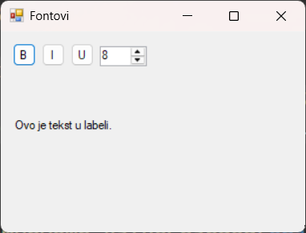

# Рад са фонтовима

У претходној лекцији научио си да користиш `FontDialog`који омогућава кориснику
да изабере фонт. У овој лекцији научићеш нешто више о раду са фонтовима и класи
[Font](https://learn.microsoft.com/en-us/dotnet/api/system.drawing.font?view=netframework-4.8)
из именског простора `System.Drawing`.

Класа `Font` представља фонт који се користи за приказ текста у контролама као
што су `Label`, `Button`, `TextBox` итд. Помоћу ове класе можеш да дефинишеш
сва својства фонта, без употребе дијалога.

Објекат класе `Font` садржи информације као што су: назив фонта (нпр. "Arial",
"Times New Roman"...), величина фонта у тачкама, стил фонта (нпр. Bold, Italic,
Underline...) и др.

Класа `Font` је неизмењива (имутабилна), што значи да не можеш мењати постојећи
фонт – мораш направити нови објекат са новим својствима и доделити га контроли.
Дефинисање фонта врши се на следећи начин:

```cs
Font noviFont = new Font("Arial", 14, FontStyle.Bold);
```

Овим је креиран објекат `noviFont` класе `Font`, где је назив фонта `Arial`,
величина фонта `14` тачака и стил фонта `Bold` (задебљан). Овако дефинисан фонт
може се применити на контроле на форми, на пример на лабелу:

```cs
TextLabel.Font = noviFont;
```

Нека је креирана форма са три дугмета B, I, U, једном контролном NumericUpDown
и једном лабелом. Задатак је да се кликом на дугме B фонт у лабели задебља,
кликом на I текст у лабели укоси, кликом на U текст у лабели подвуче и променом
вредности у NumericUpDown текст у лабели повећа или смањи на задату вредност.
Ако корисник поново кликне на B текст не треба више бити задебљан, ако поново
кликне на I не треба више бити укошен и ако поново кликне на U не треба више
бити подвучен.



Решење овог задатка може да изгледа овако:

```cs
using System;
using System.Drawing;
using System.Windows.Forms;

namespace Fontovi
{
    public partial class Form1 : Form
    {
        public Form1()
        {
            InitializeComponent();
            FontSizeNumUpDown.Value = (int)TextLabel.Font.Size;
            FontSizeNumUpDown.Minimum = 1;
            FontSizeNumUpDown.Maximum = 20;
        }

        private void BoldBtn_Click(object sender, EventArgs e)
        {
            Font trenutni = TextLabel.Font;
            FontStyle noviStil = trenutni.Style ^ FontStyle.Bold;
            TextLabel.Font = new Font(trenutni, noviStil);
        }

        private void ItalicBtn_Click(object sender, EventArgs e)
        {
            Font trenutni = TextLabel.Font;
            FontStyle noviStil = trenutni.Style ^ FontStyle.Italic;
            TextLabel.Font = new Font(trenutni, noviStil);
        }

        private void UnderlineBtn_Click(object sender, EventArgs e)
        {
            Font trenutni = TextLabel.Font;
            FontStyle noviStil = trenutni.Style ^ FontStyle.Underline;
            TextLabel.Font = new Font(trenutni, noviStil);
        }

        private void FontSizeNumUpDown_ValueChanged(object sender, EventArgs e)
        {
            Font trenutni = TextLabel.Font;
            float velicina = (float)FontSizeNumUpDown.Value;
            TextLabel.Font = new Font(trenutni.FontFamily, velicina, trenutni.Style);
        }
    }
}
```
